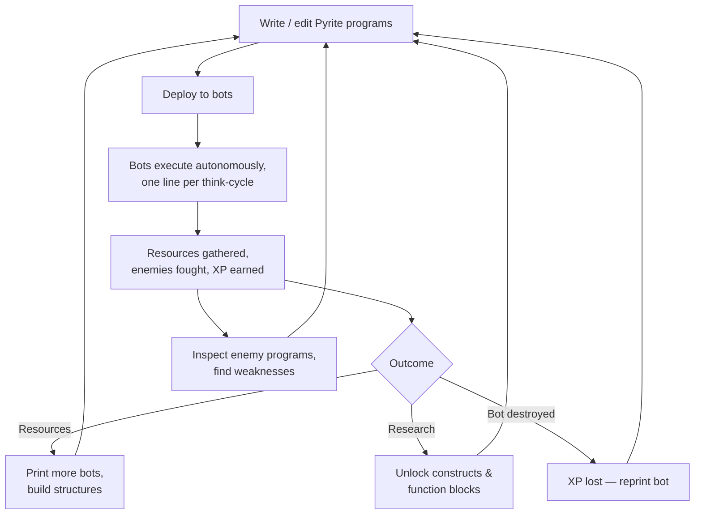

# Overview

## Elevator Pitch

A multiplayer RTS built in **Bevy** where you don't control units directly — you **program** them. Every bot in your colony runs a script in a Python-like language, interpreted one line at a time. Smarter programs cost more "think" cycles, so elegant code is a competitive advantage. You grow your colony by unlocking language constructs and function blocks, gathering resources, and defending against enemies whose logic you can read and exploit.

Working title: **(TBD)**. The unit language is called **Pyrite** (see [01-language.md](01-language.md)).

## Design Pillars

1. **The code is the game.** Direct unit control is minimal or nonexistent. Player skill = writing better programs. Progression = a richer language.
2. **Transparency is earned — one rule for everyone.** Your bots and your allies' are always open. *Every other program in the world* — opposing players and Ferals alike — is encrypted, and decrypts the same way: **programs are read on murder**, a few percent per salvage, permanently ([08-multiplayer.md](08-multiplayer.md)). Beating an enemy still means reading its program and countering it ([04-enemies.md](04-enemies.md)) — you just kill it a few times first. Low-arcana Ferals leak fast; they're the curriculum.
3. **Losses hurt.** Bots gain XP from doing tasks and get better at them. A destroyed bot loses **all** XP and must be reprinted. Protecting veterans is a real strategic concern ([02-agents.md](02-agents.md)).
4. **Deterministic by construction.** Multiplayer (co-op and PvP) from day one. The entire simulation — including every interpreted line of Pyrite — is deterministic, enabling lockstep networking ([08-multiplayer.md](08-multiplayer.md)).
5. **Terrain is a puzzle input.** Maps aren't decoration; terrain changes movement cost, vision, resource access, and even CPU behavior ([05-terrain.md](05-terrain.md)).

## Core Loop

The loop players should feel: *observe → rewrite → redeploy → watch it play out*. Iteration on code is the primary verb.

## Session Shape (target)

- **Every player owns their own colony** — allied colonies, never shared. Co-op vs. PvP is a *server setting* (Open / Non-PvP / Duel), not a mode: on the same server, players choose to ally or fight ([08-multiplayer.md](08-multiplayer.md)).
- **Language constructs are permanent account unlocks** (knowledge you keep); function blocks, colors, and hardware are earned per match ([06-progression.md](06-progression.md)). PvP requires full construct knowledge — symmetric vocabulary, matches decided by usage.
- Match length target: 30–60 minutes, with a possible persistent/longer mode later.

## Document Map

| Doc | Owns |
|---|---|
| [01-language.md](01-language.md) | Pyrite language: syntax, interpreter model, cycle costs, construct gating |
| [02-agents.md](02-agents.md) | Bot anatomy, damage/reprinting, XP & specialization |
| [03-resources.md](03-resources.md) | Resource tree and sinks |
| [04-enemies.md](04-enemies.md) | Enemy archetypes, inspectable logic, escalation |
| [05-terrain.md](05-terrain.md) | Terrain types and gameplay effects |
| [06-progression.md](06-progression.md) | Unlock tree: constructs, function blocks, hardware |
| [07-architecture.md](07-architecture.md) | Bevy/ECS design, tick model, interpreter integration |
| [08-multiplayer.md](08-multiplayer.md) | Determinism rules, lockstep networking, co-op/PvP modes |

## Glossary

| Term | Meaning |
|---|---|
| **Bot** | A player-programmed unit. Runs exactly one Pyrite program. |
| **Pyrite** | The in-game Python-like language, interpreted by the sim. |
| **Cycle** | The unit of bot computation. Each sim tick, a bot's CPU grants it N cycles; every operation costs cycles. |
| **Tick** | One fixed step of the deterministic simulation (all bots, physics, combat). |
| **Function block** | An unlockable built-in function bots can call (e.g. `scan()`, `broadcast()`). |
| **Construct** | An unlockable language feature (variables, `if`, loops, `def`, lists). |
| **Fabricator / Printer** | Structure that prints (and reprints) bots. One per program color; buildable count gated by controlled nests. Carries the desired-max population dial. |
| **Template Cache** | Non-consumable ruin where any colony studies a function block. Basic ones ring start zones; advanced ones sit deeper. |
| **Reprint** | Rebuilding a destroyed bot. Its program is preserved; its XP is not. |
| **Black Box** | Object dropped by every destroyed bot: its local logs + cause of death. Readable/recoverable by anyone. |
| **Color** | A colony program slot (Red, Green, … — start with 2; more by controlling nests, quadratic, uncapped). One color = one printer. Every bot runs one color and is tinted by it. Enemy salvages permanently decrypt a color a few % at a time. |
| **Recall** | The engine-owned fifth signal (un-writable): a printer over its desired max recalls its lowest-XP bot for re-coloring (XP kept); an over-capacity colony recalls its lowest-XP bot for scrap. An interrupt context — double-handle applies. |
| **Boot Sequence** | State a bot passes through on print or rescue: auto-upload of any local logs, then execute from line 1. |
| **Feral** | The PvE enemy faction: corrupted machines running real Pyrite programs, decryptable by salvage like everyone else's. |
| **Allegiance** | A Nest's rank 0–21, named for the tarot Major Arcana. Number ≈ difficulty; arcanum ≈ personality, especially how the nest treats code (static, mutating, researching). |
