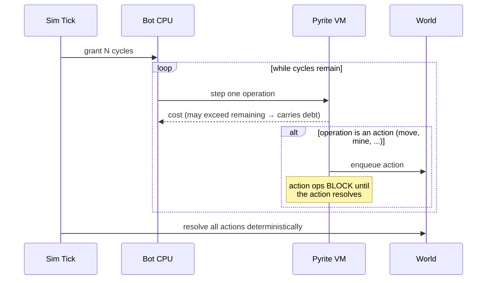
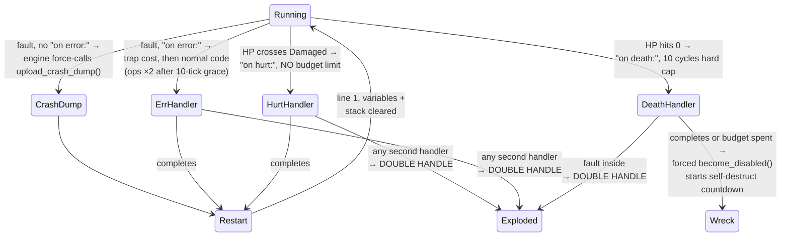

# Pyrite — The Unit Language

Pyrite is a **custom Python-like DSL** with an interpreter written in Rust. We control the whole stack, which buys us three things real Python can't cheaply give us:

1. **Line-at-a-time execution** metered in cycles (bots visibly "think").
2. **Construct gating** — `if`, loops, variables, `def` are *unlockable features*, enforced at parse time.
3. **Determinism** — required for lockstep multiplayer ([08-multiplayer.md](08-multiplayer.md)). No floats exposed to programs, no wall clock, no hash-order iteration.

## Execution Model

Every bot has a CPU that grants it a **cycle budget per simulation tick** (base: 1 cycle/tick, upgradable — see [06-progression.md](06-progression.md)). The interpreter advances a program one *operation* at a time; each operation has a cycle cost. When the budget is spent, the bot pauses mid-program until next tick.



Key rules:

- **Programs loop forever.** When the last line finishes, execution restarts at line 1. (Explicit `while True:` becomes redundant sugar once unlocked.)
- **Actions block.** `move_to(...)` costs cycles to *issue*, then the bot is busy until the action completes in the world. Thinking and acting don't overlap (until a later unlock — see "Coprocessor" in [06-progression.md](06-progression.md)).
- **Cycle debt.** An operation costing more than remaining cycles executes when enough cycles have accumulated. Nothing is free.

## Errors & Signals

**Any** runtime failure is a fault: stack overflow, type error, unsupported operation, invalid argument, a failed action (`mine()` with no ore in range). There are **five signal kinds** — four with player-facing handling models, plus the engine-owned `recall`. (All numbers below are cost-table constants — tuning values, not commitments.)



### The five kinds

| Kind | Trigger | Budget / limit | Notes |
|---|---|---|---|
| **Unhandled error** | fault, no `on error:` installed | cost of `upload_crash_dump()` (~25 cycles) | The engine **always force-calls `upload_crash_dump()`** — full debug info (see Logging), then restart. Debuggability is guaranteed; you just pay full price for it. |
| **Handled error** | fault, `on error:` installed | trap cost (~5), then a **10-tick grace window**; after it, **every operation costs ×2** until the handler ends | The overtime tax keeps handlers as *recovery*, not a place to live. Write your own lean crash logging and beat the default. |
| **Hurt** | HP crosses below Damaged threshold (edge-triggered, re-arms above it) | **unlimited** | But see the double-handle rule. Unbounded time makes long retreats-to-Repair-Bay legal — at a risk. |
| **Death** | HP hits 0 | **10 cycles**, hard | Black-box budget: a couple of `log()`s + `upload_log()`. When it completes (or the budget runs out) the engine **force-calls `become_disabled()`** — every death exits through that function. It starts the wreck's **self-destruct countdown**: field-repair in time rescues the bot (XP intact); expiry means explosion ([02-agents.md](02-agents.md)). |
| **Recall** | printer rebalancing or colony over-capacity | n/a — handler is **engine-fixed, not player-writable** | Suspend program, walk home, re-color (XP kept) or scrap (see Program Colors below). The one signal you can't customize. |

### The double-handle rule

**While a handler — or the Boot Sequence — is running, any event that would start another handler destroys the bot instantly — in any combination, no exceptions.** No wreck, no rescue window, no death handler — a **double-handle explosion**, straight to Destroyed ([02-agents.md](02-agents.md)). What *does* remain is the **Black Box** (see below): every destruction drops one, so you'll know what happened — you just don't get the bot back.

- Mid-`on hurt:` retreat and damage takes you to 0? You don't get your death handler — you explode.
- A fault inside *any* handler — `error`, `hurt`, even `death` — is a double handle. Handler code quality matters *more* than main-program quality.
- This is the counterweight to hurt's unlimited budget: the longer your handler runs, the longer you're one event away from vaporization. Short, bulletproof handlers are the craft.

### Black Boxes & the Boot Sequence

- **Every bot that reaches Destroyed — by any path — drops a Black Box** on its tile: a small persistent object containing the bot's local log ring buffer at the moment of destruction (plus id, position, tick, cause). Anyone with vision can click it to read; a bot can `recover_black_box()` it to bank the contents permanently in the colony's Log Archive. Enemies can grab it too — battlefield intel is physical.
- **The stakes split cleanly: information always survives; XP is what's gambled.** Clean death vs. double-handle no longer differ in forensics — they differ in whether a rescue was possible at all.
- **Rescued (and freshly printed) bots pass through a Boot Sequence** before running ([02-agents.md](02-agents.md)): step 1, if the local log buffer is non-empty, the engine **force-calls `upload_log()`** (the third forced-ordinary-function, after `upload_crash_dump` and `become_disabled`); step 2, the program starts from line 1, fresh state. A rescued veteran automatically files its own incident report before getting back to work.
- **Boot is an interrupt context like any handler** — it participates in the double-handle rule. A signal arriving mid-boot (`hurt` from incoming fire, a fault in the forced upload, lethal damage) explodes the bot. Consequence: **rescues must be timed.** Field-repairing a veteran while it's still under fire hands the enemy a free erasure; secure the area first, or the boot itself is the kill window.

### Signal handlers

Top-level `on <signal>:` blocks — its own unlockable construct ([06-progression.md](06-progression.md)), independent of `def`:

```python
on error:
    log(last_error())
    drop_cargo()
    upload_log()

on hurt:
    drop_cargo()
    move_to(nearest_repair_bay())

on death:
    log(position())
    log(last_error())
    upload_log()        # the black box / death report
```

Rules (all deterministic):

- One handler per signal per program. Signals are checked at operation boundaries.
- **Handler code is just code** — it pays per-op cycle costs and calls ordinary function blocks. Every constant here (trap cost, grace window, overtime multiplier, black-box budget, dump cost) is a cost-table entry, so biome overlays can tune them.
- **Forced calls are ordinary functions.** The engine's mandatory behaviors are implemented as force-calls of the same builtins players can use: unhandled error → `upload_crash_dump()`; end of death → `become_disabled()`. One code path, one cost model — engine policy "isn't even different" from player code.
- Variables are **preserved while a handler runs** (so it can inspect state), then cleared on restart.

### Logging

- `log(value)` — append to the bot's small local ring buffer (cost 1).
- `upload_log()` — transmit the buffer to the colony **Log Archive**, viewable in the inspector (cost 5 + size).
- `upload_crash_dump()` — the expensive one (~25): uploads a full structured debug report — **bot ID, position, inventory/cargo, error reason, faulting line, tick**. This is what the engine force-calls on unhandled errors; players can also call it themselves anywhere (it's just a function).

Persistent *telemetry* is player-built infrastructure — a colony with good logs is one someone programmed. But *crash* reporting has a guaranteed floor: unhandled errors always dump, so "why is that bot blinking?" always has an answer in the Archive. Logs are as inspectable as everything else (transparency pillar): allies — and in PvP, anyone who `analyze()`s your wreck — can read them.

### Consequences we *want*

- **The forced crash dump is a tax on branchless code.** A Tier-0 program that blindly calls `mine()` faults when the vein is empty and pays ~25 cycles for a dump it didn't ask for — but that dump is also how a new player learns *why* the bot is stuck. The punishment is the tutorial.
- **Handlers are the graduation.** Forced dump (~25) → your own handler (~5 + lean code of your choice): the error system itself has a skill curve. The overtime tax (ops ×2 past the grace window) keeps `on error:` a recovery mechanism, not a second program.
- **Hurt's freedom is priced in risk, not cycles.** Unlimited handler time, but every extra tick is another tick you can be double-handled. A slow limp to the Repair Bay is legal; it's also a bet.
- **Rescue denial is combat depth.** Every destruction drops a Black Box — the owner will always learn *what happened*. What double-handling a retreating veteran denies is the *rescue*: no wreck, no countdown, no field-repair, XP gone. You always get the story; you don't always get the bot.
- **Fault loops are legal and visible.** A program broken at line 1 faults forever — blinking on the field, dutifully uploading crash dumps it can't afford.
- Reading an **unset variable** is a fault (variables don't survive restarts), so state must be re-derived each pass.

## Cycle Costs (base table — moddable per map/biome)

The cost table is **data, not code** (`costs.ron`, see [07-architecture.md](07-architecture.md)). Maps and biomes ship **overlays** that override any entry, so terrain can stress *program designs*, not just stats: a biome where loop overhead triples punishes iteration-heavy code; one where `broadcast` is cheap invites swarm coordination. Corruption's cycle tax ([05-terrain.md](05-terrain.md)) is just the first shipped overlay.

Base values:

| Operation | Cost (cycles) | Notes |
|---|---|---|
| Simple statement / no-op line | 1 | |
| Built-in function call | 1 + function cost | Each function block defines its own cost |
| Variable read | 0 | Reads are free; storage is the cost |
| Variable assignment | 1 | |
| Arithmetic op (`+ - * // %`) | 1 per operator | |
| Comparison (`== < >` etc.) | 1 | |
| `if` / `elif` evaluation | 1 + condition cost | |
| Loop iteration overhead | 1 per iteration | The "loop tax" — rewards flat code where possible |
| User function call (`def`) | 2 + body | Call overhead; inlining is a real optimization |
| List index / append | 1 | |
| `broadcast()` / messaging | 3 + payload size | Communication is expensive on purpose |
| **`upload_crash_dump()`** | 25 | Force-called on unhandled errors; also player-callable |
| **Trap cost** | 5 | Paid to enter an `on error:` handler |
| **Handler grace window** | 10 ticks | Time in `on error:` at normal costs; past it, all ops ×2 |
| **Black-box budget** | 10 cycles | Hard cap for `on death:` before the bot goes down |

Design intent: **cycle costs are the balance dial.** Complex behavior should be *possible* early but *slow*, so hardware upgrades and code golf both feel rewarding.

## Syntax by Tier

Constructs are unlocked in tiers ([06-progression.md](06-progression.md) owns the tree; this section defines what each construct *is*).

### Tier 0 — Straight-line programs (game start)

Only sequential calls to unlocked function blocks. No state, no branching.

```python
move_to(nearest_ore())
mine()
move_to(nearest_depot())
deposit()
# program loops back to line 1
```

### Tier 1 — Variables & arithmetic

```python
target = nearest_ore()
move_to(target)
mine()
```

### Tier 2 — Branching (`if` / `elif` / `else`)

```python
if cargo_full():
    move_to(nearest_depot())
    deposit()
else:
    mine()
```

### Tier 3 — Loops (`while`, `break`, `continue`)

Condition loops and loop control. (`for x in container` arrives with containers in Tier 5.)

```python
while not cargo_full():
    mine()
```

`while True:` is legal but redundant — programs already loop forever implicitly. The implicit loop stays because Tier 0–2 programs need it; `while True:` exists so Python intuition doesn't fault.

### Tier 4 — User functions (`def`, `return`)

The big one: reusable subroutines, shareable across your colony as a **program library**.

**Recursion is allowed** — bounded by the bot's **call stack cap** (base **4 frames**, +4 per Stack module, see [06-progression.md](06-progression.md)). Exceeding the cap is a stack-overflow fault: penalty + restart, like every other error. Deep recursion on stock hardware is a self-inflicted fault loop; buying stack is what makes recursive style viable.

```python
def haul_home():
    move_to(nearest_depot())
    deposit()
```

### Tier 5 — Collections & iteration (lists, `for x in xs`)

Python-style iteration over a container (no C-style index loops; `range(n)` is a container builtin here). `break`/`continue` work in `for` exactly as in `while`.

```python
threats = scan_enemies()
for t in threats:
    if t.distance < 10:
        alert(t)
```

### Tier 6 — Inter-bot messaging

`broadcast(channel, value)` / `listen(channel)`. Enables coordinated colonies: forager scouts publish ore locations, haulers subscribe.

## Program Colors

A colony's programs live in **colored program slots**, and every slot is embodied in a physical **Printer** (Fabricator): one printer = one color. You start with two (**Red, Green**); additional printers are gated by **controlled Nests** ([04-enemies.md](04-enemies.md)) on a quadratic curve — not 1:1: the 3rd color needs 1 controlled nest, the 4th needs 3 total, then 6, 10, … (triangular; tuning constants). The named palette runs through nine (Red, Green, Blue, Yellow, Cyan, Magenta, Orange, Purple, White) and the count is **uncapped** beyond that (procedurally patterned tints). A nine-color colony is an endgame colony that has conquered a lot of map.

- Every bot is deployed with exactly one color and is **visibly tinted** by it — friend and foe alike can see at a glance *which* program a bot runs (not what's in it).
- Redeploying a color pushes the new source to **all bots of that color** (taking effect at each bot's next loop boundary). Each deploy creates a new **version**.
- **Secrecy is per-color attrition** ([08-multiplayer.md](08-multiplayer.md)): each enemy salvage of a bot grants +N% (default 5%) *permanent* decryption of that color — the percentage survives redeploys and only ever grows. Some kills, some leaks; ~20 kills, full read.
- Slot scarcity is a design pressure priced in *territory*, not a hard cap: early on, two programs must cover your whole colony, so generality vs. specialization is a real decision — and so is **risk assignment**. Red on 30 disposable miners will bleed toward fully-readable; Blue on one escorted veteran might stay at 5% all match. Conquering a nest for a new slot also buys a **fresh secret** (new colors start at 0% enemy decryption) — late-game colonies can rotate sensitive logic onto virgin colors, at ever-steeper territorial cost.
- **Each printer has a player-set desired max** — the population dial for its color. Actual < desired: it prints. Actual > desired: it issues a **recall** (see below) to move a bot to an under-quota color, XP intact.

### The recall interrupt

`recall` is the fifth signal — and the only one **players cannot write a handler for**. Its handler is engine-fixed: suspend the program, path home to the printer, get transported to the destination printer, re-color, and pass through the Boot Sequence. It fires when:

1. **Rebalancing** — a printer is over its desired max *and* some other printer has headroom (desired > actual): the lowest-total-XP bot of the over-quota color is recalled and re-colored at the under-quota printer, **keeping all XP** (XP tracks live on the bot, not the color). No destination with headroom → no recall; surplus bots just keep working.
2. **Over-capacity** — the colony exceeds what it can sustain ([02-agents.md](02-agents.md)): the lowest-total-XP bot in the whole colony is recalled **for scrap** (partial Metal refund).

Recall is an interrupt context like any handler or boot: **double-handle applies for the entire walk home.** A recalled bot crossing a battlefield can be erased by a single hurt trigger — so *when* you turn the population dials is a tactical decision, not bookkeeping.

### Dormant printers & ghost fleets

If the controlled nest backing a printer is lost ([04-enemies.md](04-enemies.md)), the printer goes **dormant**:

- Its desired max is forced to **0**; it prints nothing and reprints nothing.
- **No hotfixes**: the color's code is frozen at its last deployed version — you cannot redeploy a dormant color.
- Its bots become **stragglers** — over-quota by definition. Any *other* printer with headroom (desired > actual) collects them via the standard recall re-coloring, XP kept. Absorbing is **optional**: raise a fallback printer's dial to gather them, or leave them running as a **ghost fleet** — frozen code, no reinforcements, dying by attrition.
- Retake the nest and the printer reactivates: dial restored, color unfrozen.

Intel wrinkle: a ghost fleet can still be salvaged toward its color's decryption — and since the code can never be rewritten, whatever the enemy has learned about a dormant color is *permanently accurate*.

## Types

Deliberately small: `int` (i64), `bool`, `string` (labels/channels only, no manipulation initially), `entity` (opaque handle to a world object), `list`. **No floats** — all world math is fixed-point internally and exposed to Pyrite as scaled integers (e.g. positions in millitiles).

## Built-in Function Blocks (starter set)

The full catalog and unlock order live in [06-progression.md](06-progression.md). Signature style:

| Function | Cost | Effect |
|---|---|---|
| `move_to(entity\|pos)` | 2 + travel | Pathfind and move; blocks until arrival or failure |
| `mine()` | 2 + action | Extract from resource node in range |
| `deposit()` | 1 + action | Unload cargo to depot in range |
| `nearest_ore()` → entity | 3 | Query, sensor-range limited |
| `cargo_full()` → bool | 1 | |
| `attack(entity)` | 2 + action | |
| `scan_enemies()` → list | 4 | Requires Tier 5 |
| `broadcast(ch, val)` | 3 + size | Requires Tier 6 |
| `log(val)` | 1 | Append to local ring buffer |
| `upload_log()` | 5 + size | Transmit buffer to colony Log Archive |
| `upload_crash_dump()` | 25 | Full debug report (id, position, cargo, error, line); auto-forced on unhandled errors |
| `become_disabled()` | 1 | Wreck this bot and start its self-destruct countdown; auto-forced at end of `on death:`. Player-callable = deliberate scuttle |
| `salvage(entity)` | 2 + action | Recover partial Metal from a wreck (works on anyone's); destroys it → drops its Black Box. Salvager also gains **+N% permanent decryption of the bot's program color** (default 5%, [08-multiplayer.md](08-multiplayer.md)) |
| `recover_black_box(entity)` | 2 + action | Pick up a Black Box and bank its contents in the colony Log Archive |
| `last_error()` → string | 1 | Most recent fault; mainly for handlers |
| `drop_cargo()` | 1 + action | Dump cargo on current tile (grabbable by others) |
| `nearest_repair_bay()` → entity | 3 | |

## Editor & Player Experience

- In-game code editor with **per-line cycle-cost annotations** in the gutter.
- Live view: click any bot to watch its program counter step through lines in real time.
- Locked constructs appear in the editor greyed out with their unlock requirement — the editor *is* the tech-tree advertisement.
- Programs are validated at deploy time; using a locked construct is a parse error with a friendly "requires <unlock>" message.

## Decided

- **Cost table is moddable** — base `costs.ron` + per-map/biome overlays, so maps can stress specific program designs (see Cycle Costs above).
- **Recursion allowed, small stack cap** — base 4 frames, overflow is a standard fault (see Tier 4).
- **Four-kind error/signal model** (see Errors & Signals): unhandled error → engine force-calls `upload_crash_dump()` (guaranteed debuggability, full price); handled error → trap cost + 10-tick grace window, then ops ×2 (overtime tax); `on hurt:` → unlimited budget; `on death:` → 10-cycle black box. All constants live in the cost table.
- **Double-handle rule** — any event that would start a handler while another handler runs (any combination, including faults inside `on death:`) destroys the bot instantly: no wreck, no rescue. The counterweight to hurt's unlimited budget.
- **Every death exits through a forced `become_disabled()`**, which starts the wreck's self-destruct countdown: field-repair in time rescues it (XP intact); otherwise it explodes. Wrecks can also be `salvage()`d (by anyone) for partial Metal.
- **Every destruction drops a Black Box** (local logs + cause); information always survives — XP is the only thing gambled. Rescued/printed bots run a **Boot Sequence**: forced `upload_log()` if the buffer is non-empty, then execute from line 1. Forced engine behaviors are ordinary player-callable builtins (`upload_crash_dump`, `become_disabled`, `upload_log`) — one code path.
- **Boot participates in double-handle** — any signal mid-boot explodes the bot, so rescues must be timed to safety.
- **Colored program slots** — every bot carries one of the colony's colored programs, visibly tinted. One color = one Printer; printer count is gated by **controlled nests, quadratically** (3rd color: 1 nest; then 3, 6, 10 …) — named palette through 9 colors, **uncapped** beyond. Secrecy is per-color attrition: each enemy salvage grants +N% (default 5%) **permanent** decryption of that color, surviving redeploys ([08-multiplayer.md](08-multiplayer.md)). A *new* slot starts at 0%.
- **Recall** — the fifth signal, engine-fixed and un-writable: printers over their desired max recall the lowest-XP bot of their color for re-coloring (XP kept); an over-capacity colony recalls its lowest-XP bot for scrap. Recall is an interrupt context — double-handle applies all the way home.
- **Logging is ordinary functions** — `log`, `upload_log`, `upload_crash_dump` are costed builtins, so telemetry and black boxes are player-built, not engine magic (with the forced crash dump as the guaranteed floor).
- **Loops** — `while` + `break`/`continue` at Tier 3; Python-style `for x in container` with containers at Tier 5. Implicit program loop stays; `while True:` legal but redundant.

## Open Questions

- More signals later? Candidates: `on cargo_full:`, `on message(ch):` (would partially replace polling `listen()`), `on enemy_sighted:`. Each one shifts programs from polling to event-driven — powerful, so probably late unlocks if at all.
- Can `on hurt:`'s threshold be parameterized (`on hurt(30):`)? Start fixed at the Damaged threshold; revisit.
- Log ring buffer size: fixed, or a Memory-bank hardware stat? Lean hardware stat — one more reason to buy memory.
