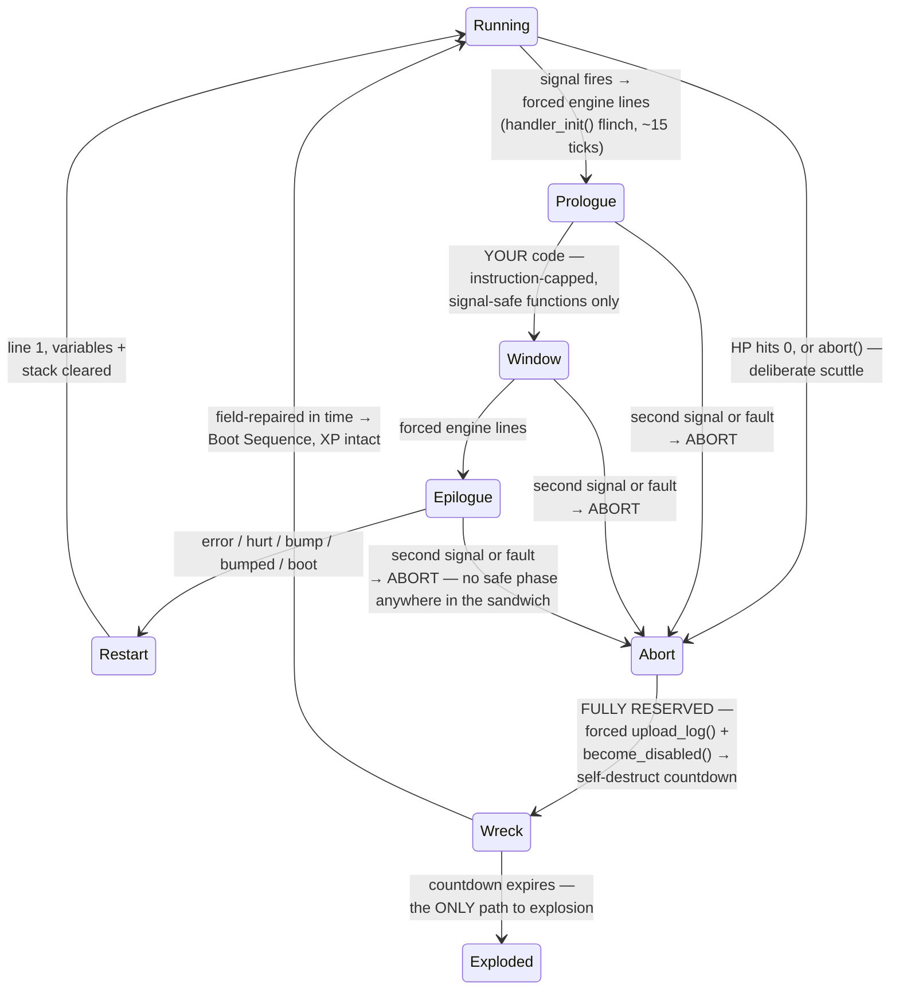

# Pyrite — The Unit Language

Pyrite is a **custom Python-like DSL** with an interpreter written in Rust. We control the whole stack, which buys us three things real Python can't cheaply give us:

1. **Line-at-a-time execution** metered in cycles (bots visibly "think").
2. **Construct gating** — `if`, loops, variables, `def` are *unlockable features*, enforced at parse time.
3. **Determinism** — required for lockstep multiplayer ([08-multiplayer.md](08-multiplayer.md)). No floats exposed to programs, no wall clock, no hash-order iteration.

## Execution Model

Every bot has a CPU that grants it a **cycle budget per simulation tick** (base: 1 cycle/tick, upgradable — see [06-progression.md](06-progression.md)). The interpreter advances a program one *operation* at a time; each operation has a cycle cost. When the budget is spent, the bot pauses mid-program until next tick.

```mermaid
sequenceDiagram
    participant Sim as Sim Tick
    participant CPU as Bot CPU
    participant VM as Pyrite VM
    participant World as World

    Sim->>CPU: grant N cycles
    loop while cycles remain
        CPU->>VM: step one operation
        VM-->>CPU: cost (unaffordable → pause & save up;<br/>forced charges → negative budget, debt)
        alt operation is an action (move, mine, ...)
            VM->>World: enqueue action
            Note over VM: action ops BLOCK until<br/>the action resolves
        end
    end
    Sim->>World: resolve all actions deterministically
```

Key rules:

- **Programs loop forever.** When the last line finishes, execution restarts at line 1 — and **variables survive the loop-around** (Q80): it's plain control flow, so `while True:` is *truly* redundant sugar. Only fault and handler restarts clear state — "re-derive your state" is the **crash-recovery** discipline, exactly where corrupted state matters. **Scope (Q80): `def` bodies are frame-local** — parameters and names first assigned inside a `def` live on the call stack (bounded by the stack-depth stat) and vanish on return, Python-style; top-level names are the program globals that persist across loop-arounds and count against variable slots.
- **Actions block.** `move_to(...)` costs cycles to *issue*, then the bot is busy until the action completes in the world. Thinking and acting don't overlap (until a later unlock — see "Coprocessor" in [06-progression.md](06-progression.md)).
- **Saving up.** An operation costing more than the remaining budget pauses the bot *in front of that operation*; grants accumulate tick by tick until it can pay, then it executes. A stock 1-cycle CPU takes four ticks to afford `closest(ore)` (cost 4) — the bot visibly sits there thinking, which is the point. Cheap ops batch: a 4-cycle CPU runs four cost-1 statements in one tick.
- **Cycle debt — engine-initiated calls charge as debt; window code pays normally (Q75).** Engine-*initiated* charges don't wait to be affordable: the trap cost on a fault, boot's forced `upload_log()`, and abort's forced sequence execute immediately and drive the budget **negative** — the logs always go home, never stalled on affordability; the bot repays the debt before its next operation. Everything written in a *window* — the error window's factory `upload_crash_dump()` included — is ordinary code costed normally, saving-up rules and all. A crash-looping bot pays its trap debt instantly, then visibly sits saving up for its own crash dump.
- **Units (Q56/Q75).** Budgets and debt are *stored* in **centicycles** (×100); `costs.ron` entries stay whole cycles, converted at charge time. Every example in this doc reads in whole cycles — only the storage is fine-grained (so percent effects like brownout's −50% bite a stock CPU).
- **No banking while blocked.** A bot waiting on an action or a channel (`move_to` in flight, blocked `receive`) **burns** its per-tick budget — waiting is what its CPU is doing. Accumulation only happens while *running*, stuck in front of an unaffordable op; you can't idle for a minute and then execute 600 cycles in one tick.
- **Bank cap — derived, not configured (Q75, completed by Q82).** The budget clamps to **`bank_cap`** after every grant, and `bank_cap` is *computed per bot per tile*: the most expensive **effective** op cost under the local overlay stack **including the bot's own per-bot overlays** (base tables give 25, the crash dump; inside Corruption it's 26; on an Overclock Field, 50). Every cost is bounded — payloads cap at `payload_cap`, `upload_log` caps at 25 — so freeze-forever in front of an unaffordable op is impossible *by construction*, honestly: the cap always reaches the priciest op this bot could pay wherever it stands. No load-time overlay rule needed; the inspector's budget meter rescales per biome. Saving up still can't overshoot the op you're waiting for.

## Errors & Signals

**Any** runtime failure is a fault: stack overflow, type error, unsupported operation, invalid argument, a failed action (`mine()` with no ore in range). There are **seven reserved handlers** — five with a player-editable window, plus two fully engine-reserved ones, `abort` and `recall`. (All numbers below are cost-table constants — tuning values, not commitments.)



### Reserved handler templates (redesign 2026-07-13)

Every signal owns a **reserved handler template** — an engine-shaped sandwich, the same three layers for all seven:

1. **Forced prologue** — engine lines no program can skip. For most signals that's `handler_init()`, the ~15-tick flinch (the universal time punishment for having a problem, and a real vulnerability window: a bot under sustained fire can be aborted mid-ritual). Boot's prologue is the forced `upload_log()`.
2. **Editable window** — your code, written as an `on <signal>:` block. Windows have a **max instruction count** (per-signal, see table; an *instruction* = one **statement** — nested calls don't multiply the count, Q80) and may only call function blocks flagged **`signal_safe`** — the C/C++ async-signal-safety idea: a single per-function property in the registry (see the function table), the same set for every window, enforced at parse/deploy time and greyed out in the editor.
3. **Forced epilogue** — engine lines that always end the handler. The extreme case is `abort`, which is *all* epilogue: `upload_log()` + `become_disabled()`, no player code at all — the logs always go home and every death exits through those calls, no exceptions.

The window ships with **factory contents** — the engine default, real replaceable Pyrite (error's factory window is `upload_crash_dump()`). Overwrite it, or delete it and leave the window empty; either way the forced lines still run. Factory code is inspectable and line-highlighted like any code — a crash-looping bot visibly *sits inside* its crash-dump call — and costed normally; unhandled crashes still chip the chassis (your handlers are armor; factory contents are not).

**Every handler has a fixed color and icon**, shown in the bot's **thought cloud** the moment it enters that state. The palette is global — the same seven colors/icons for every faction, deliberately distinct from program colors — so anyone with vision reads any bot's state at a glance (pillar 2: a wounded enemy *looks* wounded, a crash-looping enemy *looks* broken). Bot states, cleanly: **normal · boot · handler · searching · low-health · abort** (searching is the scouting stance's tell — a rooted surveyor is readable at a glance, pillar 2).

Programs store only window contents (byte-exact source, [07-architecture.md](07-architecture.md)); forced lines are engine-owned and rendered in the editor as locked phantom lines around your block — you always see the whole sandwich, you can only type in the middle.

### The seven handlers

First-pass table (colors/icons/caps are tuning values — the row *shapes* are the design). Windows may only call functions flagged **signal-safe** — a single per-function property, assigned in the function table below:

| Signal | Trigger | Cloud color · icon | Forced prologue | Window cap | Forced epilogue | Factory window |
|---|---|---|---|---|---|---|
| **error** | any runtime fault (trap cost ~5 to enter) | red · glitch/spark | `handler_init()` | ~8 instr | — (restart at line 1) | `upload_crash_dump()` — the guaranteed-debuggability floor; replace it with lean logging and beat the default |
| **hurt** | HP crosses below the `hurt_line` env variable (default 50%; edge-triggered, re-arms above) | amber · sparks/cross | `handler_init()` | ~6 instr | — (resume via restart) | *(empty — the flinch is the reaction)* |
| **bump** | this bot rammed an occupied tile | yellow · angry scribble | `handler_init()` | ~4 instr | — | `wait(35)` — + the 15-tick init = the rammer's 50-tick at-fault stun |
| **bumped** | something rammed this bot | grey · dizzy stars | `handler_init()` | ~4 instr | — | *(empty — the init flinch is the stagger)* |
| **abort** | HP hits 0, a deliberate `abort()` call, **or any second signal/fault while another template runs** (the double-handle) | black · skull | *(none)* | **0 instr — fully reserved** | **`upload_log()` + `become_disabled()`** — the logs *always* go home, then the wreck's self-destruct countdown starts; field-repair in time rescues the bot, XP intact ([02-agents.md](02-agents.md)) | — |
| **boot** | print, rescue, or recall re-coloring completes | white · power-on | `upload_log()` if the local buffer is non-empty | ~4 instr | — (main program from line 1) | *(empty)* |
| **recall** | printer rebalancing or colony over-capacity | purple · home arrow | suspend, walk home, transfer | **0 instr — fully reserved** | re-color → Boot (XP kept), or scrap (gone) | — |

Abort and recall are the degenerate cases that prove the model: the same template shape with a zero-size window — the two handlers you can't customize at all. A consequence worth savoring: **your black box is whatever you logged while alive.** There are no last words at death — `log()` discipline during normal operation *is* your forensics. Chassis damage from bumps lands regardless of handling (the window replaces the *stun*, not the dent).

Note the cap arithmetic: caps bound **worst-case instruction count, not wall time** — user-function calls count at their deploy-computed worst case (see Signal handlers), so the cap holds through any call chain. A blocking `move_to()` retreat is still *one instruction* that can run for a minute — hurt's small window allows a long limp to the Repair Bay. Time in a handler is priced by the double-handle rule, not by the cap.

### The double-handle rule: abort

**Co-arriving signals** at one op boundary (a ram whose damage also crosses the hurt line raises `bumped` + `hurt` together) resolve by **severity order — abort > recall > hurt > bumped > bump**: the highest enters its template, the rest are *dropped*, and co-arrival is **not** a double-handle (Q81 — the double-handle needs a template already *running*).

**While any handler template — prologue, window, or epilogue, including boot and the recall walk, factory contents included — is running, any event that would start another handler forces the bot into `abort` — in any combination. There is no safe phase in the sandwich: a signal landing in a forced epilogue aborts exactly like one landing in your window.** The bot doesn't get the new signal's handler and doesn't finish the old one: abort's fully reserved sequence runs — `upload_log()` then `become_disabled()` — and the bot drops into a wreck on its self-destruct countdown ([02-agents.md](02-agents.md)).

- Mid-hurt-handler retreat and damage takes you to 0? Straight to abort — the retreat is over, and the rescue race starts where the bot fell.
- A fault inside *any* handler — `error`, `hurt`, a factory window — is a double handle. Abort itself can't be double-handled: it contains no player code to fault, and signals arriving during it are absorbed — the forced sequence always finishes, the logs always go home.
- This is the counterweight to hurt's unlimited time: the longer your handler runs, the longer you're one event away from the bot dropping everything and dying where it stands. Short, bulletproof handlers are the craft.
- **Explosion is now exactly one thing: the self-destruct countdown expiring on an unrescued wreck.** No signal combination vaporizes a bot on the spot — every downed bot becomes a wreck, and every wreck is a rescue race.

### Black Boxes & the Boot Sequence

- **Every bot that reaches Destroyed — by any path — drops a Black Box** on its tile: a small persistent object containing the bot's local log ring buffer at the moment of destruction (plus id, position, tick, cause, and the bot's **env snapshot** — Q58). Anyone with vision can click it to read; a bot can `recover_black_box()` it to bank the contents permanently to its colony's cloud. Enemies can grab it too — battlefield intel is physical.
- **The stakes split cleanly: information always survives; XP is what's gambled.** Doubly guaranteed now — abort's forced `upload_log()` sends the story home *and* the wreck (or explosion) drops the physical Black Box for whoever reaches it. What's at risk is never the forensics, only the rescue race.
- **Rescued (and freshly printed) bots pass through a Boot Sequence** before running ([02-agents.md](02-agents.md)) — boot is itself a reserved handler template: prologue — if the local log buffer is non-empty, the engine **force-calls `upload_log()`** (the third forced-ordinary-function, after `upload_crash_dump` and `become_disabled`); then the optional **`on boot:` window** (set env variables, announce yourself — the bot's dotfile, see The Environment); then the program starts from line 1, fresh state. A rescued veteran automatically files its own incident report before getting back to work.
- **Boot is an interrupt context like any handler** — it participates in the double-handle rule. A signal arriving mid-boot (`hurt` from incoming fire, a fault in the forced upload) aborts the bot: the freshly rescued veteran drops straight back into a wreck, countdown running again. Consequence: **rescues must be timed.** Field-repairing a veteran while it's still under fire just re-downs it and burns the rescue window; secure the area first, or the boot itself is the enemy's second chance.

### Signal handlers

Top-level `on <signal>:` blocks — each signal's window is its own unlockable construct ([06-progression.md](06-progression.md)), independent of `def`. What you write is the *window*; the forced prologue/epilogue never appear in source:

```python
on error:               # window only — handler_init() runs before this, unskippable
    log(last_error())
    drop_cargo()
    upload_log()

on hurt:
    drop_cargo()
    move_to(closest(repair_bay).expect())

# there is no "on abort:" — abort is fully engine-reserved:
# forced upload_log() + become_disabled(). Your black box is
# whatever you logged while alive.
```

Rules (all deterministic):

- At most one block per signal per program. Signals are checked at operation boundaries.
- **Windows are capped and signal-safe** (see the table): exceeding a signal's instruction cap or calling a non-safe function there is a parse/deploy error, greyed out in the editor before you ever ship it.
- **User functions derive their safety.** A `def` is signal-safe iff everything it calls is signal-safe — builtins by their flag, other `def`s by this same rule — *and* its body is statically bounded: **no loops, no recursion** anywhere window-reachable. Boundedness is what makes "would this take too long?" a compile-time question: the deploy computes every def's **worst-case instruction count** (longest branch, calls expanded), and calling one from a window charges that worst case against the window's cap — you can't smuggle a long function through a short window. The editor badges each def with its derived safety and worst-case cost; an unsafe def names the offending call chain.
- The net shape (resolves Q51): **window-reachable code is straight-line + `if`, all the way down.** Loops belong to the main program; handlers decide and delegate.
- **Handler code is just code** — it pays per-op cycle costs and calls ordinary function blocks. Every constant here (trap cost, window caps, dump cost, `handler_init` ticks) is a cost-table entry, so biome overlays can tune them.
- **Forced calls are ordinary functions.** The engine's mandatory behaviors are implemented as force-calls of registry builtins: unhandled error → `upload_crash_dump()`; abort → `upload_log()` + `become_disabled()`. One code path, one cost model — engine policy "isn't even different" from player code. (`become_disabled` itself is **engine-only** — the player-facing scuttle verb is `abort()`, Q76.)
- Variables are **preserved while a handler runs** (so it can inspect state), then cleared on restart.

### Logging

- `log(value, level=info)` — append to the bot's local ring buffer (cost 1) at a **severity level**: `trace`, `debug`, `info`, `warn`, `error` — five pre-bound constants, same convention as the kind constants (ordinary shadowable names). `log(msg, level=error)` for the loud ones; bare `log(value)` stays `info`. **Buffer size is a hardware stat**: base 8 entries, grown by Memory-bank modules ([06-progression.md](06-progression.md)); each entry stores its level.
- `upload_log()` — transmit the buffer to **the cloud**: the colony's printers (cost 5 + size), levels preserved. **Printers always accept log traffic** — no extra structure required, no capacity limit; if you have a printer (and a colony without one is already dying), you have telemetry. Viewable in any printer's inspector, **color-coded by level** (error red, warn amber, info neutral, debug/trace dimmed) and filterable — a colony's cloud reads like a real log aggregator. Black Boxes show levels the same way.
- `upload_crash_dump()` — the expensive one (~25): uploads a full structured debug report — **bot ID, position, inventory/cargo, error reason, faulting line, tick** — filed at `error` level. This is what the engine force-calls on unhandled errors; players can also call it themselves anywhere (it's just a function).

Persistent *telemetry* is player-built infrastructure — a colony with good logs is one someone programmed. But *crash* reporting has a guaranteed floor: unhandled errors always dump, so "why is that bot blinking?" always has an answer in the Archive. Logs are as inspectable as everything else (transparency pillar): allies — and in PvP, anyone who `analyze()`s your wreck — can read them.

### Consequences we *want*

- **The forced crash dump is a tax on branchless code.** A Tier-0 program that blindly calls `mine()` faults when the vein is empty and pays ~25 cycles for a dump it didn't ask for — but that dump is also how a new player learns *why* the bot is stuck. The punishment is the tutorial.
- **Handlers are the graduation.** Factory dump (~25) → your own window (~5 trap + lean code of your choice): the error system itself has a skill curve. The instruction caps keep windows as *recovery*, not a second program — you can't move your main loop into a handler.
- **Hurt's freedom is priced in risk, not cycles.** The cap bounds code length, not time — a one-instruction blocking `move_to` retreat can run for a minute, and every tick of it is another tick you can be double-handled. A slow limp to the Repair Bay is legal; it's also a bet.
- **Rescue denial is combat depth.** Every downed bot becomes a wreck, so denial is now *physical*: double-handle a retreating veteran to down it early and deep in your territory, then guard the wreck until the countdown expires — or `salvage()` it first. You always get the story (forced logs + Black Box); you don't always get the bot.
- **Fault loops are legal, visible — and lethal.** Every *unhandled* fault also chips the chassis (tuning); a program broken at line 1 crash-loops itself to death, wreck and all. Handlers are literal armor: handled faults cost no health. Debug it or bury it.
- Reading an **unset variable** is a fault (variables don't survive restarts), so state must be re-derived each pass.

## Cycle Costs (base table — moddable per map/biome)

The cost table is **data, not code** (`costs.ron`, see [07-architecture.md](07-architecture.md)). Maps and biomes ship **overlays** that override any entry, so terrain can stress *program designs*, not just stats: a biome where loop overhead triples punishes iteration-heavy code; one where `send` is cheap invites swarm coordination. Corruption's cycle tax ([05-terrain.md](05-terrain.md)) is just the first shipped overlay.

Base values:

| Operation | Cost (cycles) | Notes |
|---|---|---|
| Simple statement / no-op line | 1 | |
| Built-in function call | full charge | **Function-table entries are full charges** (Q80) — the call statement's overhead is folded into the listed number: one figure per function, and every quoted cost in prose is the real price (`closest` is 4, the dump is 25, Corruption's max is 26) |
| Variable read | 0 | Reads are free; storage is the cost. (Not an *operation* — the Q75 ≥1 floor governs executable ops; sub-expression reads sit inside them) |
| Variable assignment | 1 | |
| Arithmetic op (`+ - * // %`) | 1 per operator | |
| Comparison (`== < >` etc.) | 1 | |
| `if` / `elif` evaluation | 1 + condition cost | |
| Loop iteration overhead | 1 per iteration | The "loop tax" — rewards flat code where possible |
| User function call (`def`) | 2 + body | Call overhead; inlining is a real optimization |
| List index / append | 1 | |
| `send()` / `try_send()` | 3 + payload size | Communication is expensive on purpose |
| `broadcast()` / `try_broadcast()` | 5 + payload size | Reaching everyone costs more |
| `receive()` issue | 2, then blocks | Blocking wait; timeout expiry is a fault |
| `match` | 1 + 1 per arm checked | Arms checked top-to-bottom; destructuring bind is free |
| Enum construction | 1 | `Order.Mine(target)` |
| **`upload_crash_dump()`** | 25 | Force-called on unhandled errors; also player-callable |
| **Trap cost** | 5 | Paid to enter the `error` handler on a *fault* (signal-raised entries — hurt/bump/bumped — skip it) |
| **Window caps** | per-signal | Max instructions in each handler's editable window (see the reserved-handler table). Caps replace the old grace-window/overtime tax: they bound code length at deploy time; handler *time* is priced by double-handle risk |
| **`bank_cap`** | derived | Max banked cycle budget — computed per tile as the most expensive *effective* op cost under the local overlay stack (25 on base tables; Q75). Clamped after each grant (see Execution Model) |

Design intent: **cycle costs are the balance dial.** Complex behavior should be *possible* early but *slow*, so hardware upgrades and code golf both feel rewarding.

## Syntax by Tier

Constructs are unlocked in tiers ([06-progression.md](06-progression.md) owns the tree; this section defines what each construct *is*).

### Tier 0 — Straight-line programs (game start)

Only sequential calls to unlocked function blocks. No state, no branching.

```python
move_to(closest(ore).expect())
mine()
move_to(closest(depot).expect())
deposit()
# program loops back to line 1
```

### Tier 1 — Variables & arithmetic

```python
target = closest(ore).expect()
move_to(target)
mine()
```

### Tier 2 — Branching (`if` / `elif` / `else`)

```python
if cargo_full():
    move_to(closest(depot).expect())
    deposit()
else:
    mine()
```

### Tier 3 — Loops (`while`, `break`, `continue`)

Condition loops and loop control. (`for x in container` arrives with containers in Tier 5.)

```python
while not cargo_full():
    mine()
```

`while True:` is legal but redundant — programs already loop forever implicitly. The implicit loop stays because Tier 0–2 programs need it; `while True:` exists so Python intuition doesn't fault.

### Tier 4 — User functions (`def`, `return`)

The big one: reusable subroutines, shareable across your colony as a **program library**.

**Recursion is allowed** — bounded by the bot's **call stack cap** (base **4 frames**, +4 per Stack extension bought at the Upgrade Station, see [06-progression.md](06-progression.md)). Exceeding the cap is a stack-overflow fault: penalty + restart, like every other error. Deep recursion on stock hardware is a self-inflicted fault loop; buying stack is what makes recursive style viable.

`def` parameters follow the builtin convention: **optional parameters last, with Python-style defaults** — `def haul_to(target, drop=1):` — passed positionally or by keyword at the call site.

Every `def` also gets a **derived signal-safety** at deploy (see Signal handlers): safe iff it only calls safe things and contains no loops or recursion — safe defs are callable from handler windows at their computed worst-case instruction cost. Writing your colony's library so the recovery verbs stay signal-safe is real API design.

**Docstrings, Python-style (DECIDED)** — a leading `"""triple-quoted"""` string in a `def` body is the function's documentation: captured at parse, **stripped from the runtime body** (free — like import lines, it doesn't exist at runtime), and surfaced by the editor (hovering the function — in the file viewer or in any code window — shows it, exactly like builtin hover docs). Triple-quoted strings may span lines and take their content raw (no escapes, literal newlines); elsewhere they're ordinary string values. A docstring alone is a legal (documented, do-nothing) body. The starter `hauling` module ships with one, so the idiom is taught by example.

```python
def haul_home():
    """Take the cargo home: nearest depot, then deposit."""
    move_to(closest(depot).expect())
    deposit()
```

### Tier 5 — Collections & iteration (lists, dicts, `for x in xs`)

Python-style containers and iteration (no C-style index loops; `range(n)` / `range(a, b)` is a container builtin here, capped by the `range_cap` cost entry). `break`/`continue` work in `for` exactly as in `while`.

- **Lists**: `[a, b]` literals, `xs[i]` (negative indices count from the end; out of range faults), `xs[i] = v`, `xs.append(v)`, `x in xs`, `len(xs)`.
- **Dicts**: `{k: v}` literals; keys are int, string, or entity — **entity keys are the headline**: per-target state like `seen[enemy] = tick`. `d[k]` faults on a missing key (Python's KeyError); `d.get(k)` is the fault-free form, giving `Option.Some(v)` / `Option.None`. `d[k] = v` inserts or overwrites, `d.remove(k)` deletes (returning the Option), `k in d` tests membership, `d.keys()` / `d.values()` give lists.
- **Dict iteration order is sorted key order, always** — never insertion order (deterministic by construction, CLAUDE.md rule 3). `for k in d:` walks keys sorted; so do `.keys()` / `.values()`.
- `in` also works on strings (substring test). Containers are **values**, not references — see Types.

```python
threats = scan_enemies()
seen = {}
for t in threats:
    seen[t] = t.distance          # entity-keyed dict
    if t.distance < 10:
        alert(t)
if len(seen) > 3:
    retreat()
```

### Tier 6 — Enums & `match`

Rust-style sum types in Python clothing: variants may carry associated data, and `match` destructures them. Arms are checked top-to-bottom, first match wins.

```python
enum Order:
    Idle
    Mine(target)
    Guard(post, radius)

match current_order:
    case Order.Mine(target):
        move_to(target)
        mine()
    case Order.Guard(post, radius):
        move_to(post)
    case Order.Idle:
        wander()
```

Enum values are first-class: storable in variables and lists — and **sendable on channels** (Tier 7), which is the real payoff: colonies develop *typed command protocols*.

### Tier 7 — Channels (inter-bot messaging)

**Blocking channels.** Any value — int, entity, list, enum — can travel a named channel. The API is a 2×2: **delivery** (one receiver vs. everyone) × **send mode** (block until heard vs. fire-and-forget):

| | Blocks until delivered | Fire-and-forget |
|---|---|---|
| **One receiver** | `send(ch, val, timeout=None)` — rendezvous handoff to exactly one receiver | `try_send(ch, val)` → bool — delivers to one blocked receiver, else the message is **lost** |
| **All receivers** | `broadcast(ch, val, timeout=None)` — blocks until ≥1 receiver, then all blocked receivers get a copy | `try_broadcast(ch, val)` → bool — copies to all currently blocked, else **lost** |

Receive side: `receive(channel)` **blocks** until a message arrives (`timeout=None`, the default, means forever); `receive(channel, timeout=ticks)` blocks up to the timeout, then **faults** (timeouts are ordinary faults — write an `on error:` window); `try_receive(channel)` returns an `Option` — `Option.Some(v)` or `None` — for non-blocking polls. Blocking sends time out the same way: fault, handle it or don't.

```python
on error:
    upload_log()        # a timeout landed here

order = receive("orders", timeout=100)   # block up to 100 ticks
match order:
    case Order.Mine(target):
        move_to(target)
        mine()
```

Semantics (deterministic):

- **No queues, no mailboxes**: messages exist only in the instant of delivery. Fire-and-forget with nobody blocked = message gone. Persistent listening posts are something you build out of bots.
- **One-receiver selection**: the longest-blocked receiver on the channel wins; ties break by lowest entity ID.
- **Blocking consumes cycles.** A blocked bot (send *or* receive) executes nothing else, and its per-tick cycle budget burns while it waits — waiting *is* what its CPU is doing. No banking cycles, no free listening posts: a bot blocked for 100 ticks spent 100 ticks of compute on patience. Handlers still fire while blocked — with the usual double-handle stakes.
- Channels are names (strings); the namespace is per-faction but **allies can be granted channels** (shared-library-style), enabling cross-colony coordination.
- **Foreign channels require a comm key.** Knowing a channel's *name* (from decrypted code — player or Feral) is not enough — every faction's traffic is keyed. Extract a key by **`analyze()`-ing any faction's wreck** (the intel verb, Q76 — one rule for keys); with key + name you can `receive` (eavesdrop / steal) and `send` (spoof) on their channels. Reading is reconnaissance; interacting takes fieldwork.
- Corruption jams channel traffic in/out ([05-terrain.md](05-terrain.md)) — a blocking `send` from inside Corruption faults on timeout like anything else. **Cloud telemetry is exempt** (Q76): the jam blocks the channel verbs, never `upload_log()`/crash dumps — the logs always go home.

## Program Colors

A colony's programs live in **colored program slots**, and every slot is embodied in a physical **Printer** (Fabricator): one printer = one color.

You start with **one working printer: Green**. A **ruined Red printer** stands in your base from tick zero — visibly broken, repairable for Data (tuning; "enough Data or something" is the spec) — making your second color the natural first colony milestone rather than a given. Printers beyond those two are gated by **controlled Nests** ([04-enemies.md](04-enemies.md)) on a quadratic curve — not 1:1: the 3rd color needs 1 controlled nest, the 4th needs 3 total, then 6, 10, … (triangular; tuning constants). The named palette runs through nine (Green, Red, Blue, Yellow, Cyan, Magenta, Orange, Purple, White) and the count is **uncapped** beyond that (procedurally patterned tints). A nine-color colony is an endgame colony that has conquered a lot of map.

- Every bot is deployed with exactly one color and is **visibly tinted** by it — friend and foe alike can see at a glance *which* program a bot runs (not what's in it).
- Redeploying a color pushes the new source to **all bots of that color** (taking effect at each bot's next loop boundary). Each deploy creates a new **version**.
- **Secrecy is per-color attrition** ([08-multiplayer.md](08-multiplayer.md)): each enemy salvage of a bot grants +N% (default 5%) *permanent* decryption of that color — the percentage survives redeploys and only ever grows. Some kills, some leaks; ~20 kills, full read.
- Slot scarcity is a design pressure priced in *territory*, not a hard cap: early on, two programs must cover your whole colony, so generality vs. specialization is a real decision — and so is **risk assignment**. Red on 30 disposable miners will bleed toward fully-readable; Blue on one escorted veteran might stay at 5% all match. Conquering a nest for a new slot also buys a **fresh secret** (new colors start at 0% enemy decryption) — late-game colonies can rotate sensitive logic onto virgin colors, at ever-steeper territorial cost.
- **Printers set fleet size and fleet composition separately.** Every printer adds a fixed amount to the colony's **fleet cap** (per-printer contribution, tuning — `printers.ron`): build more printers, support more bots. *Which* bots wear which color is the target-share system below.

### Target shares — who wears which color

Each printer **after the first** carries two player-set dials:

- a **target** — an absolute bot count, *or* a percentage **of the fleet cap** (rounded down; Q64: of the *cap*, never the live fleet, so targets are stable numbers that don't reshuffle every time a bot dies);
- a **selection key** — **any stat can be keyed**: every row of the stat sheet and every ledger number (XP tracks, total XP — [02-agents.md](02-agents.md)) is a legal sort, with a per-printer **direction toggle** (Q64): best-first *or* worst-first by the stat's improvement direction. "Red: target 20, keyed on highest Combat XP" keeps your twenty best fighters Red; a cheap-labor color keys worst-first on total XP and staffs itself with rookies. No composite keys in v1 — key + entity-ID tiebreak is the whole sort.

The **first printer (Green) is the remainder bucket** — no target, no key, not editable. It holds every bot no other printer claims, so shares always sum exactly to the fleet and every bot always has a color. **A printer is born with its color slot and an empty program file in the editor** (Q85): targets are settable immediately, and a bot re-colored onto an empty program simply idles — visibly — until you write something.

Editing any printer's rules also has the player set the **priority order across all printers** (the remainder printer is implicitly last). The **re-allocation** runs on two triggers: any rule edit, and a player-set **check interval** — every X ticks (default 1000, tuning) the printers recompute which bots they own. It resolves deterministically in the economy phase: going down the priority list, each printer sorts the fleet by its key (ties break by entity ID) and claims up to its target; an oversubscribed target simply clamps to whatever bots remain; the first printer takes the rest. Every bot whose assigned color differs from its current one gets the **recall** interrupt (below) — dispatched like any other signal (dispatch rules) — and that's that: between checks nothing reshuffles, so live XP gain churns the fleet at most once per interval, on a clock the player owns. Since recall is an interrupt context (double-handle all the way home), the check interval is itself a policy dial: a colony fighting on its frontier wants a long one. While the fleet is under cap, prints happen wherever the allocation is short: a dialed printer short of its target prints its own color; once all targets are met, the first printer prints. (Q64 answered: direction toggle per key, % of cap, no composite keys in v1.)

**A color's code sets its hardware bar** (answers Q52). Deploying a color computes its artifact's **program-memory and variable-slot requirements**; from then on its printer claims only bots whose bought hardware fits — an implicit filter that runs *before* the selection key. **A deploy is a rule edit, scoped to its color** (refined, Q73): it triggers an immediate re-allocation of *that color only* — members that no longer fit drop to the remainder, and an under-target color immediately claims eligible unclaimed bots by its key. No global reshuffle (the fleet-wide pass stays on the check interval and printer-rule edits, which set global priorities): hotfixing one program never churns the rest of the fleet, so "iterate on code" stays cheap. Pushing a program some current members can't hold drops them to the remainder right then — no version skew, no blocked deploys. The editor **warns and proceeds** ("this deploy exceeds 4 members' memory" — the same deploy-check UX as window caps), so shrinking your own fleet with bloated code is informed, visible, and legal. The flip side is a hard constraint: **the remainder color must fit stock hardware** — its artifact is capped at the universal base (32 lines, 8 names), because the remainder must be able to receive *any* bot in the colony. Your fallback program is humble by law; elite colors demand upgraded machines — the Upgrade Station is their eligibility gate. Quirks never enter the bar: it reads bought hardware only ([09-quirks.md](09-quirks.md) design rule 6).

### The recall interrupt

`recall` is the engine-owned signal — the only one **players cannot write a handler for**. Its handler is engine-fixed: suspend the program, path home to the printer, get transported to the destination printer, re-color, and pass through the Boot Sequence. It fires when:

1. **Rebalancing** — the target-share allocation (above) assigns a bot a new color: it is recalled and re-colored at the claiming printer, **keeping all XP** (XP tracks live on the bot, not the color).
2. **Over-capacity** — the colony exceeds what it can sustain ([02-agents.md](02-agents.md)): the lowest-total-XP bot **of the fleet** (ghosts exempt, Q73) is recalled **for scrap** — a partial refund of its **build receipt**. Scrap is not a death: the printer dismantles the bot and ingests its logs and env directly (the printer *is* the cloud) — no black box needed, nothing lost.

Recall is an interrupt context like any handler or boot: **double-handle applies for the entire walk home.** A recalled bot crossing a battlefield can be dropped into a wreck by a single hurt trigger — so *when* you turn the population dials is a tactical decision, not bookkeeping.

**Dispatch rules (Q73)** — how recall enters and coexists with everything else:

- **Engine-fired recalls wait politely (Q85).** The two recall triggers the *player didn't* time — deploy-triggered over-bar drops and over-capacity scrap — never enter mid-template: deploy drops defer to the next check ("iterate on code stays cheap" holds), and scrap re-selects the next-lowest bot if its target is busy. Player-fired triggers (rule edits, the check interval) dispatch like signals — your clock, your risk.
- **Recall dispatches like any other signal** (revised 2026-07-14, superseding the short-lived defer-until-Running rule). It interrupts a `Running` bot *and* a `Blocked` one (the pending action or blocked channel op is canceled — ordinary handlers already fire while blocked, and so does recall; a rooted scout or an eternal listener is recallable like anyone else). And like every other signal, **landing while any template phase runs is a double-handle → abort**. Your bookkeeping is real: a check interval that fires while bots are mid-handler can wreck them — *turn the dials when your bots are somewhere safe* is literal, and the check clock is a genuinely tactical dial.
- **Re-targets are engine-side.** The allocation never re-signals a bot that is already recalling — it just updates the walking bot's destination (the handler is engine-owned code; changing where it walks is not a second signal). If the new assignment matches the bot's *current* color, the recall cancels and the program restarts at line 1 in place — no boot, since no re-coloring happened.
- **Engine walks don't bump the mover — ice included.** A recalled bot sliding on Ice into an occupied tile takes the chassis dent and ends the slide, but no `bump` fires on it (the standing victim is `bumped` and staggered as usual); the walk re-plans and continues. One rule, no exceptions: the mover on an engine walk never receives collision signals.
- **Above-stock-bar printers don't print.** A color whose artifact exceeds stock hardware has its print rule suppressed — printing a rookie its own bar rejects is pointless — and the deploy warning says so ("this color can no longer print; it fills only by claiming upgraded bots"). Its share of fleet growth prints at the remainder instead; elite colors staff themselves by claiming Upgrade-Station graduates. The station is the recruiter.
- **A reprint is a fresh print.** The "reprint queue" is a convenience counter — one click queues a replacement print — but the bot it produces is a new stock machine whose color comes from the allocation like anyone else's. Nothing per-bot is preserved: XP gone, quirks re-rolled (latent), hardware reset.
- **Ghosts are exempt from scrap.** Over-capacity scrap picks the lowest-total-XP bot *of the fleet*; ghost machines (no recalls, by rule) are never selected. A ghost fleet's upkeep drain is therefore a burden you carry on purpose — relieved only by attrition or retaking the nest. That's the price of the investment.
- **Tool mismatch warns, never filters.** The hardware bar reads deploy-validity stats only (memory, variables). If a color's program calls tool-gated functions its claimed bots don't carry, the printer-rules UI warns (same idiom as the deploy memory warning) — but the allocation proceeds: tools are swappable at the station, and a faulting bot is a visible, diagnosable problem (red cloud), not a hidden one.
- **Dormant colors are pinned.** Module edits re-version every *active* color that contains the edited function; a dormant color keeps its frozen artifact, so the enemy's decrypted intel on it stays *permanently accurate*, as promised. Reactivation (nest retaken, ghosts uploaded) immediately re-versions the color against current module state — a deploy-equivalent, with the usual scoped re-allocation and loop-boundary hot-swap.

### Dormant printers & ghost fleets

If the controlled nest backing a printer is lost ([04-enemies.md](04-enemies.md)), the printer goes **dormant**:

- Its **fleet-cap contribution is withdrawn** and its target is voided; it prints nothing and reprints nothing. If the shrunken cap leaves the fleet over cap, nothing is scrapped — printing simply stops until attrition brings the fleet back under (over-*capacity* scrap remains an economy event only, [02-agents.md](02-agents.md)).
- **No hotfixes**: the color's code is frozen at its last deployed version — you cannot redeploy a dormant color.
- Its bots become **ghost machines** (Q65 answered) — no longer owned by the fleet: excluded from the target-share allocation entirely (no key claims, no remainder auto-absorb, no recalls — nobody force-marches them home through whatever killed their nest). They keep running their frozen code, earn XP, take no reinforcements, and die by attrition. They **still draw upkeep** — the colony's grid is the leash, so a lost nest never mints a free standing army.
- **Retake the nest and its ghosts are uploaded again**: the printer reactivates (cap contribution and target restored, color unfrozen), its surviving ghosts rejoin the fleet and the allocation, and the next redeploy reaches them at their loop boundaries like any other member. A ghost fleet held alive until the counterattack is veterans recovered for free.

Intel wrinkle: a ghost fleet can still be salvaged toward its color's decryption — and since the code can never be rewritten while dormant, whatever the enemy has learned about a dormant color is *permanently accurate*.

## Modules & the Program Library

Tier 4 promises a colony **program library**; modules are its formalization — Python-shaped, like everything else. (Q61 and Q62 both answered — decided throughout.)

- **A module is a named source file of reusable code**: `def`s and `enum` declarations only, no top-level action statements — a module that *did* things on import would be a program. Stored byte-exact, like all source.
- **`import haul` / `from haul import go_home` (DECIDED — Python's two forms).** `import haul` makes qualified calls (`haul.go_home()`) available; `from haul import go_home` binds the named functions bare (comma lists allowed). Imports are top-level declarations, per program window. Getting it wrong is a **deploy error with a pointed message**: unknown module, unknown function in a `from` list, a qualified call on a module never `import`ed, and alias/def name collisions all fail the deploy. **`import` is its own construct, unlocked right after `def`** (Q61) — its own Template Cache find; you learn to write functions before you learn to share them. A call to an imported function costs exactly what any `def` call costs (2 + body). The `import` line itself is free at runtime because it doesn't exist at runtime:
- **Imports resolve at deploy, never at runtime.** Deploying a color assembles its **artifact**: the program, its handler windows, and every module function **transitively called** by them — tree-shaken at function granularity, so dead library code never ships (import cycles are a deploy error). On the wire the artifact is one self-contained source: imported library code rides in editor-generated `module <name>:` blocks ahead of the program (players never write these — the same generated-sandwich idiom as the unified signal handler), so the parser validates every import with no registry in sight. (The sandbox currently ships whole imported modules — function-granularity tree-shaking is still open under Q61.) The version hash covers exactly the artifact ([07-architecture.md](07-architecture.md)). No dynamic loading, no import faults mid-run: determinism by construction.
- **Editing a module re-versions every *active* color whose artifact contains a changed function** (dormant colors are pinned — Q73 dispatch rules; reactivation re-versions them immediately). Each such color gets a new version and hot-swaps at each bot's next loop boundary, exactly as if you'd edited its program directly; colors that import the module but never call the edited function are untouched (tree-shaking again). One bugfix in `haul` patches the whole colony; one bug in `haul` breaks it colony-wide. Shared code is shared blast radius — the library is powerful *because* it's dangerous.
- **Handlers reuse modules like anything else**: a window may call an imported function if it's `signal_safe` (`on hurt: retreat()` with `from combat import retreat`), subject to the window's instruction cap as always. Handler *windows themselves* belong to programs, not modules — one block per signal per program, so modules export functions and enums, never `on <signal>:` blocks.
- **Secrecy: what deploys is what leaks (DECIDED — answers Q62).** A color's decryption surface is its deployed artifact — the program, its handler windows, and the module functions they actually call. **Never-deployed functions are secrets forever.** A module function deployed by several colors rides in *each* color's artifact under each color's reveal mask ([08-multiplayer.md](08-multiplayer.md)) — and since different masks over identical text reveal different characters, cross-closure reading composes exactly like cross-version reading: shared code effectively leaks at the *sum of its exposures*. Hot libraries become public knowledge fastest; forking a private variant of a popular library is real opsec.
- **The tree-shaken closure is the memory charge** (Q61, decided): deployed module functions count against per-bot **program memory** — code is code — but only what the artifact actually calls; **dead library code never hurts the bots** (tree-shaking exempts it by construction). A fat function you *do* call bloats every artifact that calls it, and Q52's hardware bar absorbs that gracefully: the color's bar rises, the editor warns at deploy, over-bar members drop to the remainder.
- **Allies can be granted modules** (Q61, decided) — the same grant mechanism as channels: shared libraries across colonies, the co-op scaffolding [08-multiplayer.md](08-multiplayer.md) gestures at. The leak rule already covers it: shared module text leaks at the sum of its deployers' exposures.

## Types

Deliberately small: `int` (i64), `bool`, `string` (labels/channels only, no manipulation initially), `entity` (opaque handle to a world object), `list`, `dict` (keys: int / string / entity), and `enum` values (user-declared sum types with associated data, Tier 6). **No floats** — all world math is fixed-point internally and exposed to Pyrite as scaled integers (e.g. positions in millitiles).

**Containers are values, not references (DECIDED).** Assignment and argument passing copy; there is no aliasing. Mutation is always rooted at a variable — `xs.append(v)`, `d[k] = v` — and inside a `def` those writes hit the variable where it lives, Python-consistent (`xs[0] = 1` in a function mutates the outer list; only `xs = ...` makes a local). Mutating a temporary (`[1,2].append(3)`) is a fault, not a silent no-op. Simpler to reason about, deterministic by construction, and it keeps snapshots/state comparison trivial.

Three builtin conventions ride on these types:

- **Kind constants** — pre-bound global constants naming entity kinds, and **every entity kind in the registry gets one** (Q79): the raws and `ore`; every structure (`depot`, `smelter`, `foundry`, `generator`, `geothermal`, `pump`, `archive`, `repair_bay`, `upgrade_station`, `sentry`, `lantern`, `request_box`, `printer`); battlefield objects (`wreck`, `black_box`, `blueprint`, `cache`, `nest`); and `enemy` / `ally` for bots. **Feral programs additionally run with nest-bound constants** (`nest`, `patrol_route`) supplied at print by their nest — the same mechanism, faction-scoped; player programs never get user bindings (Q59). The generic queries take them as arguments: `closest(ore)`, `exists(blueprint)`. Assignments may shadow them (they're ordinary names — unlike the reserved `None`/`True`/`False`), and they survive post-fault restarts. **Every raw resource has its own constant** (Q69): `iron`, `coal`, `copper`, `tin`, `silver`, `gold`, `crystal`, `wood`, `stone`, `sand` — and **`ore` is the family constant**, matching any *discovered* mineral vein or seam (Iron, Coal, Copper, Tin, Silver, Gold, and Crystal; the tier-0 surface kinds answer only their own names). `closest(ore)` in the starter program still means "nearest thing to mine"; `closest(silver)` is what a specialist writes. Queries return nodes regardless of the bot's tool tier — sensing isn't harvesting; an under-tiered `mine()` faults as usual.
- **`Option` and `None`** — Pyrite has **no null**; absence is an enum, exactly as in Rust: the builtin `Option.Some(v)` / `Option.None`, with **`None`** as sugar for `Option.None`. `None`, `True`, and `False` are **reserved words** (Python-style): assigning to them is a parse error — unlike the kind and level constants, which stay ordinary shadowable names. Optional-typed parameters accept the value or `None` — `send(ch, val, timeout=None)` means "no timeout." `.expect()` works on it (`Some` unwraps, `None` faults), `match` destructures it like any enum, and a bare `case None:` is accepted as sugar for `case Option.None:`.
- **`Result`** — a builtin enum for fallible queries: `Result.Ok(entity)` / `Result.Err(msg)`. Unwrap with `.expect()` (returns the entity, or faults with the carried message) or handle the miss fault-free with `match`:

```python
match closest(ore):
    case Result.Ok(t):
        move_to(t)
    case Result.Err(msg):
        wait(10)
```

## The Environment (env variables)

Every bot carries a small **environment**: a `key → int` store of *policy* parameters the engine consults. It's the settable half of a bot's identity — the stat sheet ([02-agents.md](02-agents.md)) is what a bot *is*; the environment is what a bot has been *told*.

- **Keys are engine-defined and pre-bound** (same convention as kind and level constants): a fixed, enumerable set with defaults and bounded ranges. `getenv(key)` never faults — unset means default.
- **Env lives on the bot, exactly like XP**: it survives restarts, faults, redeploys, and recall re-colorings; it dies with the bot. This is deliberately *not* general persistent storage — ordinary variables still clear on every restart ("re-derive your state"); env is a settings panel with engine-defined slots. **User-defined keys are out for v1** (Q59, decided): they'd be genuine persistent bot memory, undermining the fault-restart guarantee (no corrupted state survives) and the re-derive discipline. Maybe later — only with playtest evidence that the discipline reads as tedium rather than craft.
- **`setenv` / `getenv` are ordinary costed builtins**, and both are `signal_safe` — a hurt handler may lower its own `hurt_line` mid-retreat so the signal doesn't re-arm and re-fire on the limp home.
- **The `on boot:` window is your bot's dotfile.** Configuration at wake-up is the idiomatic pattern: print → boot window sets env → main program runs. Different colors can ship different profiles on identical chassis.
- **Env is private while alive — it leaks three ways** (answers Q58). No builtin or UI reads a foreign bot's live env. Instead: **behavior** — you infer a `hurt_line` by watching when the bot retreats, earned counterplay rather than a stat screen; **source** — the dotfile is code, so a color's configured values leak with its decryption % like every other line; **death** — the Black Box includes an **env snapshot**, so exact runtime values (mid-run `setenv`s, quirk clamps included) are read on murder, the game's oldest intel rule. Free live reading would make configuring bots self-defeating — `hurt_line` is precisely the number an attacker wants.

Well-known keys (v1 set — grows like the function catalog):

| Key | Default | Range | Engine behavior it parameterizes |
|---|---|---|---|
| `hurt_line` | 50 | 1–99 | The HP percentage where the `hurt` signal fires (edge-triggered; re-arms at the same line). Read live at each evaluation — moving it mid-flight is legal. Decoupled from the **Damaged** state penalty, which stays fixed at 50% ([02-agents.md](02-agents.md)) |
| `log_min_level` | `trace` | `trace`–`error` | Minimum severity actually recorded to the ring buffer — lower entries are discarded before they consume a slot (the call still costs 1). A veteran runs quiet at `warn`; a bot under diagnosis runs at `trace` |

Design rule: **env keys are policy, never stats.** A key may change *when* engine behaviors fire (thresholds, filters), never how strong, fast, or far-sensing the bot is — capability lives on the stat sheet and is paid for in hardware, XP, or quirks.

## Built-in Function Blocks (starter set)

The full catalog and unlock order live in [06-progression.md](06-progression.md). Signature convention: **optional parameters come last and are Python-style keyword defaults** — `log(msg, level=warn)`, `receive(ch, timeout=100)`; omitted means the default (`timeout=None` = block forever; `None` is the builtin `Option.None` — see Types). **Every function block carries a `signal_safe` property** — a single flag, part of its registry entry ([07-architecture.md](07-architecture.md)) — and handler windows may only call safe functions: builtins by this flag, user `def`s by derivation (safe iff they only call safe things and are loop/recursion-free — see Signal handlers). The rough rule: *sensing, logging, retreating, and giving up are safe; work and combat are not.* First-pass assignments below (tuning — flags live in data with the costs):

| Function | Cost | Signal-safe | Effect |
|---|---|---|---|
| `move_to(entity)` | 2 + travel | **yes** | Pathfind and move; blocks until arrival or failure. **Tracks moving targets** (re-paths — there is no `chase()`; `move_to` *is* the chase). Safe because retreat *is* the canonical handler |
| `mine()` | 2 + action | no | Extract from resource node in range |
| `deposit()` | 1 + action | no | Unload cargo into any adjacent **accepting structure** (Q79): Depot storage, refinery input, Generator intake, Station coolant tank, Request Box — and a Feral's nest is *their* depot |
| `withdraw(kind)` | 2 + action | no | **The take verb** (Q79): load `kind` from any adjacent holder — Depot stock, refinery output buffer, Pump tank, dropped cargo — up to cargo capacity. Start kit |
| `study()` | 2 + action | no | **The learning verb** (Q79): adjacent to a Template Cache, root for ~10 s (tuning); completing it teaches the colony that Cache's function block. Start kit — the unlock verb can't be locked |
| `cargo_count(kind)` | 1 | **yes** | How many units of `kind` in cargo (0 if none) — typed-manifest routing |
| `wander()` | 2 + action | no | A seeded random walk leg (stream `rng.wander`) — the dumb explorer. Start kit |
| `explore()` | 2 + action | no | The smart explorer (Q79): picks a random **currently-fogged** tile within reach (stream `rng.explore`), walks there, and drops into the scouting stance; resolves when the survey completes |
| `health_low()` | 1 | **yes** | True iff own HP is below the bot's own `hurt_line` — the pre-handler polling idiom |
| `repair(target)` | 2 + action | no | Requires the build/repair tool. Repairs structures and bots; **on a wreck = field repair** (the rescue verb) |
| `guard(entity)` | 2 + action | no | Blocking stance: hold near the target **entity** (never a tile), engage perceived enemies; any signal ends it |
| `escort(entity)` | 2 + action | no | Follow + guard the target entity |
| `hijack(wreck)` | 2 + action | no | Requires the build/repair tool; the slowest race verb (Q84) — boots the wreck under your remainder color ([04-enemies.md](04-enemies.md)) |
| `scan_resources()` | 8 | **yes** | List of perceived + known resource nodes nearby (map knowledge included) |
| `my_quirks()` | 2 | **yes** | List of this bot's **manifested** quirks (latent ones invisible); free of any unlock whenever quirks are on |
| `has_quirk(q)` | 1 | **yes** | Quirk names are **pre-bound constants like kind constants** (no third builtin enum) |
| `path_blocked()` | 2 | **yes** | Is the current move path obstructed by a bot? The Tier-2 corridor sensor |
| `closest(kind)` → `Result` | 4 | **yes** | Generic nearest-of-kind query over what the bot perceives — everything within **seeing**, movers within **hearing**, discovered nodes from map knowledge ([05-terrain.md](05-terrain.md)); `Result.Ok(entity)` / `Result.Err(msg)` |
| `is_seen(contact)` → bool | 1 | **yes** | Is this contact *seen* (full dossier) or heard-only (position, nothing else)? The chase-investigate predicate (Q80) |
| `exists(kind)` → bool | 1 | **yes** | Any entity of `kind` perceived (seen / heard-moving / known node)? |
| `.expect()` (method on `Result` / `Option`) | 1 | **yes** | Unwrap: `Ok`/`Some` → the value; `Err`/`None` → faults (with the carried message, for `Err`) |
| `cargo_full()` → bool | 1 | **yes** | |
| `attack(entity)` | 2 + action | no | Handlers are recovery, not combat — no fighting back mid-flinch |
| `scan_enemies()` → list | 4 | **yes** | Requires Tier 5 |
| `send(ch, val, timeout=None)` | 3 + size, blocks | no | Requires Tier 7; one receiver, rendezvous; `timeout=None` blocks forever, expiry faults. **Payload size caps at `payload_cap`** (~8, data — oversized faults `err_payload`, Q82), so sized costs are bounded. Channel-blocking calls are never signal-safe (action-blocking ones like `move_to` can be) |
| `try_send(ch, val)` → bool | 3 + size | **yes** | One receiver or lost — the fire-and-forget distress call |
| `broadcast(ch, val, timeout=None)` | 5 + size, blocks | no | All blocked receivers; waits for ≥1; timeout faults |
| `try_broadcast(ch, val)` → bool | 5 + size | **yes** | All blocked receivers or lost |
| `receive(ch, timeout=None)` | 2 + blocks | no | Timeout expiry faults |
| `try_receive(ch)` → `Option` | 2 | **yes** | `Option.Some(v)` / `None` |
| `log(val, level=info)` | 1 | **yes** | Append to the local ring buffer at a level — `trace / debug / info / warn / error` (pre-bound constants, like the kind constants) |
| `upload_log()` | min(5 + size, 25) | **yes** | Transmit buffer to the cloud (printers always accept), levels preserved. Cost caps at the dump's 25 (Q82 — big Memory banks never price the upload past the bank) |
| `upload_crash_dump()` | 25 | **yes** | Full debug report (id, position, cargo, error, line), filed at `error` level; auto-forced on unhandled errors |
| `abort()` | 1 | **yes** | Deliberate scuttle (Q76): raises the abort sequence — forced `upload_log()` + `become_disabled()` — wreck + countdown. **Nothing player-side can call `become_disabled()` directly** (it's engine-internal); abort is the only deliberate door into Disabled, so the logs always go home, no exceptions. Giving up is always safe |
| `analyze(wreck)` | 2 + action | no | The **intel verb** (Q76): dissect a wreck — from **other factions' wrecks** it yields **Data**, reads logs + env snapshot, and extracts the faction's **comm key**; Feral wrecks also grant per-arcanum decryption ([04-enemies.md](04-enemies.md)). **Your own wrecks yield nothing** (no staged Data — you already own their logs and key). Destroys the wreck. Materials or intel, pick your verb — `salvage()` is the economy one |
| `salvage(entity)` | 2 + action | no | Recover a cut of the wreck's **build receipt** — a fraction of every material invested in it ([02-agents.md](02-agents.md)) — from anyone's wreck; destroys it → drops its Black Box. Salvager also gains **+N% permanent decryption of the bot's program color** (default 5%, [08-multiplayer.md](08-multiplayer.md)) |
| `recover_black_box(entity)` | 2 + action | no | Pick up a Black Box and bank its contents to the cloud |
| `last_error()` → string | 1 | **yes** | Most recent fault; mainly for handlers |
| `drop_cargo()` | 1 + action | **yes** | Dump cargo on current tile (grabbable by others) — lightening the load is a recovery move |
| `wait(n)` | 1 + n idle ticks | **yes** | Deliberate idling; the Tier-0 traffic tool (and the factory bump response) |
| `setenv(key, val)` | 1 | **yes** | Set an env variable (engine-defined keys, bounded; see The Environment). Out-of-range faults |
| `getenv(key)` → int | 1 | **yes** | Read an env variable; unset = the key's default, never a fault |
| `rng(n)` → int | 1 | **yes** | Uniform in [0, n) from the sim's seeded stream — `wait(rng(20))` desyncs identical programs |
| `build()` | 2 + action | no | Work the nearest in-range blueprint (a `blueprint`-kind entity, [05-terrain.md](05-terrain.md)), 1 progress/tick; earns Building XP |
| `search()` | 2 + action | no | The **scouting stance** ([05-terrain.md](05-terrain.md)): the bot roots in place and its *seeing* circle expands one ring per N ticks (tuning) out to its survey reach (the hearing radius + stance bonuses like Ore-acle) — full sight at range, geology included; each new node discovered earns Scouting XP. **Resolves when the survey reaches full reach** (the program continues at the next line); moving or any signal ends it early |

## Editor & Player Experience

- In-game code editor with **per-line cycle-cost annotations** in the gutter.
- Live view: click any bot to watch its program counter step through lines in real time.
- Locked constructs appear in the editor greyed out with their unlock requirement — the editor *is* the tech-tree advertisement.
- Handler templates render as the full sandwich: forced prologue/epilogue lines shown locked (phantom lines, not in your source) around the editable window, with the window's remaining instruction budget and non-signal-safe functions greyed out inside it.
- **The implicit forever-loop is drawn, in color**: every program renders inside phantom `while True:` / loop-end lines **tinted the program's color** — a Green program visibly sits inside a green loop, a Red one in red. Same idiom as the handler sandwich: engine truth shown as locked lines you can't type on. It teaches the loop, brands the file with its printer, and marks exactly where a redeploy will land (the loop boundary).
- **Multi-window editing**: programs, modules, and individual handler windows each open as independent, movable, dockable editor windows. A hurt window and the module function it calls can sit side by side; the live view can dock next to the code it's stepping through.
- **The colony file viewer**: a tree of all the colony's code — one node per color (shown with its printer swatch, deployed-version status, and in PvP its enemy-decryption %), the module library, and each program's handler windows nested under it. Double-click opens a window. Handler windows are files like any other here — reachable, diffable, editable from the tree, with their caps and safe-sets enforced at deploy as always.
- Programs are validated at deploy time; using a locked construct is a parse error with a friendly "requires <unlock>" message.

## Decided

- **Cost table is moddable** — base `costs.ron` + per-map/biome overlays, so maps can stress specific program designs (see Cycle Costs above).
- **Recursion allowed, small stack cap** — base 4 frames, overflow is a standard fault (see Tier 4).
- **Reserved handler templates** (redesign 2026-07-13, supersedes the 2026-07-12 unified handler): every signal — `error`, `hurt`, `bump`, `bumped`, `boot`, with `abort` and `recall` **fully engine-reserved** (zero-size windows) — owns a template of **forced prologue → editable window → forced epilogue**. Prologues carry the unskippable `handler_init()` flinch (~15 ticks; boot's is the forced `upload_log()`); epilogues carry the hard-coded exits (abort is *all* epilogue: `upload_log()` + `become_disabled()`); windows are per-signal `on <signal>:` blocks with **instruction caps**, restricted to **`signal_safe`-flagged functions**, both enforced at parse/deploy time. Windows ship with **factory contents** — the engine default as real, replaceable, inspectable Pyrite (error's is `upload_crash_dump()`, the guaranteed-debuggability floor). Constants live in the cost table; caps replace the old grace-window/overtime tax.
- **Every handler state is broadcast visually** — each signal has a globally fixed color and icon shown in the bot's thought cloud on entry (distinct from program colors); handler states are readable at a glance by anyone with vision, friend or foe (pillar 2).
- **Collision signals**: rammer gets `bump`, victim gets `bumped`; the factory windows implement the asymmetric stun (rammer's `wait(35)` + init = 50 ticks; victim's flinch-only = 15) — your window replaces the stun, never the chassis damage. Engine-driven walks (recall) never raise `bump` on the mover.
- **Double-handle = abort** (2026-07-13, softening the original explosion rule): any event that would start a handler while another template runs — any combination, anywhere in the sandwich including forced epilogues, factory contents included — forces the bot into `abort`. Abort itself is un-interruptible: no player code to fault, and signals during it are absorbed. Instant explosions are gone; the counterweight to hurt's unbounded handler time is losing the bot to the wreck race early. (Answers Q50 — no humble carve-out needed.)
- **Abort is fully engine-reserved** (like recall): no `on abort:` window exists. Every death runs the forced `upload_log()` then `become_disabled()` — the logs always reach the cloud, and the wreck's self-destruct countdown starts: field-repair in time rescues it (XP intact); expiry is the **only** way a bot explodes. There are no last words — the black box is whatever the bot logged while alive. Wrecks can also be `salvage()`d (by anyone) for a cut of their build materials.
- **Every destruction drops a Black Box** (local logs + cause); information always survives — XP is the only thing gambled. Rescued/printed bots run a **Boot Sequence**: forced `upload_log()` if the buffer is non-empty, then execute from line 1. Forced engine behaviors are ordinary registry builtins (`upload_crash_dump`, `upload_log`; `become_disabled` is engine-only — the player scuttle verb is `abort()`, Q76) — one code path.
- **Boot participates in double-handle** — any signal mid-boot aborts the bot back into a wreck, so rescues must be timed to safety.
- **Colored program slots** — every bot carries one of the colony's colored programs, visibly tinted. One color = one Printer; printer count is gated by **controlled nests, quadratically** (3rd color: 1 nest; then 3, 6, 10 …) — named palette through 9 colors, **uncapped** beyond. Secrecy is per-color attrition: each enemy salvage grants +N% (default 5%) **permanent** decryption of that color, surviving redeploys ([08-multiplayer.md](08-multiplayer.md)). A *new* slot starts at 0%.
- **Recall** — the engine-owned signal, engine-fixed and un-writable: the target-share allocation re-colors claimed bots at their new printer (XP kept); an over-capacity colony recalls its lowest-XP bot for scrap. Recall is an interrupt context — double-handle applies all the way home.
- **Logging is ordinary functions** — `log`, `upload_log`, `upload_crash_dump` are costed builtins, so telemetry and black boxes are player-built, not engine magic (with the forced crash dump as the guaranteed floor).
- **Loops** — `while` + `break`/`continue` at Tier 3; Python-style `for x in container` with containers at Tier 5. Implicit program loop stays; `while True:` legal but redundant.
- **Generic fallible queries** — `exists(kind)` / `closest(kind)` with bare kind constants (`ore`, `depot`, `enemy`, `blueprint`, …) replace the old `nearest_*` / `*_exists` builtin family. `closest` returns the builtin `Result` enum (`Result.Ok(entity)` / `Result.Err(msg)`); unwrap with the `.expect()` method (faults with the message on `Err` — same behavior the old builtins had on a miss) or handle fault-free with `match`. Kind constants are host-bound names, shadowable, and survive post-fault restarts — which is why **gating is per-function, never per-argument** (Q80: `x = enemy; closest(x)` would defeat any per-kind gate; `closest` is start-kit for every kind). **Stale handles fault** (Q80): acting on an entity you no longer perceive (and don't know via map knowledge) is a failed action like any other miss. **Fault identities are pre-bound constants** (`err_timeout`, `err_tool_jam`, `err_unknown_contact`, `err_payload`, …) — a data registry, `==`-comparable, returned by `last_error()`. **Enum identity is structural** (Q80): name + variant + arity match across artifacts — spoofing a decrypted protocol is possible by construction; the defense is secrecy and rotation, not types. Per-raw constants (`iron` … `sand`) query one kind; `ore` is the family constant for any discovered mineral vein (Q69). **Yields are typed**: `mine()` produces the node's specific resource — cargo is a typed manifest, never generic "ore units" — so hauling programs route by kind (`cargo_count(kind)`, `withdraw(kind)` — Q79) and Smelter/Foundry buffers accept only their recipe's inputs. **The table is the registry; 06's tree is the acquisition map** (Q79): every registry entry is start-kit, a Cache find at a stated depth, or engine-only — no function exists without an acquisition story.
- **The verb layer is complete** (2026-07-14, answers Q79): `study()` (start-kit — the Cache-learning verb), `withdraw(kind)` (the take verb; `deposit()` generalizes to any accepting structure), `cargo_count(kind)`, `wander()` + `explore()` (dumb and smart exploration — explore picks a random fogged tile and surveys it), `health_low()`, `repair()` (field repair on wrecks), `guard(entity)`/`escort(entity)` (entity-anchored, never tiles), `hijack(wreck)`, `scan_resources()`, `my_quirks()`/`has_quirk()` (quirk names are pre-bound constants, not a third enum), `path_blocked()`. `chase`/`flee_to`/`can_see_feral` are cut (`move_to` tracks moving targets; `exists(enemy)` covers sighting). Every registry entity kind gets a constant; Ferals get nest-bound constants; the table is the registry and 06's tree the acquisition map. Ally-aid programmability (request-reading builtins) is deferred post-v1.
- **Queries follow the seeing/hearing circles** (2026-07-14, Q74 — supersedes Q57's query-radius phrasing; [05-terrain.md](05-terrain.md)): full returns within **seeing** (the sensor-range stat — total information); **movers only** within **hearing** (× `sense_factor`, ~150% — only moving things make noise, so a heard contact is a position, not a dossier); plus **discovered resource nodes from map knowledge at any range** (a known vein is a fact, not a perception — an undiscovered vein is still a miss, not a secret hit). LoS blocks both circles. Per-kind bonuses (Combat L3) widen the hearing circle for their kind. **Heard-only contacts are real entity handles** exposing position and distance only — since only bots make noise, they match bot kinds (`enemy`); action verbs accept them (`attack(contact)` closes to engage, resolving on sight), but reading any non-positional property faults (`unknown_contact`) — you heard *something*, you don't know *what*.

- **Messaging is blocking channels, not signals** — a 2×2 API: `send`/`try_send` (one receiver) and `broadcast`/`try_broadcast` (all receivers), each blocking-with-timeout or fire-and-forget (unheard messages are lost); `receive(ch, timeout=n)`/`try_receive` on the other end. No queues. Timeouts fault. **Blocking burns cycles** — waiting is what the CPU is doing, so listening posts and rendezvous have real compute cost. Any value travels; enums + `match` (Tier 6) make channel traffic into typed protocols.
- **Enums & `match`** — Rust-style sum types with associated data, Tier 6 construct.
- **Bots have an environment** — a bot-local `key → int` store of engine-defined *policy* parameters (`hurt_line`, `log_min_level`, …) read/written via the signal-safe `setenv`/`getenv` builtins. Env lives on the bot like XP (survives restarts, redeploys, recalls; dies at destruction); keys are pre-bound constants with defaults and bounds, so reads never fault. The `on boot:` window is the idiomatic config point — the bot's dotfile. **Policy, never stats**: no key makes a bot more capable. Custom hurt thresholds live here (`hurt_line` — re-answers Q41, replacing the short-lived `on hurt(n):` research); the Damaged state penalty stays fixed at 50%, decoupled from the signal.
- **Signal-safety is a single per-function property** (answers Q49): every function block's registry entry carries a `signal_safe` flag — one set for all windows, not a per-signal matrix. Assignments live in the function table (rough rule: sensing, logging, retreating, and giving up are safe; work, combat, and blocking calls are not). Flags are data, tunable like costs.
- **User `def`s derive signal-safety; boundedness is checked at deploy** (answers Q51): a def is safe iff all its calls are safe and its body has no loops and no recursion; the compiler assigns each def a worst-case instruction count (longest branch, calls expanded), and window calls charge that worst case against the window cap. Window-reachable code is straight-line + `if`, all the way down — handlers decide and delegate; loops live in the main program.
- **Logs have levels** — `log(value, level=info)` with five pre-bound level constants (`trace / debug / info / warn / error`). Levels ride the ring buffer, uploads, and Black Boxes; the cloud viewer color-codes and filters by them. Forced crash dumps file at `error`.
- **Banked cycles are capped** — budget clamps to `bank_cap` after every grant, and `bank_cap` is **derived per tile** (the most expensive effective op cost under the local overlay stack — Q75); debt from forced charges is unaffected (charged, not banked). Freeze-forever in front of an unaffordable op is impossible by construction, so overlays may raise costs freely.
- **Optional parameters are trailing keyword defaults, Python-style** — `log(msg, level=warn)`, `send(ch, val, timeout=100)`; `timeout=None` (the default) means block forever. Applies to builtins and `def`s alike; call sites may pass optionals positionally or by keyword.
- **`None` is an enum, not a null** — the builtin `Option.Some(v)` / `Option.None`, Rust-style, with `None` = `Option.None` (bare `case None:` works in `match`). Optional-typed parameters take the value or `None`; `.expect()` and `match` work on `Option` exactly as on `Result`. The type system stays null-free — absence is always explicit. The former `Recv` enum is retired: `try_receive` returns `Option` — two builtin enums (`Result`, `Option`), no one-off shapes.
- **`None`, `True`, `False` are reserved words** — assigning to them is a parse error; they can never be shadowed. Kind and level constants stay ordinary shadowable names (colliding with `ore` is survivable; a program where `None` is 5 is not worth debugging).
- **Log buffer is hardware** — base 8 entries, +Memory bank.

- **Channel espionage is real, and gated by comm keys**: to touch a foreign channel you need its faction's **comm key** (`analyze()` any faction's wreck — Q76) *plus* the channel name (found in decrypted portions of their code — player and Feral code decrypt by the same salvage-attrition rule, [08-multiplayer.md](08-multiplayer.md)). With both: `receive` to eavesdrop — or in one-receiver mode outright **steal** the message — and `send` to **spoof**. Defensive protocol craft — rotating names, enum-tag authentication, decoy channels — is the endgame of colony design.
- **Decryption surface = the deployed artifact (answers Q62)** — a color leaks exactly what it deploys: program, handler windows, and transitively-called module functions, tree-shaken at function granularity at deploy time. Unused library code never ships, never leaks, and a function nobody deploys is a secret forever. Shared module text appears under each deploying color's reveal mask; cross-closure composition (the same mechanic as cross-version reading, [08-multiplayer.md](08-multiplayer.md)) makes shared libraries leak fastest — private forks are opsec.
