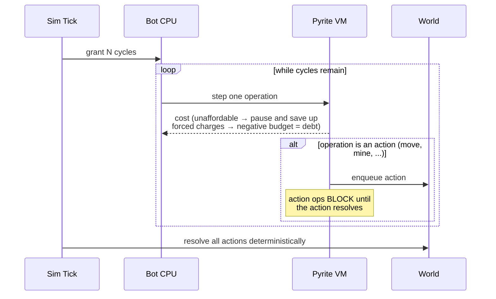

*Part of [01-language](../01-language.md).*

# Execution Model

Every bot has a CPU that grants it a **cycle budget per simulation tick** (base: 1 cycle/tick, upgradable — see [06-progression.md](../06-progression.md)). The interpreter advances a program one *operation* at a time; each operation has a cycle cost. When the budget is spent, the bot pauses mid-program until next tick.

Key rules:

- **Programs loop forever.** When the last line finishes, execution restarts at line 1 — and **variables survive the loop-around** (Q80): it's plain control flow, so `while True:` is *truly* redundant sugar. Only fault and handler restarts clear state — "re-derive your state" is the **crash-recovery** discipline, exactly where corrupted state matters. **Scope (Q80): `def` bodies are frame-local** — parameters and names first assigned inside a `def` live on the call stack (bounded by the stack-depth stat) and vanish on return, Python-style; top-level names are the program globals that persist across loop-arounds and count against variable slots.
- **Actions block — permanently** (Q100, 2026-07-26). `move_to(...)` costs cycles to *issue*, then the bot is busy until the action completes in the world. Thinking and acting **never** overlap: the old "Coprocessor unlock" is retired, because think-while-acting is a *language* feature, not hardware — a program running past a blocking call needs that call to return immediately, which means async actions, handles, awaits, and faults arriving while the program is elsewhere. The whole cycle-cost economy rests on actions blocking, so it stays unconditional. Compute grows instead through the **CPU tool** (grades 1–5, licensed by the **Processing track** — [02-agents.md](../02-agents.md)).
- **Saving up.** An operation costing more than the remaining budget pauses the bot *in front of that operation*; grants accumulate tick by tick until it can pay, then it executes. A stock 1-cycle CPU takes four ticks to afford `closest(ore)` (cost 4) — the bot visibly sits there thinking, which is the point. Cheap ops batch: a 4-cycle CPU runs four cost-1 statements in one tick.
- **Cycle debt — engine-initiated calls charge as debt; window code pays normally (Q75).** Engine-*initiated* charges don't wait to be affordable: the trap cost on a fault, boot's forced `upload_log()`, and abort's forced sequence execute immediately and drive the budget **negative** — the logs always go home, never stalled on affordability; the bot repays the debt before its next operation. Everything written in a *window* — the error window's factory `upload_crash_dump()` included — is ordinary code costed normally, saving-up rules and all. A crash-looping bot pays its trap debt instantly, then visibly sits saving up for its own crash dump.
- **Units (Q56/Q75).** Budgets and debt are *stored* in **centicycles** (×100); `costs.ron` entries stay whole cycles, converted at charge time. Every example in this doc reads in whole cycles — only the storage is fine-grained (so percent effects like brownout's −50% bite a stock CPU).
- **No banking while blocked.** A bot waiting on an action or a channel (`move_to` in flight, blocked `receive`) receives **no grant at all** — the tick's cycles are forfeited, which is what "waiting is what its CPU is doing" costs it. **What it burns is the grant, not the bank**: cycles banked *before* the block are retained, frozen, and still there on wake (a 4-cycle CPU that banks 4 and issues a 1-cycle action wakes holding 3, however long the walk took). Blocking stops the budget growing; it never empties it. Accumulation only happens while *running*, stuck in front of an unaffordable op; you can't idle for a minute and then execute 600 cycles in one tick. The two readings differ by up to a full `bank_cap` on every wake, so the distinction is spec, not detail (P35).
- **`bank_cap` — a flat ceiling, validated at load (Q75/Q82, reshaped by Q101).** The budget clamps to `bank_cap` after every grant. It is a single generous constant (~100 cycles) rather than a per-bot-per-tile derivation, and the guarantee is preserved by a **load-time check** instead of per-tick arithmetic: no key's WORST-CASE effective cost — `region(tile(base + the largest cost-raising per-bot delta any quirk or perk can contribute))` — may exceed the cap. The worst case is computable at load because overlays and quirks are both data. That closes freeze-forever for *every* bot including quirked ones, and a bad mod fails loudly rather than stranding a bot in front of an op it can never afford.

