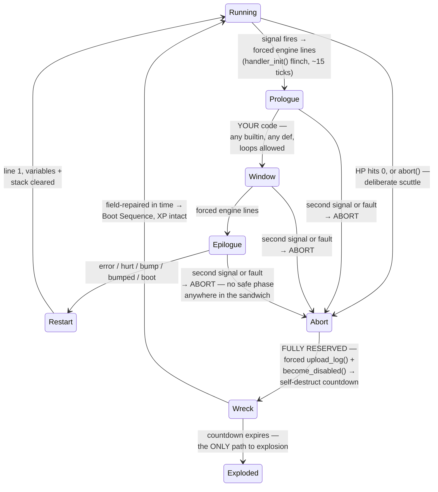

*Part of [01-language](../01-language.md).*

# Faults, Handlers & Boot

**Any** runtime failure is a fault: stack overflow, type error, unsupported operation, invalid argument, a failed action (`mine()` with no ore in range). There are **seven reserved handlers** — five with a player-editable window, plus two fully engine-reserved ones, `abort` and `recall`. (All numbers below are cost-table constants — tuning values, not commitments.)

## Reserved handler templates (redesign 2026-07-13)

Every signal owns a **reserved handler template** — an engine-shaped sandwich, the same three layers for all seven:

1. **Forced prologue** — engine lines no program can skip. For most signals that's `handler_init()`, the ~15-tick flinch (the universal time punishment for having a problem, and a real vulnerability window: a bot under sustained fire can be aborted mid-ritual). Boot's prologue is the forced `upload_log()`.
2. **Editable window** — your code, written as an `on <signal>:` block. **No cap and no restricted call set** (2026-08-02, supersedes Q49/Q51): any builtin, any `def`, loops and recursion included. Its length is bounded by program memory like any other code, and its danger by the double-handle rule below. What survives is a readout, not a gate: the editor reports each `def`'s **worst-case instruction count** — where an *instruction* is one **statement** (nested *builtin* calls don't multiply the count; a user-`def` call charges that def's own worst case, Q80) — or **unbounded** when a loop or recursion makes it undecidable. The one deploy-time **warning** (never an error) fires on an **unbounded window**: a loop the analysis can't bound, or a **channel** call left to block forever (`send`/`receive`/`broadcast` with `timeout=None`). Both park the bot inside the template indefinitely, which is the one failure here that produces no wreck and no crash dump to learn from. *Action*-blocking verbs never qualify — `move_to` blocks, but it always resolves on arrival or failure, which is why the canonical hurt retreat below is legal and unwarned.
3. **Forced epilogue** — engine lines that always end the handler. The extreme case is `abort`, which is *all* epilogue: `upload_log()` + `become_disabled()`, no player code at all — the logs always go home and every death exits through those calls, no exceptions.

The window ships with **factory contents** — the engine default, real replaceable Pyrite (error's factory window is `upload_crash_dump()`). Overwrite it, or delete it and leave the window empty; either way the forced lines still run. Factory code is inspectable and line-highlighted like any code — a crash-looping bot visibly *sits inside* its crash-dump call — and costed normally; unhandled crashes still chip the chassis (your handlers are armor; factory contents are not).

**Every handler has a fixed color and icon**, shown in the bot's **thought cloud** the moment it enters that state. The palette is global — the same seven colors/icons for every faction, deliberately distinct from program colors — so anyone with vision reads any bot's state at a glance (pillar 2: a wounded enemy *looks* wounded, a crash-looping enemy *looks* broken). The renderer's state list, cleanly: **normal · boot · handler (tinted per signal — that's where the seven colors live) · searching · low-health · abort** (searching is the scouting stance's tell — a rooted surveyor is readable at a glance, pillar 2).

Programs store only window contents (byte-exact source, [07-architecture.md](../07-architecture.md)); forced lines are engine-owned and rendered in the editor as locked phantom lines around your block — you always see the whole sandwich, you can only type in the middle.

## The seven handlers

First-pass table (colors/icons are tuning values — the row *shapes* are the design). Windows take any code; the **Window** column now records only whether a window exists at all, since `abort` and `recall` are fully engine-reserved:

| Signal | Trigger | Cloud color · icon | Forced prologue | Window | Forced epilogue | Factory window |
|---|---|---|---|---|---|---|
| **error** | any runtime fault (trap cost ~5 to enter) | red · glitch/spark | `handler_init()` | yours | — (restart at line 1) | `upload_crash_dump()` — the guaranteed-debuggability floor; replace it with lean logging and beat the default |
| **hurt** | HP crosses below the `hurt_line` env variable (default 50%; edge-triggered, re-arms above) | amber · sparks/cross | `handler_init()` | yours | — (resume via restart) | *(empty — the flinch is the reaction)* |
| **bump** | this bot rammed an occupied tile | yellow · angry scribble | `handler_init()` | yours | — | `wait(35)` — + the 15-tick init = the rammer's 50-tick at-fault stun |
| **bumped** | something rammed this bot | grey · dizzy stars | `handler_init()` | yours | — | *(empty — the init flinch is the stagger)* |
| **abort** | HP hits 0, a deliberate `abort()` call, **or any second signal/fault while another template runs** (the double-handle) | black · skull | *(none)* | **none — fully reserved** | **`upload_log()` + `become_disabled()`** — the logs *always* go home, then the wreck's self-destruct countdown starts; field-repair in time rescues the bot, XP intact ([02-agents.md](../02-agents.md)) | — |
| **boot** | print, rescue, or recall re-coloring completes | white · power-on | `upload_log()` if the local buffer is non-empty | yours | — (main program from line 1) | *(empty)* |
| **recall** | printer rebalancing or colony over-capacity | purple · home arrow | suspend, walk home, transfer | **none — fully reserved** | re-color → Boot (XP kept), or scrap (gone) | — |

Abort and recall are the degenerate cases that prove the model: the same template shape with no window at all — the two handlers you can't customize. A consequence worth savoring: **your black box is whatever you logged while alive.** There are no last words at death — `log()` discipline during normal operation *is* your forensics. Chassis damage from bumps lands regardless of handling (the window replaces the *stun*, not the dent).

Why there is no cap (2026-08-02): a cap would bound **instruction count, not wall time**, and blocking verbs sever the two — a `move_to()` retreat is *one instruction* that can run for a minute, so the most dangerous handler anyone writes was always the one that measured smallest. Time in a handler is priced by the double-handle rule, which is now the only pricing; length is priced by program memory, like every other line you write.

## The double-handle rule: abort

**Co-arriving signals** at one op boundary (a ram whose damage also crosses the hurt line raises `bumped` + `hurt` together) resolve by **severity order — abort > error > recall > hurt > bumped > bump** (error ranks right after abort: it's synchronous, it happened *inside* the op): the highest enters its template, the rest are *dropped*, and co-arrival is **not** a double-handle (Q81 — the double-handle needs a template already *running*).

**While any handler template — prologue, window, or epilogue, including boot, the recall walk, and the Upgrade-Station pad-sit, factory contents included — is running, any event that would start another handler forces the bot into `abort` — in any combination. There is no safe phase in the sandwich: a signal landing in a forced epilogue aborts exactly like one landing in your window.** The bot doesn't get the new signal's handler and doesn't finish the old one: abort's fully reserved sequence runs — `upload_log()` then `become_disabled()` — and the bot drops into a wreck on its self-destruct countdown ([02-agents.md](../02-agents.md)).

- Mid-hurt-handler retreat and damage takes you to 0? Straight to abort — the retreat is over, and the rescue race starts where the bot fell.
- A fault inside *any* handler — `error`, `hurt`, a factory window — is a double handle. Abort itself can't be double-handled: it contains no player code to fault, and signals arriving during it are absorbed — the forced sequence always finishes, the logs always go home.
- This is the counterweight to hurt's unlimited time: the longer your handler runs, the longer you're one event away from the bot dropping everything and dying where it stands. Short, bulletproof handlers are the craft.
- **Explosion is now exactly one thing: the self-destruct countdown expiring on an unrescued wreck.** No signal combination vaporizes a bot on the spot — every downed bot becomes a wreck, and every wreck is a rescue race.

## Black Boxes & the Boot Sequence

- **Every bot that reaches Destroyed — by any path — drops a Black Box** on its tile: a small persistent object containing the bot's local log ring buffer at the moment of destruction (plus id, position, tick, cause, and the bot's **env snapshot** — Q58). Anyone with vision can click it to read; a bot can `recover_black_box()` it to bank the contents permanently to its colony's cloud. Enemies can grab it too — battlefield intel is physical.
- **The stakes split cleanly: information always survives; XP is what's gambled.** Doubly guaranteed now — abort's forced `upload_log()` sends the story home *and* the wreck (or explosion) drops the physical Black Box for whoever reaches it. What's at risk is never the forensics, only the rescue race.
- **Rescued (and freshly printed) bots pass through a Boot Sequence** before running ([02-agents.md](../02-agents.md)) — boot is itself a reserved handler template: prologue — if the local log buffer is non-empty, the engine **force-calls `upload_log()`** (a forced-ordinary-function, like abort's `become_disabled` — the error window's dump, by contrast, is *factory contents*, replaceable); then the optional **`on boot:` window** (set env variables, announce yourself — the bot's dotfile, see The Environment); then the program starts from line 1, fresh state. A rescued veteran automatically files its own incident report before getting back to work.
- **Boot is an interrupt context like any handler** — it participates in the double-handle rule. A signal arriving mid-boot (`hurt` from incoming fire, a fault in the forced upload) aborts the bot: the freshly rescued veteran drops straight back into a wreck, countdown running again. Consequence: **rescues must be timed.** Field-repairing a veteran while it's still under fire just re-downs it and burns the rescue window; secure the area first, or the boot itself is the enemy's second chance.

