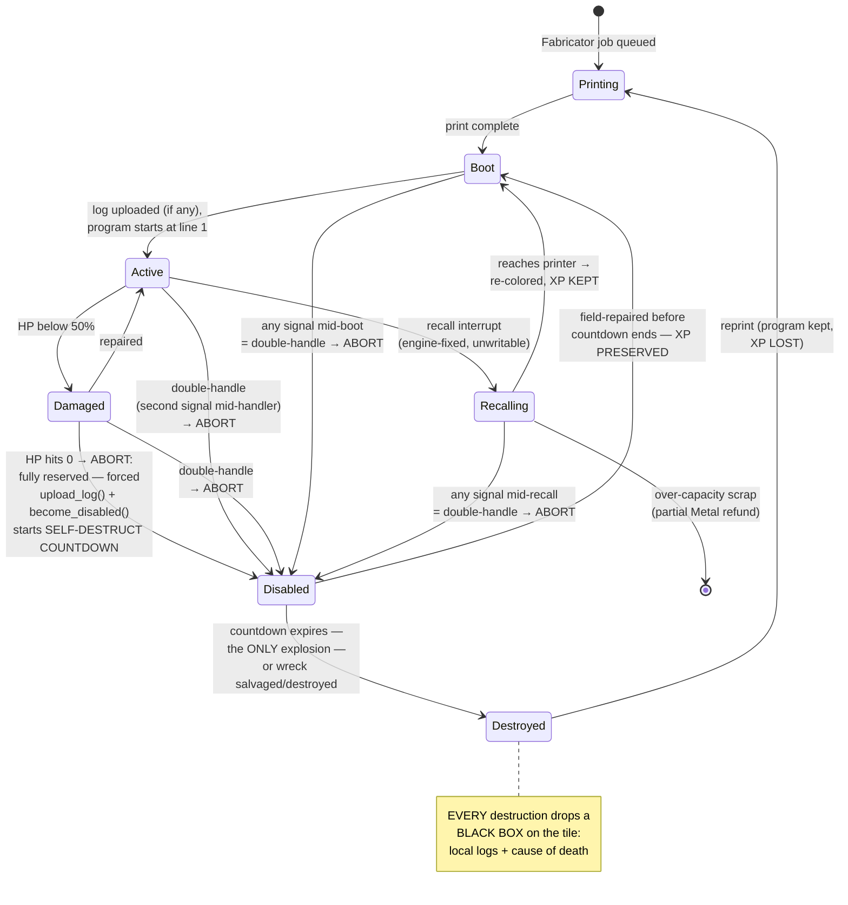

# Agents (Bots)

A **bot** is a printed machine that runs exactly one [Pyrite](01-language.md) program. Bots are the only actors the player owns; everything the colony does, a bot does.

## Anatomy

Every bot is a **chassis + modules + program**:

| Part | What it determines |
|---|---|
| **Chassis** | HP, speed, cargo size, module slots. Printed at a Fabricator from resources ([03-resources.md](03-resources.md)). |
| **CPU module** | Cycles per tick, max program length, stack depth. Upgradable. |
| **Tool modules** | Which function blocks the bot can *physically* execute (a mining drill enables `mine()`, a blaster enables `attack()`). Harvest tools are **tiered** — level N mines resources of tier ≤ N ([03-resources.md](03-resources.md)). Language unlocks are colony-wide; tools are per-bot. |
| **Program** | One of the colony's **colored program slots** ([01-language.md](01-language.md)) — one color per Printer, printer count gated by controlled nests. The bot is visibly tinted by its color. Redeploying a color updates all its bots at their next loop boundary; the printer's **desired max** controls its color's population via the recall interrupt. |

Chassis classes (initial set — tune freely):

| Chassis | HP | Speed (ticks/tile) | Cargo | Sensors (tiles) | Slots | Role bias |
|---|---|---|---|---|---|---|
| Scamp | 40 | fast (7) | 4 | 8 | 1 | scout / cheap labor |
| Drudge | 80 | med (10) | 20 | 5 | 2 | mining / hauling workhorse |
| Bulwark | 200 | slow (14) | 4 | 6 | 3 | combat / escort |
| Artisan | 60 | med (10) | 10 | 6 | 2 | building / repair |

The workhorse is deliberately myopic and the scout deliberately can't carry: chassis choice is a sensing/carrying/surviving triangle before a single module is slotted.

## The Stat Sheet

The canonical list of every number a bot owns. Anything anywhere in the design that makes one bot better or worse than another — hardware ([06-progression.md](06-progression.md)), XP perks, quirks ([09-quirks.md](09-quirks.md)), terrain and colony state — modifies a row on this sheet; if an effect can't name its row, it isn't a stat effect. All values are integers and tuning constants (`chassis.ron` / `stats.ron`).

Six sources feed the sheet, in modifier-pipeline order: **chassis** (printed shape) → **hardware modules** (Chips) → **XP perks** (earned) → **quirks** (rolled/acquired) → **state** (temporary: Damaged, brownout, Corruption, loaded, terrain).

### Compute — how well it thinks

| Stat | Base | Raised by | Lowered by | What it buys you |
|---|---|---|---|---|
| **Cycles per tick** | 1 | CPU Mk2 → 2, Mk3 → 4; quirks | **Damaged** −25%; **brownout** −50%; Corruption's cycle tax; quirks | The speed of thought. Every Pyrite operation costs cycles, so this is the exchange rate between *smart* and *slow*: a 1-cycle bot can run your scan-and-coordinate masterpiece — it'll just stand there thinking between moves. The single most contested stat in the game. |
| **Program memory** | 32 lines | Memory bank +32 | — | The longest color program this bot can receive at deploy. A colony's code can only be as ambitious as the memory of the bots that must run it (Q52). |
| **Variable slots** | 8 names | Memory bank +4 | — | How many distinct names the program may bind — checked at deploy, like program memory. |
| **Stack depth** | 4 frames | Stack module +4; quirks | quirks | How deep `def` calls nest; what makes recursion viable. Overflow is an ordinary fault — chip damage and restart. |
| **Log ring buffer** | 8 entries | Memory bank +8; quirks | quirks | How much story survives: richer `upload_log()` telemetry, richer Black Boxes, richer forced boot uploads. The forensics stat. |
| **Coprocessor** | absent | Coprocessor module | — | Think *while* an action resolves. Without it, a blocked bot is a paused bot; with it, travel time is compute time. |

Interpreter *costs* aren't bot stats — they live in `costs.ron` — but they support **per-bot overlays**: a quirk that makes `send()` cheaper or `if` pricier is a bot-local overlay on the cost table, the exact mechanism biome overlays already use per-map ([01-language.md](01-language.md)). Resolution: base table → biome overlay → per-bot quirk overlay, floored at 0.

### Body — how well it survives and carries

| Stat | Base | Raised by | Lowered by | What it buys you |
|---|---|---|---|---|
| **Max HP** | chassis (40–200) | quirks | quirks | Abuse before the wreck. Doubly load-bearing: the Damaged line and the hurt signal are *percentages of this* — more HP also widens the healthy band. |
| **Damage taken** | 100% of incoming | — | quirks (Fragile Base Class: bump ×2) | Deliberately **no armor stat** — HP is the whole defense, so combat math stays legible and a bigger gun is always a bigger gun. Only quirks scale incoming damage, and only from specific sources. |
| **Self-repair** | 1 HP / 1000 ticks | quirks | quirks | Old scars fade on their own; never combat-relevant. Repair Bays and field-repair are the real medicine. |
| **Move rate** | chassis: 7 / 10 / 14 ticks per tile | Hauling L3 (+10% while loaded); quirks | **Damaged** −25%; terrain cost multipliers ([05-terrain.md](05-terrain.md)); quirks | Response time and hauling throughput. Terrain multiplies it, so the map decides how much a fast chassis is worth. |
| **Cargo capacity** | chassis (4–20) | Hauling +10%/level; quirks | quirks | Fewer round trips. Since travel is time and time is cycles not spent working, cargo is secretly a compute stat. |
| **Module slots** | chassis (1–3) | — | — | Printed identity. Nothing modifies it — the one stat you choose forever at the Fabricator. |

### Senses & signature — how well it perceives and is perceived

| Stat | Base | Raised by | Lowered by | What it buys you |
|---|---|---|---|---|
| **Sensor range** | chassis (5–8 tiles) | Scouting +1/level; Combat L3 +1 vs enemies; High Ground +2; quirks | quirks | The query horizon: `closest()`, `exists()`, `scan_*()` and eyes-only fog reveal all cap here. A blind bot isn't dumb — it's uninformed, and no cycle budget fixes that. (Where base sight lives: Q53; reveal radius vs. query radius, and what per-kind bonuses actually extend: Q57.) |
| **Signature** | 0 | — (stealth quirks later, maybe) | quirks (Loud Fans +1) | *Proposed* (Q54): how far away enemies perceive this bot — they see it at `their sensor range + your signature`. The formal home for every "enemies sense this bot at ±N" effect. |

### Tools & work — how well it acts

| Stat | Base | Raised by | Lowered by | What it buys you |
|---|---|---|---|---|
| **Damage** | weapon module | Combat +5%/level; quirks | quirks | Kill speed — which in the wreck economy is also *rescue-denial* speed. |
| **Action time** | per tool (e.g. one `mine()` swing ~20 ticks) | Mining L3 (−25% mine); quirks | quirks | Ticks per swing once the decision is made. Cycles govern *deciding*; action time governs *doing* — a maxed CPU on slow tools is a philosopher with a shovel. |
| **Harvest tier** | tool level N | higher-tier tool module | — | Which resources `mine()` may touch at all (tier ≤ N) — a hard gate, not a rate. |
| **Build/repair rate** | tool (1 progress/tick) | Building +10%/level, L3 repairs +25%; quirks | quirks | Blueprint and field-repair throughput — including how fast a wreck rescue completes. |

### Signals & survival — how well it fails

| Stat | Base | Raised by | Lowered by | What it buys you |
|---|---|---|---|---|
| **Damaged line** | 50% of max HP, fixed | — | — | Below it the bot is **Damaged**: visible sparks, speed and cycle budget −25%. An engine state, not a policy — nothing moves it. |
| **Hurt line** | = Damaged line (50%) | the `hurt_line` **env variable** (`setenv`, [01-language.md](01-language.md)); quirks move it either way | same | When the hurt handler fires (edge-triggered, re-arms above the line). Defaults to the Damaged line but decouples via `setenv` or quirks — the Damaged penalties stay at 50% regardless. Earlier = safer and less productive; later = the opposite. Not better or worse — a *policy* knob your handler must agree with; the idiomatic place to set it is the `on boot:` window. |
| **Flinch** | `handler_init()` ≈ 15 ticks | quirks (shorter) | quirks (longer) | The forced prologue on most signals — time spent locked and vulnerable before your window runs. The shorter it is, the less every problem costs. |
| **Boot ritual** | ~20 ticks of engine time | quirks (Hot Reload ×0.5) | quirks (Windows Update ×2) | The fixed engine portion of every print, rescue, and re-coloring; the forced `upload_log()` and any `on boot:` window then run at normal cycle costs on top. All of it is double-handle exposure — boot time is rescue risk. |
| **Countdown** | ~30 s + per-XP bonus | quirks +50% | quirks −50% | The wreck's self-destruct timer: your rescue window, their salvage/hijack window — one number, three parties racing it. |
| **XP gain** | 100% | quirks (+15%) | quirks (−15%) | Multiplier on every track's earn rate — how fast this body becomes a veteran. |
| **XP preserved** | 0% on destruction | Backup Core module → 50% | — | What a reprint inherits. The one stat that softens pillar 3 — which is why its module is late and expensive ([06-progression.md](06-progression.md)). |
| **Salvage profile** | +5% color decryption to the salvager; fraction of Metal; reprint at full chassis cost | — | quirks (Open Source: double decryption, discounted reprint) | What your corpse is worth to the enemy — and what the replacement costs you. |
| **Print time** | per-chassis (~10 s, tuning) | — | — | Reprint turnaround. Fleet resilience is really countdown + print time: how long a hole in the line stays a hole. |
| **Upkeep draw** | per-chassis Energy + Metal (`upkeep.ron`) | — | — | What the colony pays per tick to keep it. Individually invisible, collectively the real population cap: sustained excess → brownout → scrap recalls. |

### The ledger — per-bot facts that aren't dials

Riding alongside the stats: **color** (program slot), **program version**, **XP per track** (×5), **quirk list**, **local log contents**, **cargo held**. XP and quirks are the two ledger entries that reach back and modify the sheet above.

### Modifier pipeline (deterministic)

One fixed order, integer math:

> **base (chassis/tool) → modules → XP perks → quirks → state (Damaged, brownout, Corruption, loaded, terrain)** → clamp (cycles/tick and move rate never below 1).

Percentages are integer percents of the running subtotal; within a layer, effects apply in stable list order (module slot order, quirk acquisition order). Every stat's data entry declares its **improvement direction** — cargo up is better, move rate *down* is better; "Raised by" in the tables above always means *improved by* — and rounding is **pessimistic**: fractional results round toward worse-for-the-bot (gains floor, penalties ceil), so the tiebreak is uniform and replay-stable. The pipeline is sim state — same inputs, same sheet, every machine ([08-multiplayer.md](08-multiplayer.md)).

**Granularity warning (Q56):** integer percents are dead on small bases. Brownout's −50% can't touch a stock 1-cycle bot (0.5 floors to 0, clamps back to 1) — as written, the colony's core over-extension penalty *only punishes upgraded CPUs*. Hauling's +10% of a Scamp's 4 cargo is +0; Building's +10% of 1 progress/tick is +0. Before these numbers are implemented, either stats store fine-grained units (a centicycle budget, deci-cargo — the millitile precedent) or small-base percent perks become flat values.

Design intent: **stats scale execution, never decisions.** XP, hardware, and quirks make the numbers bigger or smaller; only the program decides what the bot *does* — a stat sheet never rescues bad code (pillar 1).

## Damage, Faults, and Death

- **HP sources of loss**: combat damage and **unhandled faults** (each crash chips the chassis, [01-language.md](01-language.md)) — a buggy program is a slow suicide.
- **Passive self-repair**: chassis regenerate a trickle (tuning: ~1 hp / 1000 ticks — minutes per point). Enough that old scars eventually fade; not enough to matter in a fight — Repair Bays and field-repair are the real medicine. The hurt signal **re-arms** once health climbs back above its threshold, so a bot that recovers and is wounded again fires `hurt` again.
- **Damaged** (< 50% HP): visible sparks; speed and cycle budget reduced 25%. The Damaged line is fixed; the **hurt line** defaults to it but is a separate, movable stat (the `hurt_line` env variable, quirks — see the stat sheet). Crossing the hurt line fires the `hurt` signal — the amber-cloud handler template ([01-language.md](01-language.md)) — whose canonical `on hurt:` window drops cargo and retreats to a Repair Bay ([03-resources.md](03-resources.md)); the Damaged penalties apply at 50% regardless of where the hurt line sits. Pre-handler-unlock, polling `if health_low():` does the same job, worse.
- **Handler states are visible**: entering any handler template puts that signal's fixed icon and color in the bot's **thought cloud** ([01-language.md](01-language.md)) — friend and foe alike read a bot's crisis at a glance (pillar 2).
- **Disabled** (0 HP, or a double-handle): the bot **aborts** — a fully engine-reserved sequence, no player code: the engine force-calls `upload_log()` + `become_disabled()` — the same forced-ordinary-function pattern as `upload_crash_dump()` on unhandled errors; every death exits through those calls, so the logs always reach the cloud. There are no last words: the black box is whatever the bot logged while alive. It puts the bot into an inert wreck state with a **self-destruct countdown that scales with total XP** (base ~30s + per-XP bonus, tuning constants): rookies pop fast, veterans linger — the more a bot was worth, the longer the window to save it (and the longer the enemy has to salvage-snipe it; the race gets richer exactly when the stakes are highest). Before it ends, the wreck can be:
  - **field-repaired** (Artisan-class) → enters **Boot Sequence**, **XP preserved** — rescue missions are a real play;
  - **`salvage()`d** — by anyone, allies *or enemies* — for a fraction of its Metal **plus +5% permanent decryption of the bot's program color** ([08-multiplayer.md](08-multiplayer.md)) — programs are read on murder, a few percent per murder, and the percentage never goes back down. Salvage destroys the wreck;
  - **`hijack()`ed by the enemy** (harm-enabled servers, [04-enemies.md](04-enemies.md)) — the wreck boots under *their* color, **XP intact**: your veteran now works for them (no code leaks — it runs their program). Hijacked bots are **not reprintable** by their new owner: a stolen veteran is a unique prize.

  The wreck race is three-way: your rescue vs. their salvage (intel + Metal) vs. their hijack (the bot itself). The countdown scaling with XP means the richest prizes give everyone the most time to fight over them.
- **Destroyed**: the countdown expires (the wreck explodes — the *only* explosion in the game, [01-language.md](01-language.md)), or the wreck is salvaged/destroyed. There is no instant-destruction path: a **double-handle** (any second handler firing while one runs, any combination) *aborts* the bot into Disabled like any other death. Reprinting at a Fabricator costs full resources; the program redeploys automatically; **all XP is lost**.
- **Black Box**: *every* destruction, by any path, drops a Black Box on the tile — the bot's local log ring buffer plus id, tick, and cause of death. Click to read it (with vision); `recover_black_box()` banks it permanently to the colony cloud (its printers, [03-resources.md](03-resources.md)). Enemies can grab it first — logs are battlefield intel. **Information always survives; XP is the only thing gambled.** What double-handling a veteran buys the enemy is an *early wreck on their terms* — downed deep in their territory, where the rescue race is theirs to lose.
- **Boot Sequence** (entered from Printing, a rescue, or a recall re-coloring): step 1 — if the local log buffer is non-empty, the engine force-calls `upload_log()` (a rescued bot files its own incident report); step 2 — the optional `on boot:` window runs ([01-language.md](01-language.md)); step 3 — the program starts from line 1 with fresh state, and the bot is Active. **Boot is an interrupt context**: any signal arriving mid-boot is a double-handle → abort, dropping the bot straight back into a wreck with the countdown running again. Rescuing under fire burns the rescue — time your field-repairs to secured ground. (Fresh prints boot too, but inside your base that's rarely dangerous — until someone raids the Fabricator.)
- **Recalling** ([01-language.md](01-language.md)): the engine-fixed, un-writable recall interrupt — the bot suspends its program and walks home. Fired by a printer over its desired max (bot is re-colored at an under-quota printer, **XP kept** — XP lives on the bot, not the color) or by colony over-capacity (**lowest-total-XP bot is scrapped** for a partial Metal refund). Recall is an interrupt context: double-handle applies for the whole trip, so rebalancing bots that are deep in hostile territory is a gamble — turn the dials when your bots are somewhere safe.

## XP & Specialization

Bots earn XP **per task track**, by doing:

| Track | Earned by | Level perks (per level, cap L5) |
|---|---|---|
| Mining | units of ore extracted | +10% mine yield, at L3: `mine()` action time −25% |
| Hauling | cargo-distance delivered | +10% cargo capacity, at L3: +10% move speed while loaded |
| Combat | damage dealt / kills | +5% damage, at L3: +1 sensor range vs enemies |
| Building | build/repair progress | +10% build speed, at L3: repairs restore +25% more |
| Scouting | new tiles revealed | +1 sensor range, at L3: immune to Corruption's cycle tax ([05-terrain.md](05-terrain.md)) |

Design intent:

- **XP follows behavior, not assignment.** There's no class picker; a bot whose program mines becomes a good miner. The program *is* the specialization mechanism — reinforcing pillar 1.
- **Perks are task-relevant** (requirement 7): a veteran miner mines faster/more, a veteran fighter hits harder. Cross-track XP is tracked independently; hybrid programs produce hybrid veterans, but slower.
- **Total loss on destruction** (requirement 8) makes veterans strategic assets. The pressure valves: hurt-handler retreat programs, Repair Bays, escorts for L5 miners, field-repair rescue during the self-destruct countdown, and (late) the Backup Core module. Targeting enemy veterans — and double-handling or salvage-sniping them to deny rescue — becomes PvP strategy.

### XP curve (quadratic increments)

Each level costs `100 × n` more XP than the last, per track:

| Level | XP for this level | Cumulative |
|---|---|---|
| 1 | 100 | 100 |
| 2 | 200 | 300 |
| 3 | 300 | 600 |
| 4 | 400 | 1000 |
| 5 (cap) | 500 | 1500 |

Early levels come fast (new bots feel like they're growing immediately); an L5 represents real accumulated play — which is exactly what makes losing one hurt. All values are tuning constants like everything else.

### XP visibility

Levels are visible to **everyone** (pillar 2: transparency) — a veteran bot has visible wear/decals. In PvP, your shiny L5 hauler is a target. This is intentional.

## Reprinting Economics

- Reprint cost = original print cost (no discount) — the *sting* is XP, not extra resources.
- **Print cost is a match setting, default FREE** — a colony must never be soft-locked (no resources + no bots = no way to gather resources). Population stays bounded by printer dials and colony capacity; when a map does price prints, scrap refunds may be nonzero too (never exceeding print cost, or scrapping mints resources).
- Fabricators keep a **blueprint registry**: destroyed bots appear in a "reprint queue" UI with one-click requeue.
- Possible later unlock: *Backup Core* module — expensive, preserves 50% XP on destruction. Gated late so early losses stay meaningful ([06-progression.md](06-progression.md)).

## Decided

- **Perks apply to the bot only.** No colony-wide or program-attached XP effects — the veteran *is* the asset, which is what gives death its sting.
- **Quadratic XP increments** — level *n* costs 100×*n* additional XP (see XP curve table).
- **No hard bot cap — population is what the colony can sustain.** Upkeep is a **data-driven resource mix** (an `upkeep.ron`-style config, adjustable without code changes — prototype the system, then tune); **v1 config: Energy (primary drain) + Metal (chassis maintenance)** per [03-resources.md](03-resources.md). Over-extending doesn't block printing — it degrades the colony (brownout halves cycle budgets) and, if sustained, triggers **scrap recalls**: the colony recalls its lowest-total-XP bot for a partial Metal refund. The cap is an economic equilibrium the player feels, not a number they hit.
- **Wreck countdown scales with XP** — base + per-XP bonus (tuning): veterans get longer rescue windows; rookie wrecks barely exist.
- **Per-color population is player-dialed** — each printer's desired max, enforced by recall re-coloring (XP kept).
- **Bots are solid — one per tile.** When the next tile is occupied, the mover first tries a **random sidestep** (seeded sim RNG) among free neighbors that lose no ground toward its goal, then re-plans from where it lands. Only when **boxed in** does it **bump** — and collisions are **signals** ([01-language.md](01-language.md)): the rammer gets `bump`, the victim `bumped`, then both take chassis damage. The factory windows apply asymmetric-blame stuns — rammer ~5 s, victim a ~1.5 s stagger (clearing the scene before the at-fault bot re-plans). Your `on bump:` / `on bumped:` window *replaces* the stun with your own response. Double-handle applies: colliding with (or as) a bot mid-handler/boot/recall aborts it into a wreck (tuning; routed through the normal damage pipeline, so hurt/abort signals — and the double-handle rule during boots/recalls — apply). Dodges keep traffic flowing; a true head-on corridor deadlock now grinds both bots to mutual destruction — the deadlock self-clears, the expensive way. Channels remain the cheap way. Traffic jams are therefore *visible program bugs* (write better routing). Printed and re-colored bots emerge on the first free tile beside their printer; a fully walled-in printer holds finished prints until space opens.

## Open Questions

- Upkeep mix tuning: does Metal maintenance earn its complexity alongside Energy, or should the v1 config lean harder on Energy? (System is data-driven — answer via playtest, not redesign.)
