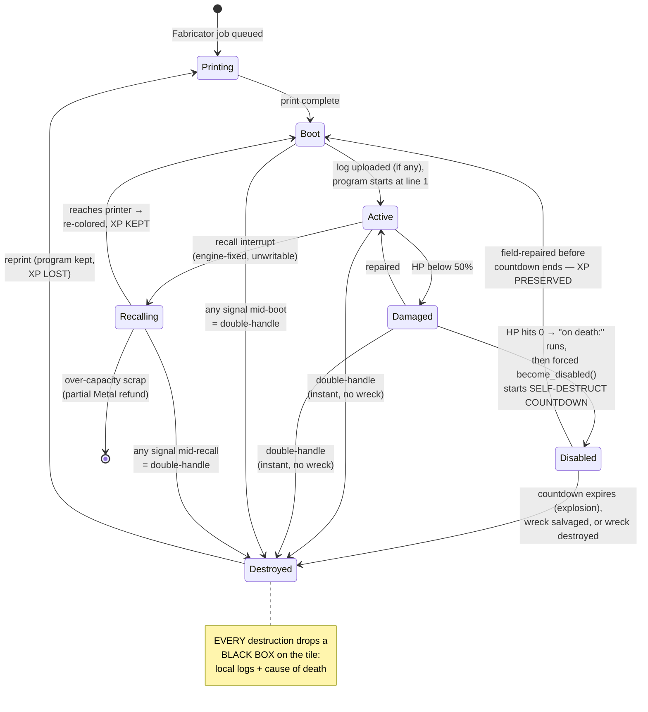

# Agents (Bots)

A **bot** is a printed machine that runs exactly one [Pyrite](01-language.md) program. Bots are the only actors the player owns; everything the colony does, a bot does.

## Anatomy

Every bot is a **chassis + modules + program**:

| Part | What it determines |
|---|---|
| **Chassis** | HP, speed, cargo size, module slots. Printed at a Fabricator from resources ([03-resources.md](03-resources.md)). |
| **CPU module** | Cycles per tick, max program length, stack depth. Upgradable. |
| **Tool modules** | Which function blocks the bot can *physically* execute (a mining drill enables `mine()`, a blaster enables `attack()`). Harvest tools are **tiered** — level N mines resources of tier ≤ N ([03-resources.md](03-resources.md)). Language unlocks are colony-wide; tools are per-bot. |
| **Program** | One of the colony's **colored program slots** ([01-language.md](01-language.md)) — one color per Printer, printer count gated by controlled nests. The bot is visibly tinted by its color. Redeploying a color updates all its bots at their next loop boundary; the printer's **desired max** controls its color's population via the recall interrupt. |

Chassis classes (initial set — tune freely):

| Chassis | HP | Speed | Slots | Role bias |
|---|---|---|---|---|
| Scamp | 40 | fast | 1 | scout / cheap labor |
| Drudge | 80 | med | 2 | mining / hauling workhorse |
| Bulwark | 200 | slow | 3 | combat / escort |
| Artisan | 60 | med | 2 | building / repair |

## Damage, Faults, and Death

- **Damaged** (< 50% HP): visible sparks; speed and cycle budget reduced 25%. Crossing this threshold fires the `on hurt:` signal ([01-language.md](01-language.md)) — the canonical handler drops cargo and retreats to a Repair Bay ([03-resources.md](03-resources.md)). Pre-handler-unlock, polling `if health_low():` does the same job, worse.
- **Disabled** (0 HP): the `on death:` signal runs (10-cycle black-box budget), then the engine force-calls `become_disabled()` — the same forced-ordinary-function pattern as `upload_crash_dump()` on unhandled errors; every death exits through that function. It puts the bot into an inert wreck state with a **self-destruct countdown that scales with total XP** (base ~30s + per-XP bonus, tuning constants): rookies pop fast, veterans linger — the more a bot was worth, the longer the window to save it (and the longer the enemy has to salvage-snipe it; the race gets richer exactly when the stakes are highest). Before it ends, the wreck can be:
  - **field-repaired** (Artisan-class) → enters **Boot Sequence**, **XP preserved** — rescue missions are a real play;
  - **`salvage()`d** — by anyone, allies *or enemies* — for a fraction of its Metal **plus +5% permanent decryption of the bot's program color** ([08-multiplayer.md](08-multiplayer.md)) — programs are read on murder, a few percent per murder, and the percentage never goes back down. Salvage destroys the wreck;
  - **`hijack()`ed by the enemy** (harm-enabled servers, [04-enemies.md](04-enemies.md)) — the wreck boots under *their* color, **XP intact**: your veteran now works for them (no code leaks — it runs their program). Hijacked bots are **not reprintable** by their new owner: a stolen veteran is a unique prize.

  The wreck race is three-way: your rescue vs. their salvage (intel + Metal) vs. their hijack (the bot itself). The countdown scaling with XP means the richest prizes give everyone the most time to fight over them.
- **Destroyed**: the countdown expires (the wreck explodes), the wreck is salvaged/destroyed, or — instantly, skipping Disabled entirely — a **double-handle** ([01-language.md](01-language.md)): any second handler firing while one runs, *any combination*, including a fault inside `on death:`. Reprinting at a Fabricator costs full resources; the program redeploys automatically; **all XP is lost**.
- **Black Box**: *every* destruction, by any path, drops a Black Box on the tile — the bot's local log ring buffer plus id, tick, and cause of death. Click to read it (with vision); `recover_black_box()` banks it permanently to the colony cloud (its printers, [03-resources.md](03-resources.md)). Enemies can grab it first — logs are battlefield intel. **Information always survives; XP is the only thing gambled.** What double-handling a veteran denies is the *rescue*, not the story.
- **Boot Sequence** (entered from Printing, a rescue, or a recall re-coloring): step 1 — if the local log buffer is non-empty, the engine force-calls `upload_log()` (a rescued bot files its own incident report); step 2 — the program starts from line 1 with fresh state, and the bot is Active. **Boot is an interrupt context**: any signal arriving mid-boot is a double-handle → instant destruction. Rescuing under fire hands the enemy an erasure — time your field-repairs to secured ground. (Fresh prints boot too, but inside your base that's rarely dangerous — until someone raids the Fabricator.)
- **Recalling** ([01-language.md](01-language.md)): the engine-fixed, un-writable recall interrupt — the bot suspends its program and walks home. Fired by a printer over its desired max (bot is re-colored at an under-quota printer, **XP kept** — XP lives on the bot, not the color) or by colony over-capacity (**lowest-total-XP bot is scrapped** for a partial Metal refund). Recall is an interrupt context: double-handle applies for the whole trip, so rebalancing bots that are deep in hostile territory is a gamble — turn the dials when your bots are somewhere safe.

## XP & Specialization

Bots earn XP **per task track**, by doing:

| Track | Earned by | Level perks (per level, cap L5) |
|---|---|---|
| Mining | units of ore extracted | +10% mine yield, at L3: `mine()` action time −25% |
| Hauling | cargo-distance delivered | +10% cargo capacity, at L3: +10% move speed while loaded |
| Combat | damage dealt / kills | +5% damage, at L3: +1 sensor range vs enemies |
| Building | build/repair progress | +10% build speed, at L3: repairs restore +25% more |
| Scouting | new tiles revealed | +1 sensor range, at L3: immune to Corruption's cycle tax ([05-terrain.md](05-terrain.md)) |

Design intent:

- **XP follows behavior, not assignment.** There's no class picker; a bot whose program mines becomes a good miner. The program *is* the specialization mechanism — reinforcing pillar 1.
- **Perks are task-relevant** (requirement 7): a veteran miner mines faster/more, a veteran fighter hits harder. Cross-track XP is tracked independently; hybrid programs produce hybrid veterans, but slower.
- **Total loss on destruction** (requirement 8) makes veterans strategic assets. The pressure valves: `on hurt:` retreat programs, Repair Bays, escorts for L5 miners, field-repair rescue during the self-destruct countdown, and (late) the Backup Core module. Targeting enemy veterans — and double-handling or salvage-sniping them to deny rescue — becomes PvP strategy.

### XP curve (quadratic increments)

Each level costs `100 × n` more XP than the last, per track:

| Level | XP for this level | Cumulative |
|---|---|---|
| 1 | 100 | 100 |
| 2 | 200 | 300 |
| 3 | 300 | 600 |
| 4 | 400 | 1000 |
| 5 (cap) | 500 | 1500 |

Early levels come fast (new bots feel like they're growing immediately); an L5 represents real accumulated play — which is exactly what makes losing one hurt. All values are tuning constants like everything else.

### XP visibility

Levels are visible to **everyone** (pillar 2: transparency) — a veteran bot has visible wear/decals. In PvP, your shiny L5 hauler is a target. This is intentional.

## Reprinting Economics

- Reprint cost = original print cost (no discount) — the *sting* is XP, not extra resources.
- Fabricators keep a **blueprint registry**: destroyed bots appear in a "reprint queue" UI with one-click requeue.
- Possible later unlock: *Backup Core* module — expensive, preserves 50% XP on destruction. Gated late so early losses stay meaningful ([06-progression.md](06-progression.md)).

## Decided

- **Perks apply to the bot only.** No colony-wide or program-attached XP effects — the veteran *is* the asset, which is what gives death its sting.
- **Quadratic XP increments** — level *n* costs 100×*n* additional XP (see XP curve table).
- **No hard bot cap — population is what the colony can sustain.** Upkeep is a **data-driven resource mix** (an `upkeep.ron`-style config, adjustable without code changes — prototype the system, then tune); **v1 config: Energy (primary drain) + Metal (chassis maintenance)** per [03-resources.md](03-resources.md). Over-extending doesn't block printing — it degrades the colony (brownout halves cycle budgets) and, if sustained, triggers **scrap recalls**: the colony recalls its lowest-total-XP bot for a partial Metal refund. The cap is an economic equilibrium the player feels, not a number they hit.
- **Wreck countdown scales with XP** — base + per-XP bonus (tuning): veterans get longer rescue windows; rookie wrecks barely exist.
- **Per-color population is player-dialed** — each printer's desired max, enforced by recall re-coloring (XP kept).
- **Bots are solid — one per tile.** Trying to enter an occupied tile is a **bump**: the mover recoils, faces what it hit, and freezes (~5 s, tuning), thinking included — a stun, not a pause. As it thaws it **re-plans its route** (A* treating current bot positions as obstacles); only if no clear route exists does it retry the same step. Traffic jams are therefore *visible program bugs* (write better routing). Printed and re-colored bots emerge on the first free tile beside their printer; a fully walled-in printer holds finished prints until space opens.

## Open Questions

- Upkeep mix tuning: does Metal maintenance earn its complexity alongside Energy, or should the v1 config lean harder on Energy? (System is data-driven — answer via playtest, not redesign.)
