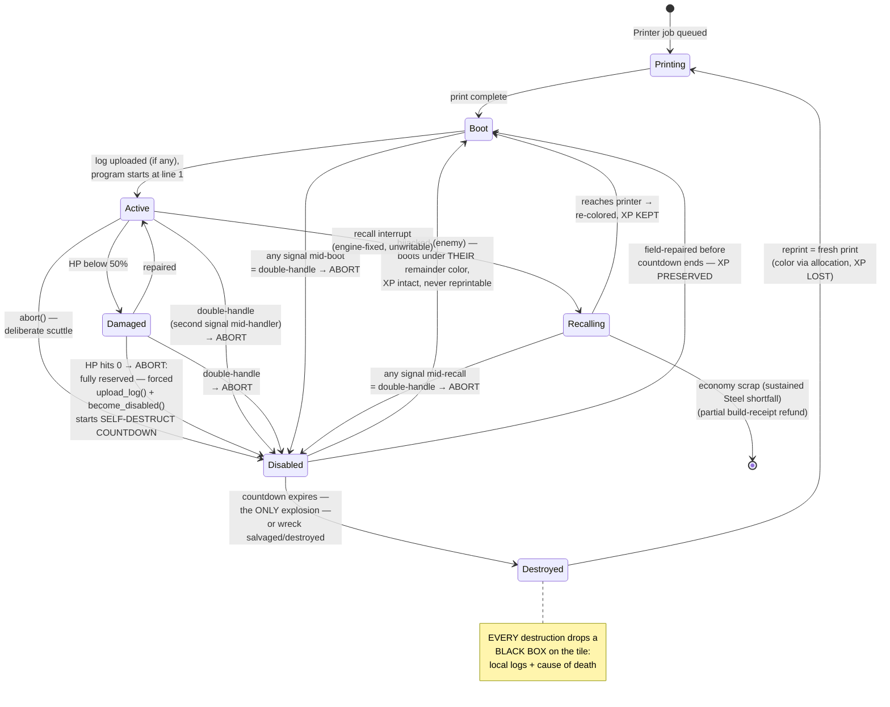

*Part of [02-agents](../02-agents.md).*

# Damage, Faults, and Death

- **HP sources of loss**: combat damage and **unhandled faults** (each crash chips the chassis, [01-language.md](../01-language.md)) — a buggy program is a slow suicide.
- **Passive self-repair**: chassis regenerate a trickle (tuning: ~1 hp / 1000 ticks — minutes per point). Enough that old scars eventually fade; not enough to matter in a fight — Repair Bays and field-repair are the real medicine. The hurt signal **re-arms** once health climbs back above its threshold, so a bot that recovers and is wounded again fires `hurt` again.
- **Damaged** (< 50% HP): visible sparks; speed and cycle budget reduced 25%. The Damaged line is fixed; the **hurt line** defaults to it but is a separate, movable stat (the `hurt_line` env variable, quirks — see the stat sheet). Crossing the hurt line fires the `hurt` signal — the amber-cloud handler template ([01-language.md](../01-language.md)) — whose canonical `on hurt:` window drops cargo and retreats to a Repair Bay ([03-resources.md](../03-resources.md)); the Damaged penalties apply at 50% regardless of where the hurt line sits. Pre-handler-unlock, polling `if health_low():` does the same job, worse.
- **Handler states are visible**: entering any handler template puts that signal's fixed icon and color in the bot's **thought cloud** ([01-language.md](../01-language.md)) — friend and foe alike read a bot's crisis at a glance (pillar 2).
- **Disabled** (0 HP, or a double-handle): the bot **aborts** — a fully engine-reserved sequence, no player code: the engine force-calls `upload_log()` + `become_disabled()` — the same forced-ordinary-function pattern as `upload_crash_dump()` on unhandled errors; every death exits through those calls, so the logs always reach the cloud. There are no last words: the black box is whatever the bot logged while alive. It puts the bot into an inert wreck state with a **self-destruct countdown that scales with the Age track** (base ~20 s + a per-Age bonus, tuning — Q83; Age rather than total XP since Q105, because tier-scaled totals would push a mid-tier bot's countdown into the hours and its wreck would never expire at all): rookies pop fast, long-lived veterans linger — the longer a bot has been alive, the longer the window to save it (and the longer the enemy has to salvage-snipe it; the race gets richer exactly when the stakes are highest). Before it ends, the wreck can be:
  - **field-repaired** (any bot carrying a **build tool of grade ≥ 2** — Q105-R2's gate, restated for Q111's tool model; the grade is licensed by the Building track, so this still means "an experienced builder", and the Artisan class held the equivalent before either) → enters **Boot Sequence** at the **Damaged line (50% HP, tuning — Q85)** with the hurt signal **re-armed**, so the first shot mid-boot fires `hurt` → double-handle → re-wreck: rescuing under fire genuinely burns the rescue. The re-wreck's countdown **resumes, never resets** — failed rescues burn the window. **XP preserved** — rescue missions are a real play;
  - **`salvage()`d** — by anyone, allies *or enemies* — for a cut of its **build receipt** (a fraction of every material invested in it — see the stat sheet's salvage profile) **plus +5% permanent decryption of the bot's program color** ([08-multiplayer.md](../08-multiplayer.md)) — programs are read on murder, a few percent per murder, and the percentage never goes back down. Salvage destroys the wreck;
  - **`hijack()`ed by the enemy** (harm-enabled servers, [04-enemies.md](../04-enemies.md)) — the wreck boots under *their* **remainder color** (Q76 — stock-capped, fits any chassis), **XP intact**: your veteran now works for them (no code leaks — it runs their program) and joins their fleet fully (cap, allocation, recall). Hijacked bots are **not reprintable** by their new owner: a stolen veteran is a unique prize.

  - **`analyze()`d** — the intel verb (Q76, [01-language.md](../01-language.md)): another faction dissects the wreck for **Data + its logs/env + your comm key** (destroying it). Your own wrecks yield you nothing — no staged Data.

  The wreck race is four-way: your rescue vs. their salvage (materials + decryption) vs. their analyze (Data + keys + logs) vs. their hijack (the bot itself). Relative speeds (Q84 — tuning, tool-modifiable): salvage fastest, analyze middle, hijack slowest and build-tool-gated; field repair is **80 progress** (first-pass — ~8 s at base build rate), scaling with the rescuer's build rate. The countdown scaling with XP means the richest prizes give everyone the most time to fight over them.
- **Destroyed**: the countdown expires (the wreck explodes — the *only* explosion in the game, [01-language.md](../01-language.md)), or the wreck is salvaged/destroyed. **The blast is real** (Q55, decided): area damage to adjacent tiles (radius tuning), **scaling with the wreck's max HP** — the toughest veterans pop hardest, and since countdown also scales with XP, the most dangerous wrecks come with the longest warnings. It hits **friend and foe, on every server type** — no harm-setting carve-out; the 20+ second public countdown is the mechanical warning (10 s under Kernel Panic — still legible), and an "ally" who walks ticking wrecks into your base is answered socially, not by rules. Cargo stays inert (a loaded coal hauler is not a bomb — revisit as a match option, maybe). Resolution (Q76): blasts fire in the **damage phase**, same-tick expiries in **entity-ID order**, and they **never chain** — a wreck destroyed *by* a blast is simply destroyed (black box drops, no detonation; "expiry is the only explosion" holds), so wreck-carpets aren't dominoes. Deliberate scuttles are a legal play (`abort()`), and clearing enemy wrecks near your structures is urgent. There is no instant-destruction path: a **double-handle** (any second handler firing while one runs, any combination) *aborts* the bot into Disabled like any other death. Reprinting is a **fresh print** (Q73): the allocation assigns its color like anyone else's; **all XP is lost**, quirks re-roll latent, hardware resets.
- **Black Box**: *every* destruction, by any path, drops a Black Box on the tile — the bot's local log ring buffer plus id, tick, cause of death, and an **env snapshot** (its runtime policy values — how env leaks to enemies, and forensics for you: "why did this one retreat early?" — Q58, [01-language.md](../01-language.md)). Click to read it (with vision); `recover_black_box()` banks it permanently to the colony cloud (its printers, [03-resources.md](../03-resources.md)). Enemies can grab it first — logs are battlefield intel. **Information always survives; XP is the only thing gambled.** What double-handling a veteran buys the enemy is an *early wreck on their terms* — downed deep in their territory, where the rescue race is theirs to lose.
- **Boot Sequence** (entered from Printing, a rescue, or a recall re-coloring): step 1 — if the local log buffer is non-empty, the engine force-calls `upload_log()` (a rescued bot files its own incident report); step 2 — the optional `on boot:` window runs ([01-language.md](../01-language.md)); step 3 — the program starts from line 1 with fresh state, and the bot is Active. **Boot is an interrupt context**: any signal arriving mid-boot is a double-handle → abort, dropping the bot straight back into a wreck with the countdown running again. Rescuing under fire burns the rescue — time your field-repairs to secured ground. (Fresh prints boot too, but inside your base that's rarely dangerous — until someone raids the Printer.)
- **Recalling** ([01-language.md](../01-language.md)): the engine-fixed, un-writable recall interrupt — the bot suspends its program and walks home. Fired when the target-share allocation assigns the bot a new color (re-colored at the claiming printer, **XP kept** — XP lives on the bot, not the color) or by the **economy scrap valve** — sustained Steel shortfall with `rust_scraps` on (`upkeep.ron`, [03-resources.md](../03-resources.md)): the **least-invested fleet bot is scrapped** — ranked by *investment* (lifetime XP **plus the value of its installed tools**), not raw XP (Q105-R3, restated for Q111): a heavily-equipped bot must never read as the fleet's cheapest machine and be dismantled for a partial build-receipt refund. Note investment and the **salvage refund** deliberately differ — salvage returns a cut of what was actually *spent*, so a quirk-granted tool counts toward what you lose but refunds nothing. Ghosts exempt — and scrap is engine-fired, so it enters *politely*, re-selecting the next-lowest if its target is mid-template (Q85). Being merely over cap never scraps ([01-language.md](../01-language.md) ruling: a shrunken cap stops prints; attrition brings the fleet back under). Player-fired recalls (rule edits, the check interval) dispatch like signals: they interrupt Running and Blocked bots alike, and landing mid-template is a double-handle → abort — so rebalancing bots that are deep in hostile territory or mid-crisis is a gamble. Turn the dials when your bots are somewhere safe; the check clock is a tactical instrument.

