# Resources

**Eleven raw materials → six refined products**, plus **Energy** (a rate, not a pile) and **Data** (a currency, not a mineral). Each exists to gate a *different verb*, so shortages push players toward different behavior instead of "more of everything." (All recipes/rates below are tuning values.)

## The Tree

```mermaid
flowchart TD
    subgraph Raw["Raw (harvested from terrain)"]
        WAT[Water<br/><i>pumped at shorelines</i>]
        SAND[Sand<br/><i>shoreline flats & dune fringes</i>]
        STONE[Stone<br/><i>outcrops, plentiful</i>]
        WOOD[Wood<br/><i>groves, regenerating</i>]
        COAL[Coal<br/><i>seams</i>]
        FE[Iron<br/><i>veins</i>]
        CU[Copper<br/><i>veins</i>]
        SN[Tin<br/><i>sparse veins</i>]
        AG[Silver<br/><i>deep veins</i>]
        AU[Gold<br/><i>deep veins, rare</i>]
        CRY[Crystal<br/><i>fields near Corruption</i>]
    end

    subgraph Refined["Refined (processed in structures)"]
        STEEL[Steel<br/><i>Smelter: 2 iron + 1 coal</i>]
        BRZ[Bronze<br/><i>Smelter: 1 copper + 1 tin</i>]
        WIRE[Wire<br/><i>Foundry: 1 copper</i>]
        CHIP[Chips<br/><i>Foundry: 1 silver + 2 crystal + 1 wire</i>]
        GLASS[Glass<br/><i>Smelter: 2 sand</i>]
        LENS[Lens<br/><i>Foundry: 2 glass</i>]
    end

    subgraph Special["Rates & currency"]
        NRG[Energy<br/><i>Generator burns wood/coal,<br/>free at geothermal vents</i>]
        DATA[Data<br/><i>earned by doing, not mining</i>]
    end

    FE --> STEEL
    COAL --> STEEL
    CU --> BRZ
    SN --> BRZ
    CU --> WIRE
    AG --> CHIP
    CRY --> CHIP
    WIRE --> CHIP
    SAND --> GLASS
    GLASS --> LENS
    WOOD --> NRG
    COAL --> NRG

    STEEL -->|structures, printing, terraforming| SINK1[Building]
    BRZ -->|tool & weapon modules| SINK2[Claws]
    WIRE -->|powered structures, electronics| SINK3[The grid]
    CHIP -->|compute upgrades, hardware| SINK4[Brains]
    AU -->|premium catalog + Data Exchange| SINK5[Late hardware & banking]
    WAT -->|coolant| SINK6[Upgrade Station]
    STONE -->|walls, bridges, civil structures| SINK9[Fortification]
    GLASS -->|glazing for sensor structures| SINK10[Seeing]
    LENS -->|Optics & sensor hardware| SINK10
    DATA -->|research| SINK7[Language & function unlocks]
    CRY -->|ammo/repair consumables| SINK8[Consumables]
```

## Resource Roles

Raw:

| Resource | Source | Primary sink | The question it asks the player |
|---|---|---|---|
| **Water** | Pumped at shorelines (Pump structure) | Coolant — the Upgrade Station consumes it per compute upgrade | *Do you hold shoreline?* Compute is water-cooled: colonies near rivers think better. |
| **Stone** | Outcrops — plentiful, everywhere | Barricades, bridges, civil structures (Depot, Sentry Post, Request Box) | *Can you dig in?* Fortification is cheap in value but heavy in logistics — walls are hauled, not conjured. |
| **Sand** | Shoreline flats and dune fringes (interacts with Q35's dune terrain) | Glass | *The other coastal claim* — water cools compute, sand feeds optics; shorelines are double-valuable. |
| **Wood** | Groves — the flagship **regenerating** node type | Generator fuel (weak); Lanterns | *Renewable but thin* — enough to idle on, never enough to grow on. |
| **Coal** | Seams | Generator fuel (strong) + Steel | *Energy logistics* — the fuel line is a supply line. |
| **Iron** | Veins, common | Steel | *Can your mining programs scale and reach?* |
| **Copper** | Veins | Wire + Bronze | *Electrification* — one ore, two competing futures. |
| **Tin** | Sparse veins | Bronze (nothing else) | *Prospect wide* — copper is everywhere, its alloy partner isn't. |
| **Silver** | Deep veins | Chips | *Contested wealth* — the midgame's fight-worthy vein. |
| **Gold** | Deep veins, rare | Premium hardware (Coprocessor, Backup Core) + the best Data Exchange rates | *Raid bait* — high value per unit of cargo, worth escorting, worth stealing. |
| **Crystal** | Fields in risky terrain ([05-terrain.md](05-terrain.md)) | Chips, consumables | *Will you venture into dangerous ground?* |

Refined:

| Product | Recipe (structure) | Primary sink | The question it asks the player |
|---|---|---|---|
| **Steel** | 2 Iron + 1 Coal (Smelter) | Structures, printing, reprints, terraforming, per-bot maintenance ([02-agents.md](02-agents.md)) | *How much are you willing to lose?* (combat/reprint costs) |
| **Bronze** | 1 Copper + 1 Tin (Smelter) | Tool & weapon modules | *Claws* — the arming material. |
| **Wire** | 1 Copper (Foundry) | Powered structures, cheap electronics, Chip input | *The grid* — everything electrified pays a copper tax. |
| **Chips** | 1 Silver + 2 Crystal + 1 Wire (Foundry) | Compute upgrades ([06-progression.md](06-progression.md)), hardware | *Compute or claws?* Better brains vs. more bots |
| **Glass** | 2 Sand (Smelter) | Lens stock; glazing for sensor structures (Sentry Post) | *Can you see?* — the seeing material. |
| **Lens** | 2 Glass (Foundry) | The **Optics module** (2 Lens + 1 Bronze — Q53 answered, [06-progression.md](06-progression.md)), rangefinders | *How far can you see?* Sensor range gets a supply chain. |

Rates & currency:

| Resource | Source | Primary sink | The question it asks the player |
|---|---|---|---|
| **Energy** | Generators (burn Wood weakly or Coal strongly) or free at geothermal vents | Powers Fabricators/Smelters/Foundries; per-bot **upkeep** | *How big can the colony get?* Soft population cap |
| **Data** | Task milestones, exploring, dissecting Feral wrecks, first-time achievements | Construct research (one-time, permanent — [06-progression.md](06-progression.md)) and the **Data Exchange**: convert Data into other resources at the Research Archive (tuned rates, Chips-favored) | *Are you doing new things or the same thing?* |

## Design Rules

1. **Data is not minable.** It comes from *activity* — first kill, tiles explored, Feral wrecks analyzed, milestones ("deliver 500 ore"). This ties progression to playing broadly, and it means a turtling player unlocks slower than an active one.
2. **Energy is upkeep, not stockpile.** It's a rate (generation vs. drain), not a pile. Exceeding generation causes **brownout**: all bot cycle budgets are halved. A colony that overbuilds *gets visibly dumber* — a thematic and legible failure state.
3. **Raw resources are spatial.** Nodes are placed by terrain generation and **mostly finite**, forcing expansion — which forces longer supply lines — which rewards better hauling/escort programs. The resource system exists to create *routing problems for player code*. **Regeneration is a per-node-type data flag**: the engine supports it, most node types ship with it off — **Wood groves are the flagship exception** (renewable, low-yield) — and maps can place other regenerating variants (e.g. a slow *seeping vein*) as design accents or for long-running servers.
4. **Buried veins are hidden until prospected** (2026-07-14, with Q57). Tier-1+ nodes (Iron and up) don't exist to a colony — not to eyes, not to `closest()`/`exists()` — until a bot discovers them with `search()` (immobile, ring-by-ring — builtin in [01-language.md](01-language.md)). Tier-0 surface resources (Wood groves, Stone outcrops, Sand flats) are visible on sight, so the starter program works untouched. Discoveries are **permanent map knowledge**; remaining amounts are live-only ([05-terrain.md](05-terrain.md)). The guaranteed start-zone nodes (Iron, Coal, Wood, Stone) ship **pre-discovered** so the pre-deployed starter program works from tick one. Expansion has a survey step: beyond the start zone, the map doesn't hand you the tier ladder — you go find it.
5. **Refinement is a logistics step, not a click.** Smelters/Foundries have input/output buffers that bots must physically feed and empty. Factory-game DNA: throughput is a program-quality problem.

## Harvest Tool Tiers

Harvesting requires a **tool module** ([02-agents.md](02-agents.md)), and tools are **tiered**: a level-N harvester works every resource of tier ≤ N. Each resource declares its required tier (data-driven; numbers below are made-up tuning values):

| Resource | Required tool tier |
|---|---|
| Wood, Stone, Sand | 0 |
| Iron, Coal | 1 |
| Copper, Tin | 2 |
| Silver, Gold | 3 |
| Crystal | 4 |
| Water | — (pumped by a structure, not mined) |

The tier ladder is the arc of the colony: chop, dig, electrify, get rich, get brave. Higher-tier tools cost more Chips — so reaching Crystal is a hardware investment on top of a territorial risk ([05-terrain.md](05-terrain.md)): the bot that can mine it is expensive, and it's working next to Corruption. Escort it.

## Ally Aid: the Request Box

No free-form resource gifting. A colony builds a **Request Box** and posts a request on it (*resource, amount*). Allied bots may — entirely voluntarily — haul the requested resource in and `deposit()` it; the owner collects what arrives.

- Aid is **physical logistics**: someone's haulers cross the map to deliver it, through whatever is between the colonies. Charity has supply lines.
- It's **programmable**: a good ally writes a standing program — `if ally_request_open(): haul_to(request_box)` — and generosity becomes infrastructure.
- Requests are visible to all allies (and, being on the field, spottable by enemy scouts: a colony begging for Steel is telling everyone something).

## Structures (resource-relevant set)

| Structure | Cost | Function |
|---|---|---|
| **Fabricator** (printer) | 20 Steel | Prints/reprints bots for **one program color** ([01-language.md](01-language.md)); buildable count gated by controlled nests ([04-enemies.md](04-enemies.md)). Each adds a fixed amount to the colony's **fleet cap**; printers after the first carry a **target share + selection key** for which bots wear their color (the first takes the remainder), enforced by recall ([01-language.md](01-language.md)). Loses its backing nest → **dormant**: cap contribution withdrawn, target voided, color frozen. Printers are also **the cloud**: they always accept `upload_log()` / crash-dump traffic (even dormant), and any printer's inspector is the colony's telemetry viewer — color-coded and filterable by log level ([01-language.md](01-language.md)). The colony heart; losing your last one is near-lethal — and it takes your telemetry with it. |
| **Depot** | 5 Stone | Cargo drop-off, storage. |
| **Smelter** | 10 Steel | The heat works: **2 Iron + 1 Coal → 1 Steel**, **1 Copper + 1 Tin → 1 Bronze**, or **2 Sand → 1 Glass** (recipe set per Smelter). Needs energy. |
| **Foundry** | 15 Steel, 5 Chips, 3 Wire | The precision works: **1 Copper → 1 Wire**, **1 Silver + 2 Crystal + 1 Wire → 1 Chip**, or **2 Glass → 1 Lens** (recipe set per Foundry). Needs energy. |
| **Generator** | 8 Steel | Burns fuel → Energy rate: Wood (weak) or Coal (strong). |
| **Geothermal Tap** | 12 Steel | Free steady Energy, only on vent tiles. |
| **Pump** | 6 Steel, 2 Wire | Placed on shoreline; extracts **Water** into its buffer for bots to haul. The only source of coolant. |
| **Research Archive** | 10 Steel, 5 Chips | Where Data is spent: construct research (learners) and the **Data Exchange** — Data → other resources at tuned rates (everyone, forever; Chips-favored, **Gold trades best per unit**). Data is a currency; the Archive is the bank. |
| **Repair Bay** | 8 Steel | Repairs bots in range (energy drain while active). The target of hurt-handler retreat programs ([01-language.md](01-language.md)). |
| **Upgrade Station** | 10 Steel, 5 Chips, 3 Wire | Bots walk here to buy **per-bot compute upgrades** (cycles, memory, stack, log buffer, Coprocessor — catalog in [06-progression.md](06-progression.md)) for Chips, **consuming Water as coolant per upgrade** (rate: Q69). Player-placed like any structure; the upgrade happens at the pad, so the queue is physical and upgrading bots are exposed while they wait ([02-agents.md](02-agents.md), Q68). |
| **Sentry Post** | 4 Stone, 1 Glass | Wide sensor radius, nothing else. Fog of war is eyes-only ([05-terrain.md](05-terrain.md)) — fixed sightlines are cheap infrastructure, but even a watchtower needs a window. |
| **Lantern** | 2 Wood | Tiny fixed sensor radius (~2 tiles, tuning) — a light, not a watchtower. The cheapest ward against eyes-only fog: string them along perimeters and haul roads. Reveals only; never prospects. |
| **Request Box** | 3 Stone | Posts a resource request allies may voluntarily fulfill by hauling and depositing (see Ally Aid). |

## Starting State (per player)

- 1 working Fabricator (the **Green** printer), 1 **ruined Red Fabricator** (repairable for Data — the first colony milestone, [01-language.md](01-language.md)), 1 Depot, 1 Generator
- 2 bots (Green, mining tools slotted) with a working Tier-0 mining program pre-deployed (the tutorial *is* reading this program)
- 30 Steel, 10 Iron + 5 Coal in buffer, 0 everything else (map generation guarantees Iron + Coal + Wood + Stone in the start zone; Copper/Tin within first-expansion reach — Q69)

## Decided

- **Raw/refined split** (2026-07-13, supersedes the five-resource model). Eleven raws — Water, Stone, Sand, Wood, Coal, Iron, Copper, Tin, Silver, Gold, Crystal — feed six refined products: **Steel** (Iron+Coal), **Bronze** (Copper+Tin — bronze is an alloy, so Tin replaced it on the raw list), **Wire** (Copper), **Chips** (Silver+Crystal+Wire), **Glass** (Sand), **Lens** (Glass). Steel replaces the old generic "Metal" for machines and printing; **Stone** (added 2026-07-14) owns fortification and civil works — barricades, bridges, Depot/Sentry/Request Box; **Sand → Glass → Lens** (added 2026-07-14) is the seeing chain — glazing for sensor structures, lenses for Optics-grade sensor hardware (Q53); Gold is direct-use premium hardware + the Exchange's densest good; Water is pumped, not mined, and cools the Upgrade Station. Every raw gates a distinct verb (see Resource Roles). Tier ladder: Wood/Stone/Sand 0 → Iron/Coal 1 → Copper/Tin 2 → Silver/Gold 3 → Crystal 4. Open edges (recipes, kind constants, sim migration): Q69.
- **Regen is a per-node-type data flag** — most node types are finite (**Wood groves are the flagship regenerating exception**); other regenerating variants exist for map design and long servers (see Design Rules).
- **Buried veins are hidden until prospected** (2026-07-14, with Q57) — tier-1+ nodes invisible to eyes and queries until `search()`ed; tier-0 surface resources visible on sight; discoveries permanent, amounts live-only (see Design Rules; fog rules in [05-terrain.md](05-terrain.md)). The **Lantern** (2 Wood) joins the structure set as the cheap vision ward below the Sentry Post.
- **Harvest tools are tiered** — level-N tools work resources of tier ≤ N; Ore low, Crystal high (see Harvest Tool Tiers).
- **Ally aid = Request Box** — posted requests, voluntarily fulfilled by physical hauling; no free-form gifting (see Ally Aid).

- **No extra reward for fulfilling requests** — the Hauling XP the trip naturally earns is the reward.
