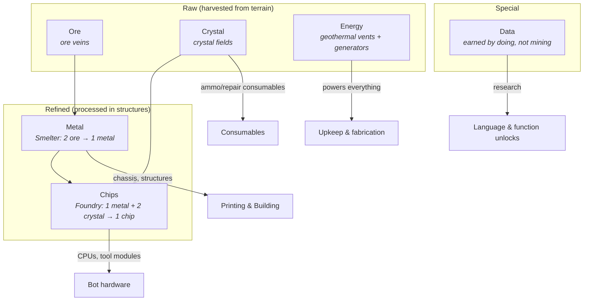

# Resources

Five resources. Each exists to gate a *different verb*, so shortages push players toward different behavior instead of "more of everything."

## The Tree

## Resource Roles

| Resource | Source | Primary sink | The question it asks the player |
|---|---|---|---|
| **Ore** | Ore veins (finite nodes) | Smelt into Metal | *Can your mining programs scale and reach?* |
| **Crystal** | Crystal fields (finite, in risky terrain — see [05-terrain.md](05-terrain.md)) | Chips, consumables | *Will you venture into dangerous ground?* |
| **Metal** | Smelter (refines Ore) | Chassis, structures, reprints | *How much are you willing to lose?* (combat/reprint costs) |
| **Chips** | Foundry (Metal + Crystal) | CPU & tool modules | *Compute or claws?* Better brains vs. more bots |
| **Energy** | Generators (burn Ore) or free at geothermal vents | Powers Fabricators/Smelters/Foundries; per-bot **upkeep** | *How big can the colony get?* Soft population cap |
| **Data** | Task milestones, exploring, dissecting Feral wrecks, first-time achievements | Research: unlocks constructs and function blocks ([06-progression.md](06-progression.md)) | *Are you doing new things or the same thing?* |

## Design Rules

1. **Data is not minable.** It comes from *activity* — first kill, tiles explored, Feral wrecks analyzed, milestones ("deliver 500 ore"). This ties progression to playing broadly, and it means a turtling player unlocks slower than an active one.
2. **Energy is upkeep, not stockpile.** It's a rate (generation vs. drain), not a pile. Exceeding generation causes **brownout**: all bot cycle budgets are halved. A colony that overbuilds *gets visibly dumber* — a thematic and legible failure state.
3. **Raw resources are spatial.** Nodes are finite and placed by terrain generation, forcing expansion — which forces longer supply lines — which rewards better hauling/escort programs. The resource system exists to create *routing problems for player code*.
4. **Refinement is a logistics step, not a click.** Smelters/Foundries have input/output buffers that bots must physically feed and empty. Factory-game DNA: throughput is a program-quality problem.

## Structures (resource-relevant set)

| Structure | Cost | Function |
|---|---|---|
| **Fabricator** (printer) | 20 Metal | Prints/reprints bots for **one program color** ([01-language.md](01-language.md)); buildable count gated by controlled nests ([04-enemies.md](04-enemies.md)). Player sets a **desired max** per printer — the population dial, enforced by recall. Loses its backing nest → **dormant**: dial forced to 0, color frozen. The colony heart; losing your last one is near-lethal. |
| **Depot** | 5 Metal | Cargo drop-off, storage. |
| **Smelter** | 10 Metal | Ore → Metal. Needs energy. |
| **Foundry** | 15 Metal, 5 Chips | Metal + Crystal → Chips. Needs energy. |
| **Generator** | 8 Metal | Burns Ore → Energy rate. |
| **Geothermal Tap** | 12 Metal | Free steady Energy, only on vent tiles. |
| **Research Archive** | 10 Metal, 5 Chips | Where Data is spent; one per colony needed to research. |
| **Repair Bay** | 8 Metal | Repairs bots in range (energy drain while active). The target of `on hurt:` retreat programs ([01-language.md](01-language.md)). |
| **Log Archive** | 5 Metal, 2 Chips | Receives `upload_log()` transmissions; the colony's crash-report/telemetry viewer. |

## Starting State (per player)

- 2 Fabricators (the Red and Green printers), 1 Depot, 1 Generator
- 2 Drudge bots (Red) with a working Tier-0 mining program pre-deployed (the tutorial *is* reading this program)
- 30 Metal, 10 Ore buffer, 0 Crystal/Chips/Data

## Open Questions

- Do resource nodes regenerate? Lean **no** for match modes (forces map control), possible **slow regen** for long co-op sessions.
- Is Crystal harvesting mechanically different from Ore (e.g. needs a specific tool module)? Lean yes — one more thing programs must handle.
- Market/trading between co-op allies: free gifting, or a transfer structure? Defer to [08-multiplayer.md](08-multiplayer.md) open questions.
