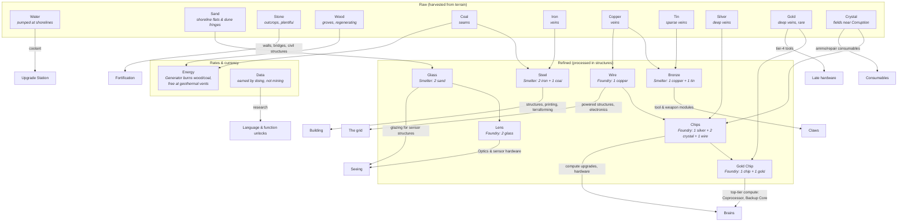

# Resources

**Eleven raw materials → seven refined products**, plus **Energy** (a rate, not a pile) and **Data** (a currency, not a mineral). Each exists to gate a *different verb*, so shortages push players toward different behavior instead of "more of everything." (All recipes/rates below are tuning values.)

## The Tree

## Resource Roles

Raw:

| Resource | Source | Primary sink | The question it asks the player |
|---|---|---|---|
| **Water** | Pumped at shorelines (Pump structure) | Coolant — the Upgrade Station consumes it per compute upgrade | *Do you hold shoreline?* Compute is water-cooled: colonies near rivers think better. |
| **Stone** | Outcrops — plentiful, everywhere | Barricades, bridges, civil structures (Depot, Sentry Post, Request Box) | *Can you dig in?* Fortification is cheap in value but heavy in logistics — walls are hauled, not conjured. |
| **Sand** | Shoreline flats and dune fringes (interacts with Q35's dune terrain) | Glass | *The other coastal claim* — water cools compute, sand feeds optics; shorelines are double-valuable. |
| **Wood** | Groves — the flagship **regenerating** node type | Generator fuel (weak); Lanterns | *Renewable but thin* — enough to idle on, never enough to grow on. |
| **Coal** | Seams | Generator fuel (strong) + Steel | *Energy logistics* — the fuel line is a supply line. |
| **Iron** | Veins, common | Steel | *Can your mining programs scale and reach?* |
| **Copper** | Veins | Wire + Bronze | *Electrification* — one ore, two competing futures. |
| **Tin** | Sparse veins | Bronze (nothing else) | *Prospect wide* — copper is everywhere, its alloy partner isn't. |
| **Silver** | Deep veins | Chips | *Contested wealth* — the midgame's fight-worthy vein. |
| **Gold** | Deep veins, rare; the Data Exchange's densest *output* | **Gold Chips** (top-tier compute) + **tier-4 tools** | *Raid bait* — high value per unit of cargo, worth escorting, worth stealing. |
| **Crystal** | Fields in risky terrain ([05-terrain.md](05-terrain.md)) | Chips, consumables | *Will you venture into dangerous ground?* |

Refined:

| Product | Recipe (structure) | Primary sink | The question it asks the player |
|---|---|---|---|
| **Steel** | 2 Iron + 1 Coal (Smelter) | Structures, terraforming, tier-2 tools, per-bot maintenance, printing when priced ([02-agents.md](02-agents.md)) | *The industrial base* — everything standing is made of it; when prints are priced, also *how much are you willing to lose?* |
| **Bronze** | 1 Copper + 1 Tin (Smelter) | Tool & weapon modules | *Claws* — the arming material. |
| **Wire** | 1 Copper (Foundry) | Powered structures, cheap electronics, Chip input | *The grid* — everything electrified pays a copper tax. |
| **Chips** | 1 Silver + 2 Crystal + 1 Wire (Foundry) | Compute upgrades ([06-progression.md](06-progression.md)); Gold Chip input | *How big is the brain budget?* Brains are bought, and Chips are the only way to think bigger — every Chip spent on thought is mining and hauling not spent on claws. |
| **Glass** | 2 Sand (Smelter) | Lens stock; glazing for sensor structures (Sentry Post) | *Can you see?* — the seeing material. |
| **Lens** | 2 Glass (Foundry) | The **Optics module** (2 Lens + 1 Bronze — Q53 answered, [06-progression.md](06-progression.md)) | *How far can you see?* Sensor range gets a supply chain. |
| **Gold Chip** | 1 Chip + 1 Gold (Foundry) | Top-tier compute — the Coprocessor and Backup Core price in these ([06-progression.md](06-progression.md)) | *Is your colony rich enough to think this hard?* The best brains are gilded. |

Rates & currency:

| Resource | Source | Primary sink | The question it asks the player |
|---|---|---|---|
| **Energy** | Generators (burn Wood weakly or Coal strongly) or free at geothermal vents | Powers Fabricators/Smelters/Foundries; per-bot **upkeep** | *How big can the colony get?* Soft population cap |
| **Data** | Task milestones, exploring, `analyze()`-ing other factions' wrecks, first-time achievements | Construct research (one-time, permanent — [06-progression.md](06-progression.md)), repairing the ruined **Red printer**, and the **Data Exchange**: convert Data into other resources at the Research Archive (tuned rates, Chips-favored) | *Are you doing new things or the same thing?* |

## Design Rules

1. **Data is not minable.** It comes from *activity* — first kill, tiles explored, **other factions' wrecks analyzed** (never your own — no staged Data, Q76), milestones ("deliver 500 ore"), and repairing the ruined Red printer is its flagship early sink. This ties progression to playing broadly, and it means a turtling player unlocks slower than an active one.
2. **Energy is upkeep, not stockpile.** It's a rate (generation vs. drain), not a pile. Exceeding generation causes **brownout**: all bot cycle budgets are halved (the Fabricator's backup trickle exempts one bot — Q84). A colony that overbuilds *gets visibly dumber* — a thematic and legible failure state. **Steel shortfall rusts** (Q84): unpaid chassis maintenance halts self-repair fleet-wide and adds a slow HP decay; sustained shortfall joins the scrap-recall trigger. All of it configurable in `upkeep.ron` — decay rate, thresholds, and whether rust scraps.
3. **Raw resources are spatial.** Nodes are placed by terrain generation and **mostly finite**, forcing expansion — which forces longer supply lines — which rewards better hauling/escort programs. The resource system exists to create *routing problems for player code*. **Regeneration is a per-node-type data flag**: the engine supports it, most node types ship with it off — **Wood groves are the flagship exception** (renewable, low-yield) — and maps can place other regenerating variants (e.g. a slow *seeping vein*) as design accents or for long-running servers.
4. **Seeing discovers; the scouting stance surveys** (2026-07-14, Q74 — supersedes "buried until prospected"). A *seen* tile is fully known, veins included; `search()` is the **scouting stance** (root in place, seeing expands ring-by-ring to the hearing radius — [01-language.md](01-language.md), [05-terrain.md](05-terrain.md)). Discoveries are **permanent map knowledge**; remaining amounts are live-only; node queries answer from map knowledge at any range. Start-zone nodes sit within the starting units' sight, so the pre-deployed starter program works from tick one. Expansion still has a survey step in practice: beyond the start zone, walking every tile with your eyeballs is slow and dangerous — a rooted scout is the cheap alternative. Ferals discover by the same rules.
5. **Refinement is a logistics step, not a click.** Smelters/Foundries have input/output buffers that bots must physically feed (`deposit()`) and empty (`withdraw()` — Q79). Factory-game DNA: throughput is a program-quality problem.
6. **Payments are abstract; feeds are physical** (Q84). Anything `deposit()`ed into a Depot enters **colony stock**, and every *payment* — blueprints, research, station purchases, module swaps, upkeep — draws from stock with no haul-to-site. The *feeds* stay physical: refinery inputs/outputs, Generator fuel, and Station coolant must actually be hauled. Logistics is gameplay where flow is the point, bookkeeping where it isn't.

## Harvest Tool Tiers

Harvesting requires a **tool module** ([02-agents.md](02-agents.md)), and tools are **tiered**: a level-N harvester works every resource of tier ≤ N. Each resource declares its required tier (data-driven; numbers below are made-up tuning values):

| Resource | Required tool tier |
|---|---|
| Wood, Stone, Sand | 0 |
| Iron, Coal | 1 |
| Copper, Tin | 2 |
| Silver, Gold | 3 |
| Crystal | 4 |
| Water | — (pumped by a structure, not mined) |

The tier ladder is the arc of the colony: chop, dig, electrify, get rich, get brave. **The ladder rule (Q72): tier-N+1 tools price only in materials mineable at tier ≤ N** — no tier's key is ever locked behind its own door.

| Tool tier | Priced in | Made from what you already mine |
|---|---|---|
| 1 | starting kit | — |
| 2 | Steel | Iron + Coal (tier 1) |
| 3 | Bronze | Copper + Tin (tier 2) |
| 4 | Bronze + **Gold** | tier-2 alloy + tier-3 wealth — *get rich to get brave* |

Each rung is bought with the previous rung's ore, so reaching Crystal is a wealth investment on top of a territorial risk ([05-terrain.md](05-terrain.md)): the bot that can mine it is expensive, and it's working next to Corruption. Escort it.

The **build/repair tool is the ladder's one exception** (Q84): civil kit, priced in **Steel** — so the first builder is a free print plus a Steel tool, and the Smelter is never locked behind the Bronze it would produce.

## Ally Aid: the Request Box

No free-form resource gifting. A colony builds a **Request Box** and posts a request on it (*resource, amount*). Allied bots may — entirely voluntarily — haul the requested resource in and `deposit()` it; the owner collects what arrives.

- Aid is **physical logistics**: someone's haulers cross the map to deliver it, through whatever is between the colonies. Charity has supply lines.
- It's **programmable**: a good ally writes a standing program — `if ally_request_open(): haul_to(request_box)` — and generosity becomes infrastructure.
- Requests are visible to all allies (and, being on the field, spottable by enemy scouts: a colony begging for Steel is telling everyone something).

## Structures (resource-relevant set)

| Structure | Cost | Function |
|---|---|---|
| **Fabricator** (printer) | 20 Steel | Prints/reprints bots for **one program color** ([01-language.md](01-language.md)); buildable count gated by controlled nests ([04-enemies.md](04-enemies.md)). Each adds a fixed amount to the colony's **fleet cap**; printers after the first carry a **target share + selection key** for which bots wear their color (the first takes the remainder), enforced by recall ([01-language.md](01-language.md)). Loses its backing nest → **dormant**: cap contribution withdrawn, target voided, color frozen. Printers are also **the cloud**: they always accept `upload_log()` / crash-dump traffic (even dormant), and any printer's inspector is the colony's telemetry viewer — color-coded and filterable by log level ([01-language.md](01-language.md)). The colony heart; losing your last one is near-lethal — and it takes your telemetry with it. Also a **backup generator** (Q84): its trickle always keeps **one bot** powered at full budget (deterministic pick: lowest entity ID) — a total blackout can never deadlock the colony, because someone can always walk out for fuel. |
| **Depot** | 5 Stone | Cargo drop-off, storage. |
| **Smelter** | 10 Steel | The heat works: **2 Iron + 1 Coal → 1 Steel**, **1 Copper + 1 Tin → 1 Bronze**, or **2 Sand → 1 Glass** (recipe set per Smelter). Needs energy. |
| **Foundry** | 25 Steel, 10 Bronze | The precision works: **1 Copper → 1 Wire**, **1 Silver + 2 Crystal + 1 Wire → 1 Chip**, **2 Glass → 1 Lens**, or **1 Chip + 1 Gold → 1 Gold Chip** (recipe set per Foundry). Needs energy. Priced in Smelter goods only (Q72): **expensive, never impossible** — the electronics age is a big Steel-and-Bronze investment, not a chicken-and-egg. |
| **Generator** | 8 Steel | Burns fuel → Energy rate: Wood (weak) or Coal (strong). Fed physically (`deposit()` fuel into its intake — Q79/Q84). |
| **Geothermal Tap** | 12 Steel | Free steady Energy, only on vent tiles. |
| **Pump** | 6 Steel, 2 Wire | Placed on shoreline; extracts **Water** into its buffer for bots to haul. The only source of coolant. |
| **Research Archive** | 10 Steel, 5 Stone | The **Data Exchange** — Data → other resources at tuned rates (everyone, forever; Chips-favored, **Gold trades best per unit**) — and the colony's telemetry annex. **Construct research needs no structure** (Q84): it's a player Command spending colony Data, so learning is never gated behind building — the Archive is the bank, not the school. |
| **Repair Bay** | 8 Steel | Repairs bots in range (energy drain while active). The target of hurt-handler retreat programs ([01-language.md](01-language.md)). |
| **Upgrade Station** | 10 Steel, 5 Chips, 3 Wire | Bots walk here to buy **per-bot compute upgrades** (cycles, memory, stack, log buffer, Coprocessor — catalog in [06-progression.md](06-progression.md)) for Chips, **consuming Water as coolant per upgrade** (rate: Q69). Works like a printer (Q68, decided): the bot **mounts the pad, sits inert for the upgrade time** (tuning, per catalog entry), and steps off upgraded — one pad, one bot, so the queue is physical and everyone in it is exposed. Orders are player-queued per bot (a `QueueUpgrade` Command — designation is the player's); the **program** must bring the bot to a pad. **Bots never path onto the pad** (Q84): they stand adjacent, and the pad *pulls* the next adjacent bot with a queued order (lowest entity ID) — no crash-looping on an occupied tile. Payment charges **at mount** (unaffordable = step off, order stays queued); pad-sit is an **interrupt context** (double-handle applies — upgrading under fire risks the prize). Player-placed like any structure; parking your veterans on a pad in contested ground is a choice. |
| **Sentry Post** | 4 Stone, 1 Glass | Wide sensor radius, nothing else. Fog of war is eyes-only ([05-terrain.md](05-terrain.md)) — fixed sightlines are cheap infrastructure, but even a watchtower needs a window. |
| **Lantern** | 2 Wood | Tiny fixed sensor radius (~2 tiles, tuning) — a light, not a watchtower. The cheapest ward against eyes-only fog: string them along perimeters and haul roads. Its little seeing circle is real sight (Q74): lit ground is surveyed ground, and a mover crossing it is detected. |
| **Request Box** | 3 Stone | Posts a resource request allies may voluntarily fulfill by hauling and depositing (see Ally Aid). |

## Starting State (per player)

- 1 working Fabricator (the **Green** printer), 1 **ruined Red Fabricator** (repairable for Data — the first colony milestone, [01-language.md](01-language.md)), 1 Depot, 1 Generator
- 2 bots (Green, **tier-1 mining tools** slotted — the start-zone veins are Iron and Coal, tier 1) with a working starter mining program pre-deployed (the tutorial *is* reading this program)
- 30 Steel, 10 Iron + 5 Coal in colony stock, 0 everything else (map generation guarantees Iron + Coal + Wood + Stone in the start zone; Copper/Tin within first-expansion reach — Q69)
- **The Generator starts stoked** (Q84 — a tuning buffer of fuel), and the start guarantee includes *starting upkeep < starting generation*: the opening never brownouts before the player acts. The starter economy's first real job is keeping it fed.

## Decided

- **Raw/refined split** (2026-07-13, supersedes the five-resource model). Eleven raws — Water, Stone, Sand, Wood, Coal, Iron, Copper, Tin, Silver, Gold, Crystal — feed seven refined products: **Steel** (Iron+Coal), **Bronze** (Copper+Tin — bronze is an alloy, so Tin replaced it on the raw list), **Wire** (Copper), **Chips** (Silver+Crystal+Wire), **Glass** (Sand), **Lens** (Glass), and **Gold Chip** (Chip+Gold, added with Q72). Steel replaces the old generic "Metal" for machines and printing; **Stone** (added 2026-07-14) owns fortification and civil works — barricades, bridges, Depot/Sentry/Request Box; **Sand → Glass → Lens** (added 2026-07-14) is the seeing chain — glazing for sensor structures, lenses for Optics-grade sensor hardware (Q53); Gold is direct-use premium hardware + the Exchange's densest good; Water is pumped, not mined, and cools the Upgrade Station. Every raw gates a distinct verb (see Resource Roles). Tier ladder: Wood/Stone/Sand 0 → Iron/Coal 1 → Copper/Tin 2 → Silver/Gold 3 → Crystal 4. Open edges (recipes, kind constants, sim migration): Q69.
- **Regen is a per-node-type data flag** — most node types are finite (**Wood groves are the flagship regenerating exception**); other regenerating variants exist for map design and long servers (see Design Rules).
- **Seeing discovers; the scouting stance surveys** (2026-07-14, Q74 — supersedes 2026-07-14's "buried until prospected") — a seen tile is fully known, veins included; `search()` is the rooted wide survey; discoveries permanent, amounts live-only, node queries answer from map knowledge (see Design Rules; fog rules in [05-terrain.md](05-terrain.md)). The **Lantern** (2 Wood) remains the cheap vision ward below the Sentry Post.
- **The bootstrap works** (2026-07-14, answers Q72). The Foundry prices in Smelter goods only (25 Steel + 10 Bronze — expensive, never impossible) and the Research Archive in Steel + Stone, so the electronics age and construct research are both reachable from the starting kit. **The ladder rule**: tier-N+1 tools price only in tier-≤N materials (t2 Steel, t3 Bronze, t4 Bronze+Gold). **Bronze arms, Chips think**: tools and weapons price in Bronze, Chips buy compute only. **Gold makes better chips**: the Gold Chip (1 Chip + 1 Gold, Foundry) is the seventh refined good, and the top of the compute catalog (Coprocessor, Backup Core) requires them. **The build receipt is literal** ([02-agents.md](02-agents.md)): refunds and salvage return fractions of what was *actually* spent — a free print's chassis line is 0; upgrades and modules always count. **Modules are made at the printer, swapped at the station**: the Fabricator slots modules at print time (materials added to the print); the Upgrade Station swaps them later ([06-progression.md](06-progression.md)).
- **The physical layer works** (2026-07-14, answers Q84). The **build/repair tool prices in Steel** (the ladder's civil-kit exception — no Bronze circle). **Research is structure-free** (a Command spending colony Data; the Archive is the bank, not the school). **The Generator starts stoked**, starting upkeep < starting generation, and the **Fabricator is a backup generator** — its trickle always keeps one bot powered (lowest entity ID): blackout can never deadlock the colony. **Payments are abstract, feeds are physical** (colony stock vs. hauled refinery/fuel/coolant flows). **Steel shortfall rusts** (self-repair halts + slow decay; configurable in `upkeep.ron`). **Wreck-race verb speeds** (tuning, tool-modifiable, in `costs.ron`): salvage ~4 s < analyze ~6 s < hijack ~10 s; field repair scales with build rate; hijack requires the build tool. **Station queue**: adjacent-stand + pad-pull (lowest ID), payment at mount, pad-sit is an interrupt context. **First-pass tuning manifest**: mine yield 2/swing; recipe batch ~30 ticks; fleet cap +15/printer; coolant 1 Water/upgrade; quirk probability default 0.5/bot; fault chip 2 HP; Generator output comfortably above ~10 bots' idle draw, Coal ≫ Wood per unit — all data, all tunable.
- **Kind constants & typed yields** (2026-07-14, answers Q69's design portion). Every raw gets a Pyrite constant (`iron` … `sand`); **`ore` stays the family constant** — any discovered mineral vein or seam — so the starter program and every existing example keep working. **`mine()` yields are typed** by the node's kind: cargo is a typed manifest, hauling routes by kind, refinery buffers accept only their recipe's inputs ([01-language.md](01-language.md)). What's left of Q69 is playtest tuning and implementation, not design: recipe ratios, burn/coolant/Exchange rates, Tin's sparsity floor, and the sim's Ore→Metal migration (replay-hash change). The map-generation *procedure* that must deliver the placement guarantees is its own open question — Q71.
- **Harvest tools are tiered** — level-N tools work resources of tier ≤ N; Ore low, Crystal high (see Harvest Tool Tiers).
- **Ally aid = Request Box** — posted requests, voluntarily fulfilled by physical hauling; no free-form gifting (see Ally Aid).

- **No extra reward for fulfilling requests** — the Hauling XP the trip naturally earns is the reward.
