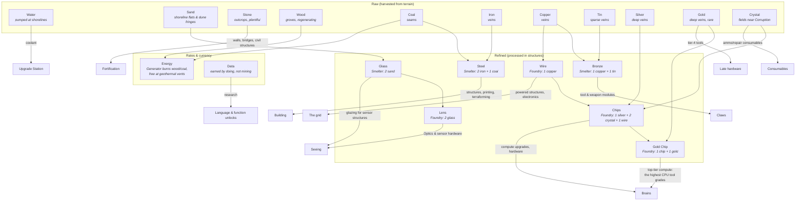

# The Tree, Roles & Design Rules

*Part of [03-resources](../03-resources.md).*

## The Tree

## Resource Roles

Raw:

| Resource | Source | Primary sink | The question it asks the player |
|---|---|---|---|
| **Water** | Pumped at shorelines (Pump structure) | Coolant — the Upgrade Station consumes it per compute upgrade | *Do you hold shoreline?* Compute is water-cooled: colonies near rivers think better. |
| **Stone** | Outcrops — plentiful, everywhere | Barricades, bridges, civil structures (Depot, Sentry Post, Request Box) | *Can you dig in?* Fortification is cheap in value but heavy in logistics — walls are hauled, not conjured. |
| **Sand** | Shoreline flats and dune fringes (interacts with Q35's dune terrain) | Glass | *The other coastal claim* — water cools compute, sand feeds optics; shorelines are double-valuable. |
| **Wood** | Groves — the flagship **regenerating** node type | Generator fuel (weak); Lanterns | *Renewable but thin* — enough to idle on, never enough to grow on. |
| **Coal** | Seams | Generator fuel (strong) + Steel | *Energy logistics* — the fuel line is a supply line. |
| **Iron** | Veins, common | Steel | *Can your mining programs scale and reach?* |
| **Copper** | Veins | Wire + Bronze | *Electrification* — one ore, two competing futures. |
| **Tin** | Sparse veins | Bronze (nothing else) | *Prospect wide* — copper is everywhere, its alloy partner isn't. |
| **Silver** | Deep veins | Chips | *Contested wealth* — the midgame's fight-worthy vein. |
| **Gold** | Deep veins, rare; the Data Exchange's densest *output* | **Gold Chips** (top-tier compute) + **tier-4 tools** | *Raid bait* — high value per unit of cargo, worth escorting, worth stealing. |
| **Crystal** | Fields in risky terrain ([05-terrain.md](../05-terrain.md)) | Chips, consumables | *Will you venture into dangerous ground?* |

Refined:

| Product | Recipe (structure) | Primary sink | The question it asks the player |
|---|---|---|---|
| **Steel** | 2 Iron + 1 Coal (Smelter) | Structures, terraforming, tier-2 tools, per-bot maintenance, printing when priced ([02-agents.md](../02-agents.md)) | *The industrial base* — everything standing is made of it; when prints are priced, also *how much are you willing to lose?* |
| **Bronze** | 1 Copper + 1 Tin (Smelter) | Tool & weapon modules | *Claws* — the arming material. |
| **Wire** | 1 Copper (Foundry) | Powered structures, cheap electronics, Chip input | *The grid* — everything electrified pays a copper tax. |
| **Chips** | 1 Silver + 2 Crystal + 1 Wire (Foundry) | Compute upgrades ([06-progression.md](../06-progression.md)); Gold Chip input | *How big is the brain budget?* Brains are bought, and Chips are the only way to think bigger — every Chip spent on thought is mining and hauling not spent on claws. |
| **Glass** | 2 Sand (Smelter) | Lens stock; glazing for sensor structures (Sentry Post) | *Can you see?* — the seeing material. |
| **Lens** | 2 Glass (Foundry) | The **optics tool**'s upper grades — the Sand → Glass → Lens sensing chain ([06-progression.md](../06-progression.md), Q111; the P11 sweep retargeted this from the deleted Optics module) | *How far can you see?* Sensor range gets a supply chain. |
| **Gold Chip** | 1 Chip + 1 Gold (Foundry) | Top-tier compute — the highest CPU tool grades price in these ([06-progression.md](../06-progression.md)) | *Is your colony rich enough to think this hard?* The best brains are gilded. |

Rates & currency:

| Resource | Source | Primary sink | The question it asks the player |
|---|---|---|---|
| **Energy** | Generators (burn Wood weakly or Coal strongly) or free at geothermal vents | Powers Printers/Smelters/Foundries; per-bot **upkeep** | *How big can the colony get?* Soft population cap |
| **Data** | Task milestones, exploring, `analyze()`-ing other factions' wrecks, first-time achievements | Construct research (one-time, permanent — [06-progression.md](../06-progression.md)), repairing the ruined **Red printer**, and the **Data Exchange**: convert Data into other resources at the Research Archive (tuned rates, Chips-favored) | *Are you doing new things or the same thing?* |

## Design Rules

1. **Data is not minable.** It comes from *activity* — first kill, tiles explored, **other factions' wrecks analyzed** (never your own — no staged Data, Q76), milestones ("deliver 500 ore"), and repairing the ruined Red printer is its flagship early sink. This ties progression to playing broadly, and it means a turtling player unlocks slower than an active one.
2. **Energy is upkeep, not stockpile.** It's a rate (generation vs. drain), not a pile. Exceeding generation causes **brownout**: all bot cycle budgets are halved (the Printer's backup trickle exempts one bot — Q84). A colony that overbuilds *gets visibly dumber* — a thematic and legible failure state. **Steel shortfall rusts** (Q84): unpaid chassis maintenance halts self-repair fleet-wide and adds a slow HP decay; sustained shortfall joins the scrap-recall trigger. All of it configurable in `upkeep.ron` — decay rate, thresholds, and whether rust scraps.
3. **Raw resources are spatial.** Nodes are placed by terrain generation and **mostly finite**, forcing expansion — which forces longer supply lines — which rewards better hauling/escort programs. The resource system exists to create *routing problems for player code*. **Regeneration is a per-node-type data flag**: the engine supports it, most node types ship with it off — **Wood groves are the flagship exception** (renewable, low-yield) — and maps can place other regenerating variants (e.g. a slow *seeping vein*) as design accents or for long-running servers.
4. **Seeing discovers; the scouting stance surveys** (2026-07-14, Q74 — supersedes "buried until prospected"). A *seen* tile is fully known, veins included; `search()` is the **scouting stance** (root in place, seeing expands ring-by-ring to the hearing radius — [01-language.md](../01-language.md), [05-terrain.md](../05-terrain.md)). Discoveries are **permanent map knowledge**; remaining amounts are live-only; node queries answer from map knowledge at any range. Start-zone nodes sit within the starting units' sight, so the pre-deployed starter program works from tick one. Expansion still has a survey step in practice: beyond the start zone, walking every tile with your eyeballs is slow and dangerous — a rooted scout is the cheap alternative. Ferals discover by the same rules.
5. **Refinement is a logistics step, not a click.** Smelters/Foundries have input/output buffers that bots must physically feed (`deposit()`) and empty (`withdraw()` — Q79). Factory-game DNA: throughput is a program-quality problem.
6. **Payments are abstract; feeds are physical** (Q84). Anything `deposit()`ed into a Depot enters **colony stock**, and every *payment* — blueprints, research, station purchases, upkeep — draws from stock with no haul-to-site. The *feeds* stay physical: refinery inputs/outputs, Generator fuel, and Station coolant must actually be hauled. Logistics is gameplay where flow is the point, bookkeeping where it isn't.

