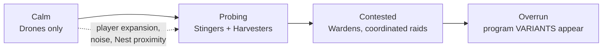

# Enemies — The Feral

The PvE faction: **Feral machines**, corrupted bots left over from whatever wrecked this world. The core conceit (requirement 5): **Ferals run real Pyrite programs on the same VM as player bots**, and players can *decrypt and read those programs* — by the same rule that governs everything: programs are read on murder.

## Why enemies run the player's VM

- **One interpreter, one truth.** No separate AI system to build or keep deterministic ([08-multiplayer.md](08-multiplayer.md)). Feral behavior is exactly as inspectable, steppable, and deterministic as player code.
- **Reading code is the counterplay.** A Feral's program is its stat block *and* its weakness. `if attacker_count > 2: flee_to_nest()` is an instruction to the player: bring three bots. Decryption is how you earn the read.
- **Enemies are the curriculum.** Early Feral programs are simple Tier-0/1 scripts that teach by example (and leak in a kill or two); late ones use constructs the player hasn't unlocked yet — a preview of their own future power, behind a longer decryption grind.

## Inspection & Decryption

Feral programs are **encrypted exactly like player code** ([08-multiplayer.md](08-multiplayer.md)): each salvage/analysis of a nest's unit grants **permanent +N% decryption** of that nest's archetype program. One universal rule, no exceptions: **programs are read on murder** — yours, theirs, everyone's.

| Method | What you get |
|---|---|
| Click any visible Feral | Archetype + nest tag, live behavior — and your current **decrypted view** of its source (stable noise where unrevealed), with **live program counter** stepping over the lines you've revealed |
| `analyze()` a Feral wreck | **Data** ([03-resources.md](03-resources.md)) + **+N% decryption** of that nest's archetype program + the nest's **comm key** ([01-language.md](01-language.md)) |
| Codex library | Every decrypted view, versioned and diffable (mutating nests create versions; your % persists across them) |

- **Decrypt rate is per-arcanum tuning** — the difficulty knob: the Fool leaks its whole program in a couple of kills (the curriculum still works; it's just earned), while high arcana stay cryptic across a long campaign.
- Once decrypted, the live program-counter view delivers the aha-moments: a retreating player literally watches the pursuer's code hit its `if distance_from_nest > 40: return_home()` line.
- **Channels are never included**: even at 100% decryption you can *see* the Warden calls `try_broadcast("intruder", …)`, but listening in or spoofing requires the nest's comm key — reading is reconnaissance; interacting takes fieldwork. Suppressing a nest's alarms by message-stealing, or baiting defenders with fake alerts, is intended late-game play.

## Feral Archetypes (initial set)

Each archetype = chassis + program. Programs shown are their *actual* shipped source.

### Drone (threat 1) — teaches Tier 0

```python
wander()
wander()
if exists(enemy):
    attack(closest(enemy).expect())
```

Harmless in ones. Exists so the first program a player ever reads is trivially comprehensible.

### Stinger (threat 2) — teaches conditionals

```python
if health_low():
    flee_to(nest)
if exists(enemy):
    chase(closest(enemy).expect())
    attack(closest(enemy).expect())
wander()
```

Counterplay written in the code: hurt it and it *will* run — ambush the retreat path.

### Harvester (threat 2) — economic enemy

```python
target = closest(ore).expect()
move_to(target)
mine()
move_to(nest)
deposit()
```

Steals *your* map's ore and feeds its nest. Ignores bots entirely — a pure race pressure on the economy.

### Warden (threat 3) — teaches loops + messaging

```python
for spot in patrol_route:
    move_to(spot)
    if exists(enemy):
        try_broadcast("intruder", closest(enemy).expect())
        attack(closest(enemy).expect())
```

Patrols and *calls for help* (other Ferals block on `receive("intruder")`). Counterplay: jam or bait the call, or kill it inside one patrol leg.

### Nest (structure, threat scales)

Prints Ferals from harvested resources, exactly like a player Fabricator. Feral economy is real: starve the nest (kill Harvesters) and it prints less. Destroying a Nest yields a large Data bounty.

**Controlling nests is the territory game**: a defeated Nest can be **claimed** (a bot with a build tool converts the site) instead of razed. Controlled nests gate how many **printers** — and therefore program colors — a colony may build, on a quadratic curve ([01-language.md](01-language.md), [03-resources.md](03-resources.md)). Razing pays Data now; claiming grows your program portfolio forever. Higher-arcana nests are worth the same slot credit but are far harder to take — pick your conquests.

**Claims must be held: Ferals reclaim nests.** An undefended claim is a loan — nearby Feral activity can re-take the site, sending its printer dormant ([01-language.md](01-language.md)). Aggressiveness is arcanum-flavored: siege personalities (Tower, Justice) will assault defended claims; most others only reoccupy ones left empty.

## Nest Allegiance — the Major Arcana (0–21)

Every Nest has an **Allegiance**, numbered 0–21 after the tarot Major Arcana. **The number is the difficulty axis** — higher allegiance means better-written programs, higher construct tiers, and nastier tricks. The arcanum is the nest's *personality*: what it prints, how it fights, and above all **how it treats code** — whether its programs are static, mutated between prints, or actively researched.

All of this is first-pass flavor to tune; the mechanical skeleton (allegiance number → code-behavior flags) is the part to build.

| # | Arcanum | Nest identity | Code behavior |
|---|---|---|---|
| 0 | The Fool | Tier-0 straight-line bots that wander into things and fault constantly. Poses no real threat — the tutorial nest. | Static; ships with bugs *on purpose* (reading its crash-loops is the first lesson) |
| 1 | The Magician | Loves to create: every print carries a small mutation — no two of its Drones run identical code. | **Procedural mutation**, minor (tweaked constants, reordered lines) |
| 2 | The High Priestess | Silent intelligence: stealth scouts that shadow your bots and **collect your Black Boxes** before you do. | Static, sensor-heavy; steals intel rather than dealing damage |
| 3 | The Empress | Fertility: double print rate, Harvester floods, buds **satellite nests**. Wins by growth, not combat. | Static economy scripts, excellently tuned |
| 4 | The Emperor | Order: officer bots broadcast commands to ranks. Kill the officer and the formation decoheres to Tier-1 behavior. | Static, messaging-heavy hierarchy |
| 5 | The Hierophant | The teacher: deploys textbook-perfect demos of constructs you haven't unlocked — and **converts**: attempts to `hijack()` your disabled wrecks into its flock. | Static exemplars; hijack-capable |
| 6 | The Lovers | Bonded pairs: units fight in twos; when one dies, its partner hot-swaps to an avenger program. | Static, signal-linked pairs |
| 7 | The Chariot | Speed: fast raid swarms on straight-line assault vectors, terrain-ignorant pathing (exploitable at chokes). | Static rush scripts |
| 8 | Strength | Few, heavy, patient: high-HP hunters that **target your highest-XP bots** first. | Static; priority logic reads XP decals |
| 9 | The Hermit | Lone elites far from any nest; the nest itself is hidden and must be scouted to be ended. | Static, self-sufficient (long programs, big CPU) |
| 10 | Wheel of Fortune | Chance: patrol routes, targets, even cycle budgets rolled from seeded RNG streams. Unreadable by pattern, only by code. | **Procedurally randomized parameters** per print |
| 11 | Justice | The ledger: retaliates in proportion to each player's aggression — tit-for-tat tracked per player (multiplayer-aware). | Static but **stateful**: grudge counters in colony memory |
| 12 | The Hanged Man | Sacrifice: scuttle-bombers that weaponize `become_disabled()` — deliberate scuttles that plant ticking wrecks on your doorstep: clear them in time or eat the countdown explosion. | Static, scuttle-centric |
| 13 | Death | The recycler: **salvages every wreck on the field** — yours, other Ferals', its own — to fuel printing. Starves your salvage economy and eats your battlefields. | Static; salvage-centric |
| 14 | Temperance | Balance: reads your army composition and prints proportional counters. The first nest that **researches** — its tech keeps pace with yours. | **Researches**; adaptive mix |
| 15 | The Devil | Corruption: spreads Corruption biome tiles outward and **hijacks your bots** — reprogrammed veterans fight for it, XP intact. | Hijack-capable; terrain-altering |
| 16 | The Tower | Ruin: ignores your bots entirely; sudden all-in lightning raids on structures — Fabricators and Archives first. | Static siege scripts, long dormancy between strikes |
| 17 | The Star | Guidance: relay beacons that extend **other nests'** broadcast range and repair their units. Kill the support first. | Static, cross-nest cooperative |
| 18 | The Moon | Illusion: decoy units running deliberately misleading (but real) programs; forges **fake Black Boxes** with lying logs. Trust nothing on this part of the map — even what you've decrypted was *written to be decrypted*. | **Procedural counter-intel**; dishonest by design |
| 19 | The Sun | Clarity: no tricks — simply the best straightforward combat programs in the game, surging on full Energy. Honest and terrifying. | Static, peak-quality authored code |
| 20 | Judgement | Resurrection: reboots its dead **with XP intact** — its veterans accumulate all match. Leave no wrecks, or face them again, stronger. | Static; XP-preserving reprints |
| 21 | The World | Completion: rotates through the behaviors of every lower arcanum and uses the full construct set. The endgame nest. | **Researches + procedurally mutates**; everything |

### What Allegiance controls (the mechanical flags)

- **Program quality**: which construct tiers ([01-language.md](01-language.md)) and function blocks its scripts use. Roughly: arcana 0–4 preview Tiers 0–2, 5–13 preview Tiers 3–5, 14+ use things players are still saving Data for.
- **Code modification** (your Magician instinct, generalized): `static` (most) / `mutates-per-print` (1, 10, 18, 21) / `researches` (14, 21 — these escalate their own tree over the match, answering "should nests research?": *some do, by arcanum*).
- **Mutation style**: authored variants vs. procedural — set **per nest type and biome**. A Magician nest in Corruption mutates handlers; one in a Loop Desert unrolls loops. Biome cost overlays ([05-terrain.md](05-terrain.md)) shape what mutations are *viable*, so the same arcanum plays differently across the map.
- **Map placement**: allegiance scales with distance from player starts — 0–4 near start zones, 5–13 midfield, 14–21 deep field. The **maximum arcanum on a map is a match option** (available on any server type, PvP included) — raising it doesn't make the neighborhood meaner, it makes the *frontier* deeper. Allegiance is geography as much as clock.

## Capturing Wrecks (decided)

`hijack()` (late-game function block, [06-progression.md](06-progression.md)): field-repair **any enemy wreck** — Feral *or* player, on harm-enabled servers — during its self-destruct countdown while flashing one of your **color programs** onto it. It passes through the standard Boot Sequence ([02-agents.md](02-agents.md)) and comes up as *your* bot, original chassis, **XP intact**. Boot-as-interrupt applies: a hijack under fire aborts the prize back into a wreck — the theft has to be covered, not just fast.

- **Hijacked bots are never reprintable** by their new owner — no blueprint transfers. A stolen L5 veteran or captured Feral chassis is a unique prize; when it dies, it's gone.
- The Hierophant (5) and the Devil (15) run the same play against *you* — protect your wrecks or lose them twice.

## Escalation



- Escalation is driven by **player footprint** (territory claimed, energy output, Ferals killed), not wall-clock — turtles stay calm, expanders get pressure. Escalation and Allegiance are orthogonal: **allegiance is who a nest is; escalation is how awake it is.** A provoked Fool nest just sends more fools; a provoked Magician mutates faster.
- **Variants**: at high threat, nests with the mutation flag print archetypes with *modified programs* (e.g. a Stinger whose flee threshold is removed). Variants are flagged visually; the Codex diff view shows exactly what changed. Late-game reading comprehension test.
- **Handler-tier Ferals**: the Stinger polls `if health_low():` — deliberately the *worse* pattern. Higher-tier variants replace it with an `on hurt:` window (retreat fires instantly, mid-chase), previewing the signal-handler unlock ([06-progression.md](06-progression.md)) and demonstrating exactly why it's better: you watch a variant Stinger break off the *instant* your first shot lands.

## Co-op & PvP Role

- **Co-op**: Ferals are the primary antagonist; escalation scales with combined player footprint.
- **PvP**: Ferals are map hazard + neutral economy (deny opponents Data by controlling Nest kills). Optionally disabled in "pure" PvP.

## Decided

- **Capture & reprogram: yes, any wreck** — `hijack()` works on Feral *and* player wrecks (harm-enabled servers) via the Boot Sequence (see Capturing Wrecks). Hierophant and Devil nests mirror it against players.
- **Hijacked units keep their XP and are never reprintable** — unique prizes; high-arcana veterans are the best capture targets, mirroring Judgement's XP-keeping resurrections.
- **Nothing Feral is free** — code decrypts by salvage/analyze attrition at per-arcanum rates (Fool leaks in ~2 kills; high arcana stay cryptic); channels additionally require the nest's comm key. One universal rule: programs are read on murder.
- **Some nests research** — controlled by arcanum (Temperance, The World); the rest are static or mutate-only.
- **Mutation style is per nest type × biome** — authored vs. procedural is an arcanum flag, flavored by the biome's cost overlays.
- **Nest Allegiance 0–21** (Major Arcana) is the enemy difficulty-and-personality axis; number ≈ difficulty, arcanum ≈ how it treats code.
- **Controlled nests gate printers/colors** (quadratic) — see Nest section above.
- **v1 arcana subset: 0 (Fool), 1 (Magician), 5 (Hierophant), 7 (Chariot), 13 (Death), 16 (Tower), 18 (Moon)** — spans the difficulty axis and covers the flag matrix: static, mutating, hijacking, salvage-denial, siege, and counter-intel.
- **Losing a claimed nest makes its printer dormant, not dead** — fleet-cap contribution withdrawn, target voided, color frozen (no prints, no hotfixes); its bots become **ghost machines**: off the allocation, running frozen code, still drawing upkeep, dying by attrition (Q65). Retaking the nest reactivates the printer and **uploads its surviving ghosts back into the fleet** ([01-language.md](01-language.md)).
- **Max arcanum is a match option, on any server type** — higher-arcana nests always spawn farther from player starts; raising the cap deepens the frontier rather than hardening the neighborhood.
- **Mutated programs stay functional** — procedural mutation must yield parse-valid, non-degenerate programs. Buggy Feral code (the Fool) is an authored choice, never a mutation accident.
- **Ferals reclaim claimed nests** — claims must be defended; loss sends the printer dormant. Siege arcana (Tower, Justice) assault defended claims; others reoccupy empty ones.
