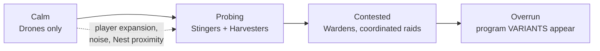

*Part of [04-enemies](../04-enemies.md).*

# Escalation

- Escalation is driven by **player footprint** (territory claimed, energy output, Ferals killed), not wall-clock — turtles stay calm, expanders get pressure. Escalation and Allegiance are orthogonal: **allegiance is who a nest is; escalation is how awake it is.** A provoked Fool nest just sends more fools; a provoked Magician mutates faster.
- **Variants**: at high threat, nests with the mutation flag print archetypes with *modified programs* (e.g. a Stinger whose flee threshold is removed). Variants are flagged visually; the Codex diff view shows exactly what changed. Late-game reading comprehension test.
- **Handler-tier Ferals**: the Stinger polls `if health_low():` — deliberately the *worse* pattern. Higher-tier variants replace it with an `on hurt:` window (retreat fires instantly, mid-chase), previewing the signal-handler unlock ([06-progression.md](../06-progression.md)) and demonstrating exactly why it's better: you watch a variant Stinger break off the *instant* your first shot lands.

## Co-op & PvP Role

- **Co-op**: Ferals are the primary antagonist; escalation scales with combined player footprint.
- **PvP**: Ferals are map hazard + neutral economy (deny opponents Data by controlling Nest kills). Optionally disabled in "pure" PvP.
