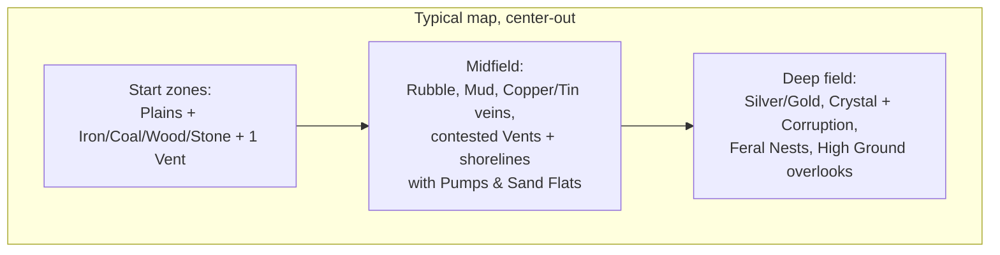

# Terrain

Rule: **every terrain type must change what a good program looks like.** If a tile type doesn't alter movement, sensing, resources, or computation, it doesn't ship. The map is a tile grid (fits the deterministic sim and integer math — see [08-multiplayer.md](08-multiplayer.md)).

## Tile Types

| Terrain | Move cost | Effects | The program it demands |
|---|---|---|---|
| **Plains** | 1× | none | baseline |
| **Rubble** | 2× | — | Pathing tradeoffs: `move_to` auto-paths, but route *choice* (waypoints) is player code |
| **Ore Vein** | 1× | minable mineral node — Iron, Coal, Copper, Tin, Silver, or Gold variant ([03-resources.md](03-resources.md)); deeper/rarer kinds sit farther from start zones | mining loops |
| **Grove** | 1× | harvestable Wood; **regenerates** | renewable-but-thin logging loops |
| **Outcrop** | 1× | harvestable Stone node — plentiful, near everywhere ([03-resources.md](03-resources.md)) | fortification supply lines: walls are hauled |
| **Sand Flat** | 1× | harvestable Sand — shoreline flats and dune fringes ([03-resources.md](03-resources.md)); deep **Dunes** (below) make *interior* sand risky to work: a harvesting bot is standing still, and the sinking clock ticks | glassworks supply; another reason coasts are contested |
| **Crystal Field** | 1× | minable Crystal; usually spawns near Corruption | risk-managed harvesting (`if exists(enemy): move_to(closest(repair_bay).expect())`) |
| **Geothermal Vent** | 1× | only tile allowing Geothermal Tap | expansion targets worth fighting over |
| **Mud** | 3×, and loaded bots 4× | — | haulers should route *around*; naive `move_to(depot)` straight-lines through it |
| **Water** | impassable (ground) | blocks ground bots; shoreline tiles accept a **Pump** (the Water resource, [03-resources.md](03-resources.md)) | natural walls; chokepoint defense — and now a resource worth holding |
| **High Ground** | 1×, enter only via Ramp tiles | +2 sensor range, +25% ranged damage down | king-of-the-hill fights; scout perches |
| **Corruption** | 1× | bots suffer **+1 cycle cost on every operation**; no channel traffic (`send`/`receive`) in/out; Ferals spawn here | *the signature tile*: your code literally runs worse here — simple short programs outperform clever long ones inside Corruption |
| **Dunes** | 2× | **idling sinks** (Q35): stand still longer than N ticks and the exit cost escalates | sand punishes loitering — `wait(n)` staging and rally points are unsafe here; keep moving |
| **Mountain** | **edge-cost** (Q36): climbing on is expensive, descending moderate, ridge-to-ridge 1× | summit tiles carry High Ground's +2 sensor state — the soft-slope sibling of ramp-gated High Ground | ranges are highways with costly on-ramps: route *along* them, budget the climb |
| **Ice** | 1×/tile, **uncontrolled** | entering continues the move in the same direction until non-ice — a deterministic slide (Q37); an arrow overlay mid-slide *redirects* it; sliding into an occupied tile is a normal bump (slider = rammer) and ends the slide — except engine walks (recall), which never bump the mover (Q73) | plan slide endpoints; mass-produces `on bump:` use |
| **Ford** | 4× | mapgen-placed shallow crossings — *specific* tiles, not all water (Q38); wading grants a **signature bonus** (the water masks you — see Fog of War) | the slow, sneaky back door; bridges stay the fast contested chokepoint |
| **Road** | ½× | terraformed (the Road blueprint, Stone — see Terraforming); the ½ exists because move costs store at ×2 scale (Q39, below) | logistics arteries worth paving — and worth raiding |
| **Scree** | 2× | **collapses to Rubble after N crossings** (per-tile counter, Q40 — the natural-bridge-HP precedent) | the shortcut wears out: optimal programs rotate routes |
| **Snow** | 1× | **mutes movement** (Q78): a bot on Snow makes no movement noise — undetectable by *hearing* regardless of signature; only **seeing** finds it | the silent-approach biome: attackers route assaults over snow without creeping; defenders need *eyes* on the snowline (Sentries, Lanterns, patrols) — ears are useless there |

Move costs are integers in `costs.ron` stored at **×2 scale** (Plains 2, Road 1, Rubble 4, Mud 6/8 …) so Road's half-plains cost exists (Q39) — the same fine-grained-units medicine as Q56, and a one-time migration that buys tuning granularity everywhere. Footprints and a `tracks_at()` sensor (Q40's second half) are **deferred post-v1** — per-tile trace state and a new sensor surface haven't earned their sim cost yet.

## Biome cost overlays

The Pyrite cycle-cost table is data with **per-biome overlays** ([01-language.md](01-language.md), [07-architecture.md](07-architecture.md)): any map or biome can override any operation's cost, including the fault penalty. This is the general mechanism for terrain that stresses *program designs* rather than stats. Shipped and speculative examples:

| Biome overlay | Override | Design it punishes / rewards |
|---|---|---|
| **Corruption** (shipped first) | every op +1 | punishes long clever programs |
| Static Wastes | `send` ×3 | punishes swarm coordination |
| Loop Desert | loop iteration ×3 | punishes iteration-heavy code, rewards unrolled/flat code |
| Overclock Field | all ops −1 (min 1), crash-dump cost ×2 | rewards bold code, makes bugs expensive |

Map authors pick overlays per biome; the editor shows *effective* per-line costs for the tile the selected bot stands on. Overlays may raise costs freely — `bank_cap` derives per bot per tile from the max effective op cost (Q75/Q82), so no overlay or quirk can strand a saving-up bot — and no overlay or quirk can push an op below **1 cycle** (the global floor). An overlay defines **one effective value per key** (rows like "all ops −1" are shorthand for the generated table — no stacking ambiguity: Overclock's crash dump is exactly 50).

## Terraforming (build & deconstruct)

The map is editable — both directions. **Designation is the player's; labor is code**: the player places a **blueprint** on a target tile (a UI act — one lockstep Command, charged on placement), and bots service it with `move_to(closest(blueprint).expect())` + `build()` (1 progress/tick, adjacent, earns Building XP; several bots stack). Programs never name tiles — Pyrite has no position literals, and doesn't need them. Terraform **blueprint types** (Q80 — these are *not* functions: placing one is a Command, the Cache find unlocks the ability to place them, and bots service them with `build()`; unlocked after `build`/`repair`, [06-progression.md](06-progression.md)):

| Blueprint | Effect | Cost |
|---|---|---|
| **Clear** | Rubble → Plains; yields a little **Stone** | build time |
| **Bridge** | Water → Bridge (ground-passable) | Stone + build time |
| **Barricade** | Plains → Barricade (blocks movement **and vision** — it's tall; has HP, attackable) | Stone + build time |
| **Demolish** | remove Bridge / Barricade | build time |
| **Cleanse** | Corruption → Plains (see Corruption dynamics — it grows back) | build time, slow |
| **Road** | Plains / Rubble → Road (half plains move cost) | Stone + build time |

Deconstruction is symmetric and adversarial: enemies can `demolish` **your** bridge — behind your raiding party. Chokepoints stop being facts of the map and become claims you defend.

Beyond buildings, two **instant designation layers** sit on top of any tile (signage, not construction — no build labor):

- **Overlays** — traffic rules. An **Arrow** makes its tile one-way (enter and leave only along the arrow; small cost; clearable). Arrows on a bridge = a directional crossing; opposing arrowed bridges = a deadlock-free roundabout; arrows on plain ground = dedicated lanes.
- **Paint** — free cosmetic tile color for zoning and notes-to-self. Future hook: a `paint_at()` sensor would let programs *read* paint, turning player markings into machine-readable signals.

## Narrow Corridors & Traffic Tools

Bots are solid and bump-freezes are expensive ([02-agents.md](02-agents.md)), so a one-tile corridor is a real engineering problem: two bots meeting head-on inside one **deadlock** — mutual bump, freeze, re-plan (no route), bump again, forever. **The engine will not solve this for you.** Traffic is player code; the toolkit is a ladder:

| Tier | Tool | The fix it enables |
|---|---|---|
| 0 | `wait(n)` + `rng(n)` | `wait(rng(20))` desynchronizes identical programs — stagger departures, time-slice the corridor |
| 2 | sensors + `if` | Check before committing (`path_blocked()` — real as of Q79 — plus occupancy peeks) |
| 6–7 | enums + **channels** | The real answer: a one-receiver channel token is a **mutex with a lease** (round 4) — hold the token to enter, `send` it back on exit, and the gatekeeper's `receive` timeout is the lease: a holder that crashes (handler restarts clear its token variable) or wrecks simply times out, and the gatekeeper's own fault-restart mints a fresh token. Lost locks recover; a wrecked holder still *physically* plugs a one-tile corridor — that's the drama, not a bug. (Give the gatekeeper an `on error:` window, or each lease expiry chips it — timeouts are ordinary faults) |
| terraform | bridges + **arrow overlays** / the Clear blueprint | Widen the corridor — or arrow two crossings in opposite directions: a deadlock-free roundabout, no mutex required ([Terraforming](#terraforming-build--deconstruct)) |

Design intent: corridor congestion is the first *systems* problem a colony hits — visible (frozen bots stare at each other), diagnosable (crash-free, just slow), and solvable at every tier with the tools of that tier. A deadlocked corridor is not a bug; it's the tutorial for channels.

## Fog of War (decided: eyes only)

**Vision is the live union of every friendly bot's and structure's sensor range. Nothing else.**

- No permanent "explored" reveal. The UI keeps a **greyed terrain snapshot** of last-seen tiles (you remember the shape of the land), but live state — units, resources remaining, nest status — exists only where something of yours is looking *right now*.
- Scouting is therefore **infrastructure, not an event**: standing watch is a job bots do (and earn Scouting XP for, [02-agents.md](02-agents.md)). A cheap Sentry Post structure exists for fixed sightlines ([03-resources.md](03-resources.md)).
- **Tall things block vision.** Sensors are line-of-sight: Barricades and cliff faces cut sightlines. High Ground sees *over* Barricades — height beats walls, which is half of why perches matter. Corollary: walling your base in also blinds it; pair walls with Sentry Posts or high ground.
- Terrain hooks apply: High Ground +2 sensor range, Scouting-track veterans see (and hear) farther.
- **Seeing and hearing (Q74, superseding Q57's two-radii phrasing)**: one stat, two concentric circles. **Seeing** (inner — the sensor-range stat, base 5): *total information* — fog lifted, entities fully tracked, resource amounts exact, geology known. **Hearing** (outer — `sensor range × sense_factor`, tuning ~150%: base 5 sees / 7 hears): *movement detection only* — a moving bot registers as a contact, but the ground stays fogged and nothing stationary registers at all. **Only moving things make noise.** One improvement to the stat widens both circles; per-kind bonuses (Combat L3 "+1 vs enemies") widen the *hearing* circle for their kind. Queries follow the circles: full returns within seeing, movers only within hearing — plus **discovered resource nodes from map knowledge at any range** (a known vein is a fact, not a perception).
- **Line of sight blocks both circles** (v1): Barricades and cliff faces cut seeing *and* hearing — thick walls muffle. (Loud-through-walls is a parked later idea.)
- **Structures see and hear too**: the Sentry Post's wide radius and the Lantern's small one are seeing circles, with hearing derived the same way — a Sentry detects the creeping infiltrator the moment it moves, and structure detection triggers Hiding episodes like any bot's.
- **Signature offsets the heard-at distance (Q54, reworked)**: a *moving* bot B is heard by E at `E.hearing radius + B.signature`, floored at 1. Loud (+, Loud Fans) is heard from beyond the normal circle; quiet (−, Hiding levels) must be approached. **Sight is absolute** — inside the seeing circle nothing hides, whatever its signature. The emergent stealth verb is **creeping**: move in bursts, freeze often — silent while still, exposed while moving. Bots only (structures and nodes have no signature).
- **Detection = seen or heard.** A Hiding episode opens when any unit or structure of an enemy faction first sees or hears the bot, and re-arms only after the bot is unseen *and* unheard by that whole faction for M ticks (tuning). The perception check is passive and geometric, every tick — it doesn't care what the enemy's program is doing.
- **Seeing discovers — the scouting stance surveys (Q74, superseding "buried until prospected").** A *seen* tile is fully known, geology included: resource veins are discovered by sight. The **scouting stance** (`search()`, [01-language.md](01-language.md)) is the wide survey: the bot roots in place and its *seeing* circle expands one ring per N ticks out to its hearing radius — full sight at range, each new node earning Scouting XP; moving or any signal ends it. In practice expansion still has a survey step: walking every tile with your eyeballs is slow and dangerous, and a rooted scout is the cheap safe alternative. **Discovered nodes are permanent map knowledge** — the one deliberate exception besides the terrain snapshot to "no persistent intel" — but their *remaining amounts* are live-only, like everything else. **Ferals play by the same rules**: a nest knows only the veins its units have seen.
- Rendering: fogged tiles draw the greyed snapshot with ambient animations **frozen at the last-seen frame** — the world visibly stops where you stop watching, and resumes on reveal. **Heard-only contacts render as pulsing blips** on the fogged snapshot — a position, not a picture. Pure view layer, no sim state, no replay exposure. The ally vision grant pools **ears with eyes** (heard contacts share along with sight — one grant).
- **Lanterns are the cheap ward** ([03-resources.md](03-resources.md)): a tiny fixed sensor radius for pocket change — string them along perimeters and roads. Sentry Posts stay the real watchtowers; Lanterns make *lit territory* a visible map feature.
- **Ally vision sharing is a grant**, like channels ([01-language.md](01-language.md)) — allied colonies choose to pool eyes; it isn't automatic. **The grant includes prospected node knowledge** (Q70): allies pool maps as well as eyes — one grant, no second stingier dial.
- **Prospecting details (Q70)**: a surveying bot is **visibly searching** — a thought-cloud tell, so a prospector deep in neutral ground is a readable target (pillar 2). The greyed snapshot shows a discovered node's **existence only**, never amounts (amounts are live-only everywhere). An **emptied node** updates your map knowledge only when observed — you learn your vein ran dry when you look — and a re-run `search()` reports it as *discovered-but-exhausted*, distinguishing "ran dry" from "never there."
- **Terrain modifies the hearing model** (with Q54/Q74): **Fords quiet** the wader — a wading mover is heard at reduced range (a signature offset). **Snow mutes** (Q78) — movement on Snow makes *no* noise at all: a hearing-immunity state, stronger than any signature offset; only seeing detects a bot on snow. Signature is moot there — even Loud Fans is silent on the white (signature is movement noise, and snow swallows it).

## Corruption is the thematic centerpiece

Corruption attacks the player's core resource — computation:

- Every Pyrite operation costs +1 cycle inside it (via its biome overlay) → a 10-line smart program crawls; a 3-line dumb one barely notices. **Terrain that inverts the "better code wins" rule locally.**
- Channel traffic (`send`/`receive`/`broadcast`) is jammed → coordinated squads decohere, blocked receivers inside never wake; bots must be individually competent to fight there. **Cloud telemetry is exempt** (Q76): `upload_log()`, crash dumps, and black-box banking always get through — the jam blocks bot-to-bot radio, not the engine's uplink. The logs always go home, even from inside the static.
- Crystal (needed for Chips → better CPUs) spawns near Corruption → the resource that buys computation lives where computation is worst. Deliberate loop.
- Scouting-track L3 veterans are immune to the cycle tax ([02-agents.md](02-agents.md)) — XP as terrain key: the only bots whose *code* runs clean in there.

### Corruption is alive (dynamics)

- **Corruption radiates from sources** — Blight Cores seeded by mapgen, and nests that spread it (the Devil, [04-enemies.md](04-enemies.md)). Tiles corrupt outward slowly toward each source's radius.
- **Cleansing works, and doesn't last** (the Cleanse blueprint). Cleansed tiles re-corrupt while their source survives. Treating symptoms buys time (a corridor to the Crystal, a breathing spell for a claim); **rooting out the source is the only cure** — and sources sit deep in the zone, where your code runs worst.
- Left alone, Corruption **comes back and keeps coming**: an untended frontier slowly re-corrupts, pressuring claims, channels, and supply lines. It's the PvE antagonist that never idles.

## Map Composition Guidelines

These are the *goals* a generated map must exhibit; the generation **procedure** that produces them is specified below in **Map Generation** (2026-07-17, answers Q71).

- **Start zones are safe and legible** — a Tier-0 program works there. Difficulty is geographic.
- **Template Caches ring each start zone** ([06-progression.md](06-progression.md)): basic ones close, advanced ones toward the midfield. They're non-consumable study sites — everyone can learn from them, so the deep ones are worth *holding*, not racing. The opening toolkit sweep is the first thing eyes-only fog makes interesting.
- **Every expansion is a tradeoff**: more veins = longer haul routes; the tier ladder (Copper/Tin → Silver/Gold → Crystal, [03-resources.md](03-resources.md)) is laid out center-out, so richer material is farther material; Crystal = Corruption exposure; Vents and shorelines = contested.
- **Chokepoints from Water/High Ground** give defensive programs something to anchor on — `guard()` takes an **entity**, never a tile (Q79), so the idiom is a Sentry Post or Lantern at the choke: `guard(closest(sentry).expect())`.
- PvP maps are **mirror-symmetric**; co-op maps are asymmetric with a shared frontier.

## Map Generation

*The procedure that produces the composition above (2026-07-17, answers Q71). v1 is **co-op-first**: PvP mirror symmetry is designed here but deferred (see PvP Symmetry, below).*

### Determinism: generate a `MapSpec` at setup, then bake it

Map generation is a **deterministic, seeded, integer-only function** — `sim::mapgen::generate(config, seed) → MapSpec` — run **once** when a match is created, *not* inside the tick loop. It draws from a dedicated `mapgen` RNG (seeded `stream_seed(seed, "mapgen")`, advanced with the same SplitMix64 as every other stream — no floats, no wall clock, BTree/sorted iteration). Its output, a concrete `MapSpec`, is distributed to every peer and stored in the replay exactly as authored maps already are ([07-architecture.md](07-architecture.md)).

That one choice buys every determinism property at once:

- **Seed-reproducible** — the same seed (+ config + generator version) yields the same map on any machine, so friends can share a seed.
- **Replay-proof** — because the *concrete* `MapSpec` is baked into the replay, an old replay still plays back after the generator's code changes; the map travels with the recording, not as a seed to re-run. Storing the output is strictly more robust than storing the seed.
- **Zero lockstep surface** — mapgen never runs per-tick and never enters the phase-9 state hash. It's a setup-time producer, so it carries none of the desync risk of in-tick code. The map's determinism contribution is the stored `MapSpec`, which world-build already folds into `terrain_hash`.

### The pipeline: skeleton → fill → validate

Three stages, deterministic end to end:

1. **Skeleton — place the guarantees by construction.** Nothing load-bearing is left to chance. The generator lays the map out **center-out in bands** and *directly places* every must-have: one **start zone per player** on the rim (safe Plains, the guaranteed kit — an Iron vein, a Coal seam, a Grove, a Stone outcrop — a Vent, and a reachable shore strip), the **midfield band** (Copper/Tin veins, contested Vents, shorelines with Sand Flats, Rubble/Mud), and the **deep field** (Silver/Gold, Crystal seeded *next to* Corruption sources, Feral nests placed by arcanum — higher arcanum farther out, capped at `max_arcanum` — High Ground overlooks). Template Caches ring each start (basic close, advanced toward the midfield). *If you can place it, place it* — the skeleton is where every hard composition goal is satisfied on purpose.

2. **Fill — organic variety with integer value-noise.** Within each band the generator paints the *decorative* terrain — Rubble, Mud, Snow, Dunes, Ice, Scree, extra Water/High Ground — from a deterministic integer noise, against per-band budgets. This is the only "random-looking" stage, and it touches **nothing** the floor depends on: it fills the gaps *around* the placed guarantees, never overwriting them.

3. **Validate — check the emergent floor, regenerate on failure.** Some requirements aren't a tile you can place — they're global properties of the finished layout (is every start actually *walkable* to its kit and the midfield, or did a fill-stage Water band wall it off?). A cheap integer **BFS/flood-fill validator** checks the **playability floor**; on any failure the generator derives the next sub-seed and regenerates, capped at N attempts. The retry counter is folded into the seed, so `seed S` always resolves to "the first candidate that passed" — identically on every machine. If the cap is hit, that's a config bug (bands too dense), surfaced loudly, not shipped silently.

### The guarantee ledger

Three tiers, and the difference is the whole discipline of "ensuring things happen":

- **By construction (the skeleton places them, so they cannot fail):** the start-zone kit (Iron + Coal + Wood + Stone), a start Vent, the center-out tier bands, nest rings by arcanum, Crystal beside Corruption, Template Caches ringing starts.
- **Validated, regenerate-on-failure (the playability floor):**
  - every start's kit is **walkable** from its printer;
  - at least one start vein sits **within the starting bots' sight** (base 5, [02-agents.md](02-agents.md)) so the shipped `closest(ore).expect()` answers on tick 1;
  - a **reachable shoreline** per start (Water is the only coolant *and* Sand the only Glass feedstock — no start may starve both compute and optics);
  - **Copper + Tin reachable** in the first-expansion band (no Bronze soft-lock);
  - **no start sealed** from the midfield / shared frontier.
- **Weighted tendencies (never validated):** exact biome proportions, where snow/dunes/ice sit, midfield richness variance, decorative terrain — aesthetic, allowed to vary freely.

### Co-op layout (v1)

Co-op maps are **asymmetric with a shared frontier**, which means starts need only be *individually* playable — never identical. Players sit around the rim; richness and danger climb toward a shared, contested **deep-field center** — the frontier the team pushes into against Ferals and Corruption. Each start is built and validated on its own; there is no cross-start bookkeeping. This is the whole v1 target, and it deliberately sidesteps symmetry.

### PvP symmetry (designed, deferred)

PvP maps are **mirror-symmetric, resource-exact**, via **rotational (point) symmetry**: generate one player's wedge, then **rotate-copy** it N times about the center (N = players). Rotational over reflective — no mirror seam, no handedness bias; each player's start is *truly identical*, same vein amounts and distances. It layers cleanly on the co-op generator (generate a wedge, rotate) and is **out of v1 scope** — noted here so the co-op design doesn't foreclose it.

### Scaling

Map size scales with player count: each player gets a rim **wedge of roughly constant start-zone area and band depth** (so opening pace and expansion distance feel the same at any count), the overall radius grows with the number of wedges, and the shared center scales to stay contested. All figures — band widths, resource densities per band, Corruption amount, retry cap, wedge size — are **tuning constants** in a `mapgen` config (data, per the doc convention), not code.

### Integration & scope

`sim::mapgen` is a fresh module: a pure `fn generate(&MapgenConfig, seed) → MapSpec` (co-op v1: one `MapSpec` with N rim start zones) emitting the same paint-lists `build_colony` fills by hand today, consumed unchanged by `Sim::new` / `World::from_spec`. It ships with a **`MapSpec` validator** (bounds, no fatal overlaps, the floor checks) — none exists today. It never touches the tick or the state hash. Dependencies to respect: Template-Cache placement needs the progression system's Cache entity; nest arcanum placement uses the existing `max_arcanum` gate; Corruption sources reuse Blight Cores. Implementation is follow-on milestone work (flagged in [TASKS.md](TASKS.md)).

## Terrain × Systems Matrix

| System | Terrain interaction |
|---|---|
| Language ([01](01-language.md)) | Corruption cycle tax; move costs multiply `move_to` action time |
| Agents ([02](02-agents.md)) | Scout perk vs Corruption; loaded-hauler mud penalty |
| Resources ([03](03-resources.md)) | All raw resources are terrain-placed; Vents gate free energy |
| Enemies ([04](04-enemies.md)) | Nests anchor in Corruption; Feral patrol routes follow terrain graph |
| Multiplayer ([08](08-multiplayer.md)) | Tile grid + integer move costs keep pathing deterministic |

## Decided

- **Terraforming is in scope** — build (bridges, barricades) and deconstruct (clear, demolish, cleanse), symmetric and adversarial (see Terraforming).
- **Fog of war is eyes-only** — live union of friendly bot + structure sensors; greyed terrain memory, no persistent live intel (see Fog of War).
- **Seeing and hearing** (2026-07-14, answers Q74; supersedes Q57's two-radii phrasing) — one stat, two concentric circles: **seeing** (the sensor-range stat) is total information — fog lifted, entities tracked, geology known; **hearing** (× `sense_factor`, ~150%) detects *movement only* — **only moving things make noise**, so standing still is silence and **creeping** (move, freeze, move) is the stealth verb. LoS blocks both (v1). Structures see and hear too. Signature offsets the heard-at distance of movers; sight is absolute. Detection (for Hiding episodes) = seen or heard, passive geometric check, per-faction episodes. Water's "conducts pings farther" line is cut.
- **Snow mutes movement** (2026-07-14, answers Q78) — bots on Snow make no movement noise: undetectable by hearing regardless of signature; only seeing finds them. The silent-approach biome — snow is where armies move unheard, so defenders need eyes on the snowline, not ears. The first terrain hook that modifies the hearing model itself.
- **Seeing discovers; the scouting stance surveys** (2026-07-14, with Q74; supersedes "buried until prospected") — a seen tile is fully known, veins included; `search()` is the scouting stance (root in place, seeing expands ring-by-ring to the hearing radius). Discoveries are permanent map knowledge, remaining amounts live-only; node queries answer from map knowledge at any range. Ferals play by the same rules (see Fog of War; builtin in [01-language.md](01-language.md), node rules in [03-resources.md](03-resources.md)).
- **Fog renders as greyed tiles with frozen animations** (2026-07-14) — the snapshot holds the last-seen frame; motion resumes on reveal. View layer only.
- **Tall things block vision** — sensors are line-of-sight; Barricades are true walls; High Ground sees over them.
- **Corruption is dynamic** — radiates from sources, re-corrupts cleansed ground until the source is destroyed (see Corruption dynamics).
- **The terrain backlog lands** (2026-07-14, answers Q35–Q40, Q67): Dunes sink idlers (2×, escalating exit cost after N idle ticks); Mountains use **edge costs** (climb dear, descend moderate, ridge-run free; summits carry the High Ground sensor state) and coexist with ramp-gated High Ground; Ice slides deterministically (arrows redirect, bumps end it, slider = rammer); Fords are mapgen-placed slow crossings that quiet the wader's signature; the cost table stores **×2** so Stone-built Roads run at half plains; Scree collapses to Rubble after N crossings; Snow conceals the stationary (large signature cut after N idle ticks — *superseded 2026-07-14: movement-only hearing made this redundant; replaced same day by Q78's snow-mutes-movement*). Footprints/`tracks_at()` deferred post-v1. Edge costs and the ×2 migration touch A*/`move_to` — replay hashes change when these land.
- **Prospecting edges** (2026-07-14, answers Q70) — the ally grant shares prospected maps; searching is visible (thought-cloud tell); snapshots show node existence only; exhausted nodes update on observation, and `search()` distinguishes exhausted from absent (see Fog of War).
- **Map generation is a setup-time seeded producer** (2026-07-17, answers Q71 — see **Map Generation**). A deterministic integer-only `sim::mapgen::generate(config, seed) → MapSpec` runs **once at match creation**, emits a concrete `MapSpec`, and that spec is distributed and stored in the replay (never run in the tick, never in the state hash) — seed-reproducible *and* replay-proof against generator code changes. The pipeline is **skeleton → fill → validate**: place every guarantee by construction (start-zone kit, tier bands center-out, nest rings, Crystal-by-Corruption, Caches), fill decorative biome variety with seeded integer noise, then **BFS-validate the playability floor and regenerate on failure** (kit walkable, a start vein in sight, a reachable shoreline per start, Copper+Tin reachable, no sealed start). **v1 is co-op-first** (asymmetric, rim starts, shared contested center — no symmetry bookkeeping); **PvP mirror symmetry is rotational + resource-exact** (generate a wedge, rotate-copy) and deferred. Implementation is follow-on milestone work.

## Open Questions

- Corruption spread/re-corruption rates, source radii, and cleanse speed — pure tuning, needs the prototype.
