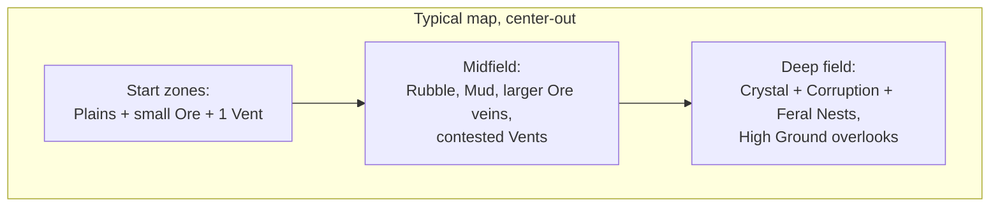

# Terrain

Rule: **every terrain type must change what a good program looks like.** If a tile type doesn't alter movement, sensing, resources, or computation, it doesn't ship. The map is a tile grid (fits the deterministic sim and integer math — see [08-multiplayer.md](08-multiplayer.md)).

## Tile Types

| Terrain | Move cost | Effects | The program it demands |
|---|---|---|---|
| **Plains** | 1× | none | baseline |
| **Rubble** | 2× | — | Pathing tradeoffs: `move_to` auto-paths, but route *choice* (waypoints) is player code |
| **Ore Vein** | 1× | minable Ore node | mining loops |
| **Crystal Field** | 1× | minable Crystal; usually spawns near Corruption | risk-managed harvesting (`if can_see_feral(): flee`) |
| **Geothermal Vent** | 1× | only tile allowing Geothermal Tap | expansion targets worth fighting over |
| **Mud** | 3×, and loaded bots 4× | — | haulers should route *around*; naive `move_to(depot)` straight-lines through it |
| **Water** | impassable (ground) | blocks ground bots; conducts sensor pings farther | natural walls; chokepoint defense |
| **High Ground** | 1×, enter only via Ramp tiles | +2 sensor range, +25% ranged damage down | king-of-the-hill fights; scout perches |
| **Corruption** | 1× | bots suffer **+1 cycle cost on every operation**; no `broadcast()` in/out; Ferals spawn here | *the signature tile*: your code literally runs worse here — simple short programs outperform clever long ones inside Corruption |

## Biome cost overlays

The Pyrite cycle-cost table is data with **per-biome overlays** ([01-language.md](01-language.md), [07-architecture.md](07-architecture.md)): any map or biome can override any operation's cost, including the fault penalty. This is the general mechanism for terrain that stresses *program designs* rather than stats. Shipped and speculative examples:

| Biome overlay | Override | Design it punishes / rewards |
|---|---|---|
| **Corruption** (shipped first) | every op +1 | punishes long clever programs |
| Static Wastes | `broadcast` ×3 | punishes swarm coordination |
| Loop Desert | loop iteration ×3 | punishes iteration-heavy code, rewards unrolled/flat code |
| Overclock Field | all ops −1 (min 1), crash-dump cost ×2, grace window halved | rewards bold code, makes bugs expensive |

Map authors pick overlays per biome; the editor shows *effective* per-line costs for the tile the selected bot stands on.

## Corruption is the thematic centerpiece

Corruption attacks the player's core resource — computation:

- Every Pyrite operation costs +1 cycle inside it (via its biome overlay) → a 10-line smart program crawls; a 3-line dumb one barely notices. **Terrain that inverts the "better code wins" rule locally.**
- Messaging (`broadcast`/`listen`) is jammed → coordinated squads decohere; bots must be individually competent to fight there.
- Crystal (needed for Chips → better CPUs) spawns near Corruption → the resource that buys computation lives where computation is worst. Deliberate loop.
- Scouting-track L3 veterans resist the slow ([02-agents.md](02-agents.md)) — XP as terrain key.

## Map Composition Guidelines

- **Start zones are safe and legible** — a Tier-0 program works there. Difficulty is geographic.
- **Every expansion is a tradeoff**: more Ore = longer haul routes; Crystal = Corruption exposure; Vents = contested.
- **Chokepoints from Water/High Ground** give defensive programs something to anchor on (`guard(ramp_tile)`).
- PvP maps are **mirror-symmetric**; co-op maps are asymmetric with a shared frontier.

## Terrain × Systems Matrix

| System | Terrain interaction |
|---|---|
| Language ([01](01-language.md)) | Corruption cycle tax; move costs multiply `move_to` action time |
| Agents ([02](02-agents.md)) | Scout perk vs Corruption; loaded-hauler mud penalty |
| Resources ([03](03-resources.md)) | All raw resources are terrain-placed; Vents gate free energy |
| Enemies ([04](04-enemies.md)) | Nests anchor in Corruption; Feral patrol routes follow terrain graph |
| Multiplayer ([08](08-multiplayer.md)) | Tile grid + integer move costs keep pathing deterministic |

## Open Questions

- Destructible/buildable terrain (bridges over Water, clearing Rubble)? High value, defer to post-core.
- Fog of war model: per-tile explored/visible standard, or sensor-only (no persistent map without a `map_share()` broadcast)? The latter is more thematic, harsher — prototype both.
- Does Corruption spread/recede dynamically? Great co-op pressure mechanic; keep static for v1.
