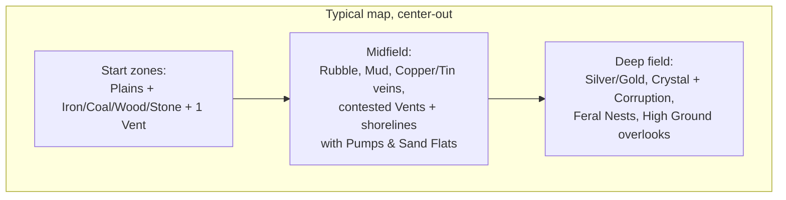

# Terrain

Rule: **every terrain type must change what a good program looks like.** If a tile type doesn't alter movement, sensing, resources, or computation, it doesn't ship. The map is a tile grid (fits the deterministic sim and integer math — see [08-multiplayer.md](08-multiplayer.md)).

## Tile Types

| Terrain | Move cost | Effects | The program it demands |
|---|---|---|---|
| **Plains** | 1× | none | baseline |
| **Rubble** | 2× | — | Pathing tradeoffs: `move_to` auto-paths, but route *choice* (waypoints) is player code |
| **Ore Vein** | 1× | minable mineral node — Iron, Coal, Copper, Tin, Silver, or Gold variant ([03-resources.md](03-resources.md)); deeper/rarer kinds sit farther from start zones | mining loops |
| **Grove** | 1× | harvestable Wood; **regenerates** | renewable-but-thin logging loops |
| **Outcrop** | 1× | harvestable Stone node — plentiful, near everywhere ([03-resources.md](03-resources.md)) | fortification supply lines: walls are hauled |
| **Sand Flat** | 1× | harvestable Sand — shoreline flats and dune fringes ([03-resources.md](03-resources.md)); Q35's deep-dune terrain would make *interior* sand costly to work | glassworks supply; another reason coasts are contested |
| **Crystal Field** | 1× | minable Crystal; usually spawns near Corruption | risk-managed harvesting (`if can_see_feral(): flee`) |
| **Geothermal Vent** | 1× | only tile allowing Geothermal Tap | expansion targets worth fighting over |
| **Mud** | 3×, and loaded bots 4× | — | haulers should route *around*; naive `move_to(depot)` straight-lines through it |
| **Water** | impassable (ground) | blocks ground bots; conducts sensor pings farther; shoreline tiles accept a **Pump** (the Water resource, [03-resources.md](03-resources.md)) | natural walls; chokepoint defense — and now a resource worth holding |
| **High Ground** | 1×, enter only via Ramp tiles | +2 sensor range, +25% ranged damage down | king-of-the-hill fights; scout perches |
| **Corruption** | 1× | bots suffer **+1 cycle cost on every operation**; no channel traffic (`send`/`receive`) in/out; Ferals spawn here | *the signature tile*: your code literally runs worse here — simple short programs outperform clever long ones inside Corruption |

## Biome cost overlays

The Pyrite cycle-cost table is data with **per-biome overlays** ([01-language.md](01-language.md), [07-architecture.md](07-architecture.md)): any map or biome can override any operation's cost, including the fault penalty. This is the general mechanism for terrain that stresses *program designs* rather than stats. Shipped and speculative examples:

| Biome overlay | Override | Design it punishes / rewards |
|---|---|---|
| **Corruption** (shipped first) | every op +1 | punishes long clever programs |
| Static Wastes | `send` ×3 | punishes swarm coordination |
| Loop Desert | loop iteration ×3 | punishes iteration-heavy code, rewards unrolled/flat code |
| Overclock Field | all ops −1 (min 1), crash-dump cost ×2, grace window halved | rewards bold code, makes bugs expensive |

Map authors pick overlays per biome; the editor shows *effective* per-line costs for the tile the selected bot stands on.

## Terraforming (build & deconstruct)

The map is editable — both directions. **Designation is the player's; labor is code**: the player places a **blueprint** on a target tile (a UI act — one lockstep Command, charged on placement), and bots service it with `move_to(nearest_blueprint())` + `build()` (1 progress/tick, adjacent, earns Building XP; several bots stack). Programs never name tiles — Pyrite has no position literals, and doesn't need them. Terraform actions (unlocked after `build`/`repair`, [06-progression.md](06-progression.md)):

| Action | Effect | Cost |
|---|---|---|
| `clear(tile)` | Rubble → Plains; yields a little **Stone** | build time |
| `bridge(tile)` | Water → Bridge (ground-passable) | Stone + build time |
| `barricade(tile)` | Plains → Barricade (blocks movement **and vision** — it's tall; has HP, attackable) | Stone + build time |
| `demolish(tile)` | remove Bridge / Barricade | build time |
| `cleanse(tile)` | Corruption → Plains (see Corruption dynamics — it grows back) | build time, slow |

Deconstruction is symmetric and adversarial: enemies can `demolish` **your** bridge — behind your raiding party. Chokepoints stop being facts of the map and become claims you defend.

Beyond buildings, two **instant designation layers** sit on top of any tile (signage, not construction — no build labor):

- **Overlays** — traffic rules. An **Arrow** makes its tile one-way (enter and leave only along the arrow; small cost; clearable). Arrows on a bridge = a directional crossing; opposing arrowed bridges = a deadlock-free roundabout; arrows on plain ground = dedicated lanes.
- **Paint** — free cosmetic tile color for zoning and notes-to-self. Future hook: a `paint_at()` sensor would let programs *read* paint, turning player markings into machine-readable signals.

## Narrow Corridors & Traffic Tools

Bots are solid and bump-freezes are expensive ([02-agents.md](02-agents.md)), so a one-tile corridor is a real engineering problem: two bots meeting head-on inside one **deadlock** — mutual bump, freeze, re-plan (no route), bump again, forever. **The engine will not solve this for you.** Traffic is player code; the toolkit is a ladder:

| Tier | Tool | The fix it enables |
|---|---|---|
| 0 | `wait(n)` + `rng(n)` | `wait(rng(20))` desynchronizes identical programs — stagger departures, time-slice the corridor |
| 2 | sensors + `if` | Check before committing (candidate blocks: `path_blocked()`, occupancy peeks) |
| 6–7 | enums + **channels** | The real answer: a one-receiver channel token **is a mutex** — hold the token to enter the corridor, `send` it back on exit; gatekeeper bots at each mouth |
| terraform | bridges + **arrow overlays** / `clear()` | Widen the corridor — or arrow two crossings in opposite directions: a deadlock-free roundabout, no mutex required ([Terraforming](#terraforming-build--deconstruct)) |

Design intent: corridor congestion is the first *systems* problem a colony hits — visible (frozen bots stare at each other), diagnosable (crash-free, just slow), and solvable at every tier with the tools of that tier. A deadlocked corridor is not a bug; it's the tutorial for channels.

## Fog of War (decided: eyes only)

**Vision is the live union of every friendly bot's and structure's sensor range. Nothing else.**

- No permanent "explored" reveal. The UI keeps a **greyed terrain snapshot** of last-seen tiles (you remember the shape of the land), but live state — units, resources remaining, nest status — exists only where something of yours is looking *right now*.
- Scouting is therefore **infrastructure, not an event**: standing watch is a job bots do (and earn Scouting XP for, [02-agents.md](02-agents.md)). A cheap Sentry Post structure exists for fixed sightlines ([03-resources.md](03-resources.md)).
- **Tall things block vision.** Sensors are line-of-sight: Barricades and cliff faces cut sightlines. High Ground sees *over* Barricades — height beats walls, which is half of why perches matter. Corollary: walling your base in also blinds it; pair walls with Sentry Posts or high ground.
- Terrain hooks apply: High Ground +2 sensor range, Water conducts sensor pings farther, Scouting-track veterans see farther.
- **One stat, two radii (Q57, refined)**: the stat sheet's **sensor range** ([02-agents.md](02-agents.md)) drives both senses, but **sensing outranges seeing**. The **fog-reveal radius** (eyes) *is* sensor range; the **query radius** (`closest()`, `exists()`, `scan_*()`, and `search()` prospecting) is derived larger from the same value — `sensor range × query_factor` (tuning, first pass 150% floored: base 5 eyes / 7 queries). One improvement raises both: every point of sensor range widens the eyes by a tile and the queries by more. Per-kind bonuses (Combat L3 "+1 vs enemies", the Ore-acle merit) extend **queries only**, on top. Anything queried beyond the eyes — the whole ring between the two radii — may sit on a tile that stays fogged: the query says *something is there*, not what the ground looks like.
- **Signature offsets being sensed (Q54)**: enemy E's queries return bot B at range `E.query_radius + B.signature`, floored at 1 — adjacency always detects. Default 0 senses at the normal rate; a noisy bot (Loud Fans) is sensed *outside* the normal radius; a quiet one (Hiding levels) must be approached. Fog reveal is untouched — a loud bot is heard past the eyes, not seen. Bots only (structures and nodes have no signature); this is the formal home of every "±N detectability" effect ([02-agents.md](02-agents.md), [09-quirks.md](09-quirks.md)).
- **Buried resources need prospecting.** Seeing a tile shows its terrain, not its geology: tier-1+ resource nodes (Iron and up) are invisible — to the eye *and* to queries — until a bot discovers them with `search()` (roots in place, scans outward ring by ring — builtin in [01-language.md](01-language.md); each new node found earns Scouting XP). Tier-0 surface resources (Wood groves, Stone outcrops, Sand flats) are visible on sight, so the Tier-0 starter program still works. **Discovered nodes are permanent map knowledge** — the one deliberate exception besides the terrain snapshot to "no persistent intel" — but their *remaining amounts* are live-only, like everything else.
- Rendering: fogged tiles draw the greyed snapshot with ambient animations **frozen at the last-seen frame** — the world visibly stops where you stop watching, and resumes on reveal. Pure view layer, no sim state, no replay exposure.
- **Lanterns are the cheap ward** ([03-resources.md](03-resources.md)): a tiny fixed sensor radius for pocket change — string them along perimeters and roads. Sentry Posts stay the real watchtowers; Lanterns make *lit territory* a visible map feature.
- **Ally vision sharing is a grant**, like channels ([01-language.md](01-language.md)) — allied colonies choose to pool eyes; it isn't automatic. (Whether the grant also shares prospected node knowledge: Q70.)

## Corruption is the thematic centerpiece

Corruption attacks the player's core resource — computation:

- Every Pyrite operation costs +1 cycle inside it (via its biome overlay) → a 10-line smart program crawls; a 3-line dumb one barely notices. **Terrain that inverts the "better code wins" rule locally.**
- Channel traffic (`send`/`receive`) is jammed → coordinated squads decohere, blocked receivers inside never wake; bots must be individually competent to fight there.
- Crystal (needed for Chips → better CPUs) spawns near Corruption → the resource that buys computation lives where computation is worst. Deliberate loop.
- Scouting-track L3 veterans are immune to the cycle tax ([02-agents.md](02-agents.md)) — XP as terrain key: the only bots whose *code* runs clean in there.

### Corruption is alive (dynamics)

- **Corruption radiates from sources** — Blight Cores seeded by mapgen, and nests that spread it (the Devil, [04-enemies.md](04-enemies.md)). Tiles corrupt outward slowly toward each source's radius.
- **`cleanse()` works, and doesn't last.** Cleansed tiles re-corrupt while their source survives. Treating symptoms buys time (a corridor to the Crystal, a breathing spell for a claim); **rooting out the source is the only cure** — and sources sit deep in the zone, where your code runs worst.
- Left alone, Corruption **comes back and keeps coming**: an untended frontier slowly re-corrupts, pressuring claims, channels, and supply lines. It's the PvE antagonist that never idles.

## Map Composition Guidelines

- **Start zones are safe and legible** — a Tier-0 program works there. Difficulty is geographic.
- **Template Caches ring each start zone** ([06-progression.md](06-progression.md)): basic ones close, advanced ones toward the midfield. They're non-consumable study sites — everyone can learn from them, so the deep ones are worth *holding*, not racing. The opening toolkit sweep is the first thing eyes-only fog makes interesting.
- **Every expansion is a tradeoff**: more veins = longer haul routes; the tier ladder (Copper/Tin → Silver/Gold → Crystal, [03-resources.md](03-resources.md)) is laid out center-out, so richer material is farther material; Crystal = Corruption exposure; Vents and shorelines = contested.
- **Chokepoints from Water/High Ground** give defensive programs something to anchor on (`guard(ramp_tile)`).
- PvP maps are **mirror-symmetric**; co-op maps are asymmetric with a shared frontier.

## Terrain × Systems Matrix

| System | Terrain interaction |
|---|---|
| Language ([01](01-language.md)) | Corruption cycle tax; move costs multiply `move_to` action time |
| Agents ([02](02-agents.md)) | Scout perk vs Corruption; loaded-hauler mud penalty |
| Resources ([03](03-resources.md)) | All raw resources are terrain-placed; Vents gate free energy |
| Enemies ([04](04-enemies.md)) | Nests anchor in Corruption; Feral patrol routes follow terrain graph |
| Multiplayer ([08](08-multiplayer.md)) | Tile grid + integer move costs keep pathing deterministic |

## Decided

- **Terraforming is in scope** — build (bridges, barricades) and deconstruct (clear, demolish, cleanse), symmetric and adversarial (see Terraforming).
- **Fog of war is eyes-only** — live union of friendly bot + structure sensors; greyed terrain memory, no persistent live intel (see Fog of War).
- **One stat, two radii — sensing outranges seeing** (2026-07-14, answers Q57; refined same day) — fog reveal = sensor range; query/search radius = sensor range × `query_factor` (tuning, ~150%), so one stat improves both and queries always reach past the eyes; per-kind bonuses extend queries only; queries may return entities on fogged tiles (see Fog of War).
- **Buried resources need prospecting** (2026-07-14, with Q57) — tier-1+ nodes are hidden from eyes and queries until `search()`ed; discoveries are permanent map knowledge, remaining amounts live-only (see Fog of War; builtin in [01-language.md](01-language.md), node rules in [03-resources.md](03-resources.md)).
- **Fog renders as greyed tiles with frozen animations** (2026-07-14) — the snapshot holds the last-seen frame; motion resumes on reveal. View layer only.
- **Tall things block vision** — sensors are line-of-sight; Barricades are true walls; High Ground sees over them.
- **Corruption is dynamic** — radiates from sources, re-corrupts cleansed ground until the source is destroyed (see Corruption dynamics).

## Open Questions

- Corruption spread/re-corruption rates, source radii, and cleanse speed — pure tuning, needs the prototype.
