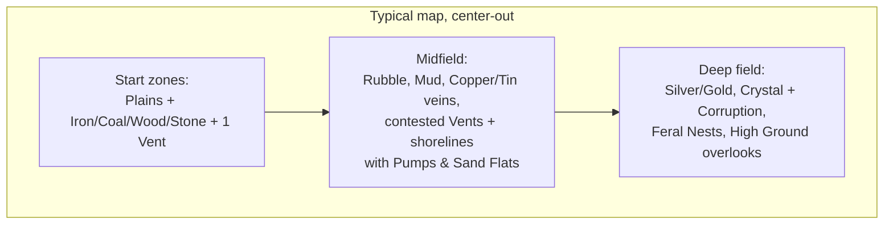

# Map Composition & Generation

*Part of [05-terrain](../05-terrain.md).*

## Map Composition & Generation

## Map Composition Guidelines

These are the *goals* a generated map must exhibit; the generation **procedure** that produces them is specified below in **Map Generation** (2026-07-17, answers Q71).

- **Start zones are safe and legible** — a Tier-0 program works there. Difficulty is geographic.
- **Template Caches ring each start zone** ([06-progression.md](../06-progression.md)): basic ones close, advanced ones toward the midfield. They're non-consumable study sites — everyone can learn from them, so the deep ones are worth *holding*, not racing. The opening toolkit sweep is the first thing eyes-only fog makes interesting.
- **Every expansion is a tradeoff**: more veins = longer haul routes; the tier ladder (Copper/Tin → Silver/Gold → Crystal, [03-resources.md](../03-resources.md)) is laid out center-out, so richer material is farther material; Crystal = Corruption exposure; Vents and shorelines = contested.
- **Chokepoints from Water/High Ground** give defensive programs something to anchor on — `guard()` takes an **entity**, never a tile (Q79), so the idiom is a Sentry Post or Lantern at the choke: `if exists(sentry): guard(closest(sentry).expect())` (the `exists` guard, per P22, is for the colony that hasn't built one yet).
- PvP maps are **mirror-symmetric**; co-op maps are asymmetric with a shared frontier.

## Map Generation

*The procedure that produces the composition above (2026-07-17, answers Q71). v1 is **co-op-first**: PvP mirror symmetry is designed here but deferred (see PvP Symmetry, below).*

## Determinism: generate a `MapSpec` at setup, then bake it

Map generation is a **deterministic, seeded, integer-only function** — `sim::mapgen::generate(config, seed) → MapSpec` — run **once** when a match is created, *not* inside the tick loop. It draws from a dedicated `mapgen` RNG (seeded `stream_seed(seed, "mapgen")`, advanced with the same SplitMix64 as every other stream — no floats, no wall clock, BTree/sorted iteration). Its output, a concrete `MapSpec`, is distributed to every peer and stored in the replay exactly as authored maps already are ([07-architecture.md](../07-architecture.md)).

That one choice buys every determinism property at once:

- **Seed-reproducible** — the same seed (+ config + generator version) yields the same map on any machine, so friends can share a seed.
- **Replay-proof** — because the *concrete* `MapSpec` is baked into the replay, an old replay still plays back after the generator's code changes; the map travels with the recording, not as a seed to re-run. Storing the output is strictly more robust than storing the seed.
- **Zero lockstep surface** — mapgen never runs per-tick and never enters the phase-9 state hash. It's a setup-time producer, so it carries none of the desync risk of in-tick code. The map's determinism contribution is the stored `MapSpec`, which world-build already folds into `terrain_hash`.

## The pipeline: skeleton → fill → validate

Three stages, deterministic end to end:

1. **Skeleton — place the guarantees by construction.** Nothing load-bearing is left to chance. The generator lays the map out **center-out in bands** and *directly places* every must-have: one **start zone per player** on the rim (safe Plains, the guaranteed kit — an Iron vein, a Coal seam, a Grove, a Stone outcrop — a Vent, and a reachable shore strip), the **midfield band** (Copper/Tin veins, contested Vents, shorelines with Sand Flats, Rubble/Mud), and the **deep field** (Silver/Gold, Crystal seeded *next to* Corruption sources, Feral nests placed by arcanum — higher arcanum farther out, capped at `max_arcanum` — High Ground overlooks). Template Caches ring each start (basic close, advanced toward the midfield). *If you can place it, place it* — the skeleton is where every hard composition goal is satisfied on purpose.

2. **Fill — organic variety with integer value-noise.** Within each band the generator paints the *decorative* terrain — Rubble, Mud, Snow, Dunes, Ice, Scree, extra Water/High Ground — from a deterministic integer noise, against per-band budgets. This is the only "random-looking" stage, and it touches **nothing** the floor depends on: it fills the gaps *around* the placed guarantees, never overwriting them.

3. **Validate — check the emergent floor, regenerate on failure.** Some requirements aren't a tile you can place — they're global properties of the finished layout (is every start actually *walkable* to its kit and the midfield, or did a fill-stage Water band wall it off?). A cheap integer **BFS/flood-fill validator** checks the **playability floor**; on any failure the generator derives the next sub-seed and regenerates, capped at N attempts. The retry counter is folded into the seed, so `seed S` always resolves to "the first candidate that passed" — identically on every machine. If the cap is hit, that's a config bug (bands too dense), surfaced loudly, not shipped silently.

## The guarantee ledger

Three tiers, and the difference is the whole discipline of "ensuring things happen":

- **By construction (the skeleton places them, so they cannot fail):** the start-zone kit (Iron + Coal + Wood + Stone), a start Vent, the center-out tier bands, nest rings by arcanum, Crystal beside Corruption, Template Caches ringing starts.
- **Validated, regenerate-on-failure (the playability floor):**
  - every start's kit is **walkable** from its printer;
  - at least one start vein sits **within the starting bots' sight** (base 5, [02-agents.md](../02-agents.md)) so the shipped `closest(ore).expect()` answers on tick 1;
  - a **reachable shoreline** per start (Water is the only coolant *and* Sand the only Glass feedstock — no start may starve both compute and optics);
  - **Copper + Tin reachable** in the first-expansion band (no Bronze soft-lock);
  - **no start sealed** from the midfield / shared frontier.
- **Weighted tendencies (never validated):** exact biome proportions, where snow/dunes/ice sit, midfield richness variance, decorative terrain — aesthetic, allowed to vary freely.

## Co-op layout (v1)

Co-op maps are **asymmetric with a shared frontier**, which means starts need only be *individually* playable — never identical. Players sit around the rim; richness and danger climb toward a shared, contested **deep-field center** — the frontier the team pushes into against Ferals and Corruption. Each start is built and validated on its own; there is no cross-start bookkeeping. This is the whole v1 target, and it deliberately sidesteps symmetry.

## PvP symmetry (designed, deferred)

PvP maps are **mirror-symmetric, resource-exact**, via **rotational (point) symmetry**: generate one player's wedge, then **rotate-copy** it N times about the center (N = players). Rotational over reflective — no mirror seam, no handedness bias; each player's start is *truly identical*, same vein amounts and distances. It layers cleanly on the co-op generator (generate a wedge, rotate) and is **out of v1 scope** — noted here so the co-op design doesn't foreclose it.

## Scaling

Map size scales with player count: each player gets a rim **wedge of roughly constant start-zone area and band depth** (so opening pace and expansion distance feel the same at any count), the overall radius grows with the number of wedges, and the shared center scales to stay contested. All figures — band widths, resource densities per band, Corruption amount, retry cap, wedge size — are **tuning constants** in a `mapgen` config (data, per the doc convention), not code.

## Integration & scope

`sim::mapgen` is a fresh module: a pure `fn generate(&MapgenConfig, seed) → MapSpec` (co-op v1: one `MapSpec` with N rim start zones) emitting the same paint-lists `build_colony` fills by hand today, consumed unchanged by `Sim::new` / `World::from_spec`. It ships with a **`MapSpec` validator** (bounds, no fatal overlaps, the floor checks) — none exists today. It never touches the tick or the state hash. Dependencies to respect: Template-Cache placement needs the progression system's Cache entity; nest arcanum placement uses the existing `max_arcanum` gate; Corruption sources reuse Blight Cores. Implementation is follow-on milestone work (flagged in [TASKS.md](../TASKS.md)).

