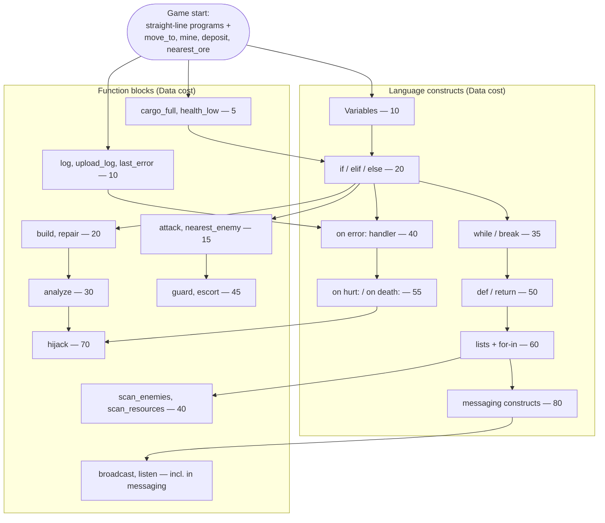

# Progression

Progression runs on two **scopes**:

| Scope | What | Rationale |
|---|---|---|
| **Permanent (account)** | **Language constructs** — variables, `if`, loops, `def`, lists, handlers, messaging | *Knowledge.* Once a player has learned to use `if`, they have it — forever, in every future match. The constraint stops being "can I say it" and becomes "how effectively can I say it." |
| **Per-match** | **Function blocks** (Data), **program colors** (controlled nests, [04-enemies.md](04-enemies.md)), **hardware** (Chips) | *Situation.* What your colony can *do* this game is earned this game. |

A construct is permanently unlocked the first time it's researched in any match (its Data cost is paid once, ever). Function blocks re-unlock every match.

**PvP gate: all constructs must be permanently unlocked before entering PvP.** Every PvP player has the full language; matches are symmetric races over functions, colors, and hardware, decided by code quality. (Co-op has no gate — mixed-knowledge groups are fine, and the shared program library lets veterans hand working code to newer players.)

The three per-match tracks in detail (requirements 3b/3c):

1. **Language constructs** — what syntax your colony's programs may use (colony-wide; permanent scope).
2. **Function blocks** — what built-ins programs may call (colony-wide, per-match; some also need a tool module on the bot).
3. **Hardware** (not research — purchased per-bot with Chips) — cycles/tick, program length, stack depth.

## Unlock Tree

**Program color slots are deliberately NOT in this tree** — they aren't researched with Data. Colors are gated by **controlled Feral nests** on a quadratic curve ([01-language.md](01-language.md), [04-enemies.md](04-enemies.md)): a third progression axis (territory) alongside research (Data) and hardware (Chips).

Reading the tree: **constructs gate expressiveness, functions gate verbs**, and they interleave — e.g. `scan_enemies()` returns a list, so it requires lists; `if` is pointless without something to branch on, so sensor functions come first.

## Design Rules

1. **Every unlock changes what programs *can say*, immediately.** No "+5% damage" research. That lives in XP ([02-agents.md](02-agents.md)) and hardware.
2. **The editor advertises the tree.** Locked syntax/functions are visible but greyed out in the editor with cost and prerequisites ([01-language.md](01-language.md)). The player wants `if` because they *felt* its absence, not because a tooltip said so.
3. **Enemies preview unlocks.** Ferals use constructs before you have them ([04-enemies.md](04-enemies.md)) — Warden's `for`-loop patrol is an ad for Tier 5.
4. **Data sources force breadth** — milestones span mining, exploring, combat, analysis, so a one-note strategy starves research (see Data rules in [03-resources.md](03-resources.md)).

## Hardware Upgrades (Chips, per-bot)

| Upgrade | Cost | Effect |
|---|---|---|
| CPU Mk2 / Mk3 | 5 / 15 Chips | 2 / 4 cycles per tick |
| Memory bank | 5 Chips | +32 program lines, +4 variables |
| Stack module | 8 Chips | +4 call depth (base cap is 4; recursion is legal but overflows fault — stack is what makes recursive style viable, [01-language.md](01-language.md)) |
| Coprocessor | 20 Chips | think *while* an action resolves (removes action-blocking — huge, late) |
| Backup Core | 25 Chips | preserve 50% XP on destruction (see [02-agents.md](02-agents.md)) |

Hardware is where the "compute vs. claws" economy bites: Chips also buy weapons/tools, so a maxed-CPU bot is an underarmed one.

## Pacing Targets (a NEW player's first co-op session)

This table describes the *learning arc* — the one-time journey through the permanent construct unlocks. A veteran starts every match with all known constructs and instead races function blocks, nest claims (colors), and hardware; their pacing curve is the economy, not the language.

| Time | Player state |
|---|---|
| 0–5 min | Reads the pre-deployed Tier-0 miner program; edits a line; feels ownership |
| 5–15 min | Unlocks Variables + sensors; first `if cargo_full()` — the "my bot is smart now" beat |
| 15–30 min | Loops + combat functions; first Feral raid survived by *code they wrote* |
| 30–45 min | `def` and `on error:`; colony library of shared functions emerges; first uploaded crash log explains a mystery |
| 45–60 min | Lists/scan or messaging; coordinated multi-bot behavior; session climax vs. Warden raid or first Nest kill |

## Decided

- **Constructs are permanent account unlocks; functions/colors/hardware are per-match.** The language is knowledge you keep; the match is how well you use it (see scopes table above).
- **PvP requires full construct knowledge** — symmetric expressiveness by construction.

## Open Questions

- Do co-op allies share per-match function research? Lean yes (shared Archive) — keeps a group at the same capability level.
- Should some functions be *findable* (looted from Feral analysis) rather than researched? Thematic, encourages Codex play — prototype with `guard`/`escort`.
- Where do new players earn their construct unlocks — co-op only, or a dedicated solo "academy" campaign against low-arcana nests? Lean: any PvE play counts; an authored academy accelerates it.
- Cross-scope tree edges (e.g. `scan_enemies` requires lists): in a mixed-knowledge co-op match, a newer player simply can't research that function yet. Acceptable, or should function prereqs check the *team's* knowledge? Lean per-player — it preserves the learning arc.
