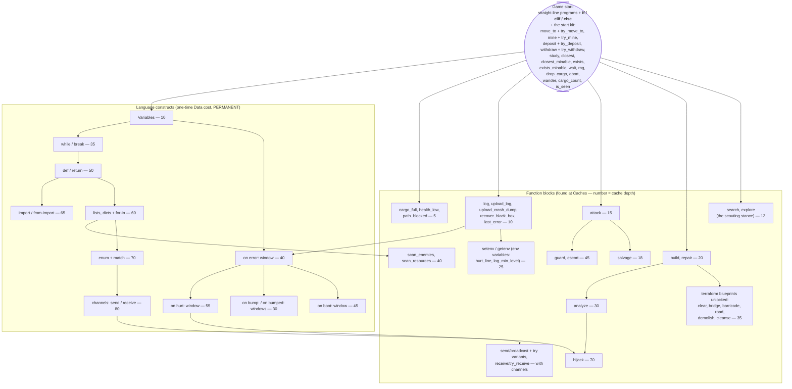

# Progression

Progression runs on two **scopes**:

| Scope | What | Rationale |
|---|---|---|
| **Permanent (account)** | **Language constructs** — variables, `if`, loops, `def`, lists, handlers, messaging | *Knowledge.* Once a player has learned to use `if`, they have it — forever, in every future match. The constraint stops being "can I say it" and becomes "how effectively can I say it." |
| **Per-match** | **Function blocks** (found at Caches — see below), **program colors** (Green at start; repair the ruined Red printer with Data; more via controlled nests, [04-enemies.md](04-enemies.md)), **hardware** (Chips) | *Situation.* What your colony can *do* this game is earned this game. |

A construct is permanently unlocked the first time it's researched in any match (its Data cost is paid once, ever). Function blocks re-unlock every match.

**PvP gate: all constructs must be permanently unlocked before entering PvP.** Every PvP player has the full language; matches are symmetric races over functions, colors, and hardware, decided by code quality. (Co-op has no gate — mixed-knowledge groups are fine, and the shared program library lets veterans hand working code to newer players.)

The three per-match tracks in detail (requirements 3b/3c):

1. **Language constructs** — what syntax your colony's programs may use (colony-wide; permanent scope). Unlocked by researching with Data, **in any PvE play** — first research ever = yours forever.
2. **Function blocks** — what built-ins programs may call (colony-wide, per-match; some also need a tool module on the bot). **Learned, not researched** — studied at Template Caches (see below).
3. **Hardware** (not research — purchased per-bot with Chips) — cycles/tick, program length, stack depth.

## Template Caches

Function blocks are **learned from Template Caches**: ruined installations holding intact old-world code templates. **Studying a template does not consume it** — a Cache is a *school*, not a pickup. Any colony, ally or enemy, can send a bot to study the same site (the start-kit **`study()`** verb — adjacent, rooted ~10 s, Q79) and unlock its function colony-wide for the match.

- **Depth ordering replaces Data pricing**: basic sensors and `attack` sit in the ruins ringing every start zone (finding them is an opening ritual, not an expedition); `scan`, `guard`/`escort`, `hijack` lie deeper — shared map features worth controlling *access* to, though never used up. (The numbers in the tree below read as *cache depth*, not Data cost.)
- **Skill expression is the tree walk**: what your colony can do this match = which templates you've studied, in what order. Routing study trips down the function tree — under eyes-only fog ([05-terrain.md](05-terrain.md)), past whatever holds the ground — is the opening/midgame craft.
- **Contest is territorial, never exclusive**: you can't deny an opponent a function by learning it first — only by holding the ground around its Cache. Knowledge spreads; territory doesn't.
- Construct prerequisites still apply, per-player ([Decided](#decided)).

## Unlock Tree

```mermaid
flowchart TD
    START([Game start:<br/>straight-line programs + <b>if / elif / else</b><br/>+ the start kit:<br/>move_to + try_move_to, mine + try_mine,<br/>deposit + try_deposit, withdraw + try_withdraw,<br/>study, closest, closest_minable, exists,<br/>exists_minable, wait, rng, drop_cargo, abort,<br/>wander, cargo_count, is_seen])

    subgraph Constructs["Language constructs (one-time Data cost, PERMANENT)"]
        VAR["Variables — 10"]
        WHILE["while / break — 35"]
        SIG1["on error: window — 40"]
        SIG2["on hurt: window — 55"]
        BUMP_H["on bump: / on bumped: windows — 30"]
        BOOT_W["on boot: window — 45"]
        DEF["def / return — 50"]
        IMPORT["import / from-import — 65"]
        LIST["lists, dicts + for-in — 60"]
        ENUM["enum + match — 70"]
        MSG_C["channels: send / receive — 80"]
    end

    subgraph Functions["Function blocks (found at Caches — number ≈ cache depth)"]
        F_SENSE["cargo_full, health_low,<br/>path_blocked — 5"]
        F_SEARCH["search, explore<br/>(the scouting stance) — 12"]
        F_LOG["log, upload_log, upload_crash_dump,<br/>recover_black_box, last_error — 10"]
        F_SALV["salvage — 18"]
        F_ATK["attack — 15"]
        F_BUILD["build, repair — 20"]
        F_SCAN["scan_enemies, scan_resources — 40"]
        F_AN["analyze — 30"]
        F_BC["send/broadcast + try variants,<br/>receive/try_receive — with channels"]
        F_GUARD["guard, escort — 45"]
        F_HIJACK["hijack — 70"]
        F_TERRA["terraform blueprints unlocked:<br/>clear, bridge, barricade, road,<br/>demolish, cleanse — 35"]
        F_ENV["setenv / getenv (env variables:<br/>hurt_line, log_min_level) — 25"]
    end

    START --> VAR
    START --> F_SENSE
    START --> F_LOG
    VAR --> WHILE
    VAR --> SIG1
    F_LOG --> SIG1
    SIG1 --> SIG2
    START --> F_ATK
    F_ATK --> F_GUARD
    F_ATK --> F_SALV
    START --> F_BUILD
    WHILE --> DEF
    DEF --> IMPORT
    START --> F_SEARCH
    F_LOG --> F_ENV
    SIG1 --> BUMP_H
    SIG1 --> BOOT_W
    F_BUILD --> F_AN
    F_BUILD --> F_TERRA
    F_AN --> F_HIJACK
    SIG2 --> F_HIJACK
    DEF --> LIST
    LIST --> F_SCAN
    LIST --> ENUM
    ENUM --> MSG_C
    MSG_C --> F_BC
```

**Program color slots are deliberately NOT in this tree** — they aren't researched with Data. Colors are gated by **controlled Feral nests** on a quadratic curve ([01-language.md](01-language.md), [04-enemies.md](04-enemies.md)): a third progression axis (territory) alongside research (Data) and hardware (Chips).

Handler-window unlocks buy the right to **edit** that signal's window ([01-language.md](01-language.md)) — pre-unlock, the reserved template still runs with its factory contents, so nothing is unhandled, just uncustomized.

Reading the tree: **constructs gate expressiveness, functions gate verbs**, and they interleave — e.g. `scan_enemies()` returns a list, so it requires lists; `if` is pointless without something to branch on, so sensor functions come first.

## Design Rules

1. **Every unlock changes what programs *can say*, immediately.** No "+5% damage" research. That lives in XP ([02-agents.md](02-agents.md)) and hardware.
2. **The editor advertises the tree.** Locked syntax/functions are visible but greyed out in the editor with cost and prerequisites ([01-language.md](01-language.md)). The player wants `if` because they *felt* its absence, not because a tooltip said so.
3. **Enemies preview unlocks.** Ferals use constructs before you have them ([04-enemies.md](04-enemies.md)) — Warden's `for`-loop patrol is an ad for Tier 5, readable once you've killed enough Wardens to decrypt it. The preview is earned like everything else.
4. **Data sources force breadth** — milestones span mining, exploring, combat, analysis, so a one-note strategy starves research (see Data rules in [03-resources.md](03-resources.md)).

## Tools & capacity buys (per-bot, at the Upgrade Station)

Everything above the floor statline is **bought at the Upgrade Station**
([03-resources.md](03-resources.md)): the bot physically walks to the structure,
mounts the pad, and sits inert for the entry's build time. Two families are sold.

### Tools — one per XP track, grades 1–5

Grade 1 ships free with the chassis; **grades 2–5 are bought, and each is
licensed by level** — a bot may buy grade N once *either* that track's level
*or* its **total level** (the floored mean across the ten tracks) reaches N
(Q111/Q118). Levels rarely change a stat by themselves; **the tools carry the
power**, which is what keeps an uncapped ladder from running away (Q121).

| Track | Tool | What its grades buy |
|---|---|---|
| Mining | **drill** | Harvest reach (grades 2–4 add resource tiers 2/3/4), then quality at 5 |
| Building | **build tool** | Build and repair rate. **Grade ≥ 2 gates the heavy verbs**: field repair, `hijack`, nest claim/raze (Q105-R2) |
| Combat | **weapon** | Damage per hit |
| Scouting | **optics** | Sensor range — one stat, so both circles widen ([05-terrain.md](05-terrain.md)) |
| Processing | **CPU** | Cycles per tick |
| Hauling | **cargo rack** | Cargo capacity |
| Age | **hull plating** | Max HP |
| Mileage | **drivetrain** | Move rate |
| Hiding | **signature dampener** | Movement signature |
| Flinch | **gyros** | Flinch duration |

**Pricing follows resource ROLE, not a uniform rung** — *Bronze arms, Chips
think*. The one hard constraint is anti-circularity (Q118): **no tool may be
priced in a material its own ladder unlocks at or above the grade being
bought**, which binds on the drill alone, since only the drill unlocks
materials. So the drill climbs Steel → Bronze → Bronze+Gold, weapons and civil
kit price in Bronze, sensing in the Sand → Glass → Lens chain, and compute
starts cheap and escalates: **CPU 2 in Wire, 3 in Silver + Wire, 4 in Chips, 5
in Gold Chips**. Three invariants are checked at load: anti-circularity, no
orphan materials, and **no gaps** — every grade from 2 to a tool's ceiling has
an entry, so no reachable level is dead.

**Only the compute family draws coolant** (Q119) — the CPU tool and the
capacity buys below. Mechanical tools are not thermal and pay none; the
requirement is declared per catalog entry in data.

### Capacity buys — flat, unlicensed

Not tied to a track and not graded: capacities, not things a bot *does*.

| Upgrade | Cost | Effect |
|---|---|---|
| Memory bank | Wire, escalating | +32 program lines, +4 variables, +8 log ring-buffer entries |
| Stack extension | Wire, escalating | +4 call depth (base cap is 4; recursion is legal but overflows fault — stack is what makes recursive style viable, [01-language.md](01-language.md)) |
| Log buffer | Wire | More ring-buffer entries — richer `upload_log()`, richer Black Boxes |

These start on **Wire** rather than Chips deliberately: how large a program a
player may write must not be the last thing a colony unlocks (Q118).

Hardware is where the "compute vs. claws" economy bites, as two material
streams (Q72): **Bronze arms, Chips think.**

## Pacing Targets (a NEW player's first co-op session)

This table describes the *learning arc* — the one-time journey through the permanent construct unlocks. A veteran starts every match with all known constructs and instead races function blocks, nest claims (colors), and hardware; their pacing curve is the economy, not the language.

| Time | Player state |
|---|---|
| 0–5 min | Reads the pre-deployed Tier-0 miner program; edits a line; feels ownership. First Cache spotted nearby |
| 5–15 min | Studies the sensor Cache, researches Variables; first `if cargo_full()` — the "my bot is smart now" beat |
| 15–30 min | Loops + combat functions; first Feral raid survived by *code they wrote* |
| 30–45 min | `def` and the `on error:` window; colony library of shared functions emerges; first uploaded crash log explains a mystery |
| 45–60 min | Lists/scan or messaging; coordinated multi-bot behavior; session climax vs. Warden raid or first Nest kill |

## Decided

- **Constructs are permanent account unlocks; functions/colors/hardware are per-match.** The language is knowledge you keep; the match is how well you use it (see scopes table above).
- **PvP requires full construct knowledge** — symmetric expressiveness by construction.
- **Progression is per-player, always.** Allies do **not** share function unlocks — each colony recovers its own Caches ([08-multiplayer.md](08-multiplayer.md) scaffolding shares libraries and intel, not capability). Cross-scope prerequisites check the *individual's* knowledge — a newer player in a veteran group keeps their own learning arc.
- **All function blocks are learned at Template Caches** — non-consumable study sites; anyone can learn from any Cache; depth replaces Data pricing (see Template Caches).
- **Any PvE play earns construct unlocks** — no dedicated academy required (one can be authored later as an accelerant).

- **Data is a currency** — beyond one-time construct research, the Research Archive runs a **Data Exchange** (Data → other resources at tuned rates, Chips-favored, Gold densest — [03-resources.md](03-resources.md)). Data never goes dead: veterans convert it, raze-vs-claim stays a real choice, and milestone Data keeps mattering in PvP.
