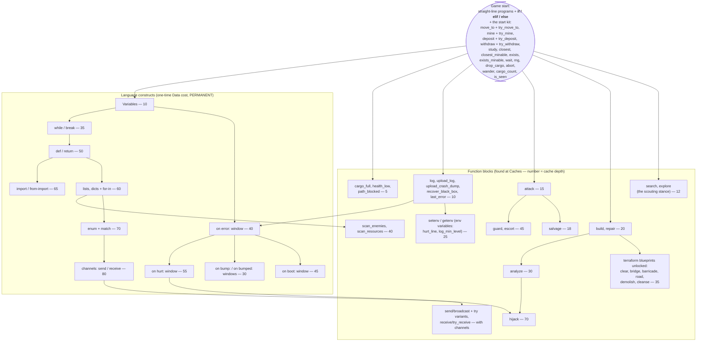

*Part of [06-progression](../06-progression.md).*

# The Unlock Tree

**Program color slots are deliberately NOT in this tree** — they aren't researched with Data. Colors are gated by **controlled Feral nests** on a quadratic curve ([01-language.md](../01-language.md), [04-enemies.md](../04-enemies.md)): a third progression axis (territory) alongside research (Data) and hardware (the Upgrade Station).

Handler-window unlocks buy the right to **edit** that signal's window ([01-language.md](../01-language.md)) — pre-unlock, the reserved template still runs with its factory contents, so nothing is unhandled, just uncustomized.

Reading the tree: **constructs gate expressiveness, functions gate verbs**, and they interleave — e.g. `scan_enemies()` returns a list, so it requires lists. (Branching needs no place in this ordering: it ships at game start beside the start kit's own predicates — Q117.)

## Design Rules

1. **Every unlock changes what programs *can say*, immediately.** No "+5% damage" research. That lives in XP ([02-agents.md](../02-agents.md)) and hardware.
2. **The editor advertises the tree.** Locked syntax/functions are visible but greyed out in the editor with cost and prerequisites ([01-language.md](../01-language.md)). The player wants variables because they *felt* their absence, not because a tooltip said so.
3. **Enemies preview unlocks.** Ferals use constructs before you have them ([04-enemies.md](../04-enemies.md)) — Warden's `for`-loop patrol is an ad for Tier 5, readable once you've killed enough Wardens to decrypt it. The preview is earned like everything else.
4. **Data sources force breadth** — milestones span mining, exploring, combat, analysis, so a one-note strategy starves research (see Data rules in [03-resources.md](../03-resources.md)).
