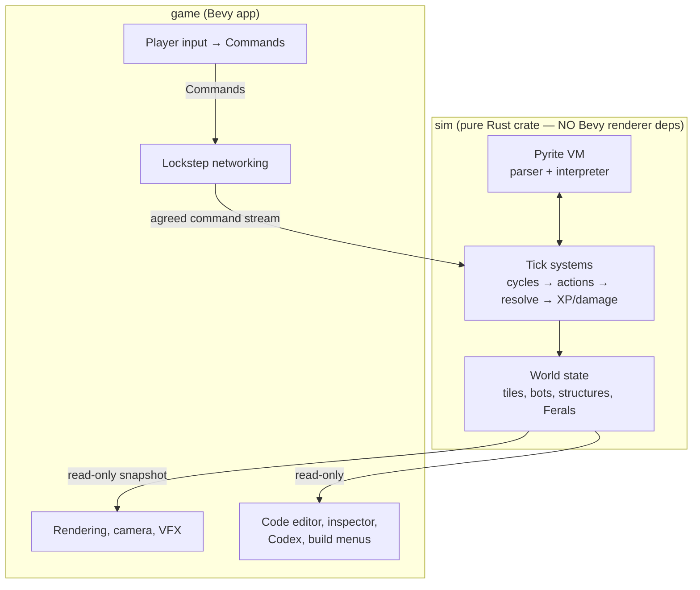
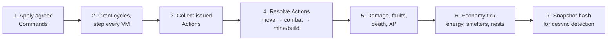

# Architecture (Bevy)

Constraint that shapes everything: the simulation must be **deterministic and fixed-tick** for lockstep multiplayer ([08-multiplayer.md](08-multiplayer.md)). Rendering is decoupled and free-running.

## Layering



**Rule 1: the `sim` crate is renderer-free and deterministic.** It depends on `bevy_ecs` at most (or is plain Rust). Given `(seed, command stream)` it must replay identically on every machine and in tests. This rule is why multiplayer, replays, and headless balance-testing all come cheap.

**Rule 2: players emit Commands, never mutations.** Deploying a program, queueing a print, placing a structure — all are serializable `Command` values fed through the lockstep layer, even in single-player (single-player = lockstep with one peer).

## Tick Model

- Fixed sim tick, target **10 ticks/sec** (bots feel deliberate, cycle budgets stay legible, network headroom is generous).
- Bevy `FixedUpdate` drives the sim; `Update` renders with interpolation between the last two sim states.
- Per-tick system order (deterministic, explicit ordering):



Within each phase, iterate entities in **stable ID order** — never hash-map order.

## Pyrite VM

- **Tree-walking interpreter** over a parsed AST, one op per `step()`. Simple, debuggable, fast enough (thousands of bots × a few ops/tick is trivial). Bytecode VM is a later optimization if profiling demands it.
- VM state per bot (a component): program AST handle, program counter (as an AST cursor), variable table (fixed-size, from hardware), call stack (capped: base 4 frames + hardware), cycle debt, run state (`Running | Faulted { error, cycles_remaining } | Blocked(action)`).
- **Unified fault path**: every runtime failure (stack overflow, type error, unsupported op, failed action) routes through one `fault(error)` transition. With `on error:`: pay trap cost, jump the cursor to the handler (variables preserved); a per-handler tick counter applies the **overtime multiplier** (all op costs ×2 past the grace window). Without: the VM force-executes the `upload_crash_dump()` builtin (same registry entry players call — one code path). Either way, afterwards reset (clear variables + stack) and restart at line 1 ([01-language.md](01-language.md)).
- **Signal dispatch**: signals (`error` sync; `hurt`/`death` async from the damage system, phase 5 → checked at op boundaries next VM step) set a pending-signal field on `VmState`. Dispatch lives in the VM, not scattered across game systems: one handler per signal; `death` runs under a hard 10-cycle budget and ends with a force-call of `become_disabled()` (wreck + self-destruct countdown; field-repair within it restores the bot); and the **double-handle rule** — any signal or fault arriving while `handler_active` is set, in any combination, emits `Destroy(bot, Exploded)` (bypasses the wreck state entirely). Handler blocks are just AST nodes; handler execution is ordinary `step()`ing. **Engine-forced behaviors reuse the player-facing builtin registry entries** (`upload_crash_dump`, `become_disabled`, boot-time `upload_log`) — no parallel internal implementations to drift out of sync.
- **Recall** is dispatched like any signal but its handler is an **engine-owned Pyrite program** (immutable, runs on the same VM — the forced-call principle extended to a whole program): suspend user program, `move_to(home_printer)`, transfer, re-color → Boot. Recall sets `handler_active` (double-handle applies). Target selection (lowest-total-XP of color / of colony) runs in the economy phase, deterministic tie-break by entity ID.
- **Every `Destroy` spawns a Black Box entity** on the bot's tile (one system, one spawn point — impossible to miss a path): snapshot of the log ring buffer + id, tick, cause.
- **Decryption state** ([08-multiplayer.md](08-multiplayer.md)) is sim state, not UI state: per `(color slot, faction)` a monotonic decryption level; the character reveal set is derived deterministically per version, keyed on `(color, version, faction, level)`. Both the level *and* the mask must be identical across lockstep peers (they're inspectable state); noise glyphs are seeded the same way so re-viewing never re-rolls. Program storage is per-faction **color slots** (uncapped count) → versioned entries in `ProgramLibrary`; a bot's `DeployedProgram` is `(color, version)`. Bots enter via a `Boot` state (from print or rescue) whose sequence is: force `upload_log()` if buffer non-empty → reset VM → Active. **Boot sets `handler_active`** — it's an interrupt context, so a signal mid-boot triggers the same double-handle `Destroy` path (one flag, one rule, no special cases).
- All error/signal constants (`crash_dump_cost`, `trap_cost`, `grace_window_ticks`, `overtime_mult`, `blackbox_budget`) are `costs.ron` entries like everything else — tunable and overlay-able per biome.
- **Construct gating at parse time**: parser takes an `UnlockSet`; locked syntax yields a structured error the editor renders ([06-progression.md](06-progression.md)).
- **Cycle costs are layered data**: base `costs.ron` asset (op → cost, including `fault_penalty`) + per-map/biome **overlay** assets ([05-terrain.md](05-terrain.md)). Effective cost = overlay(base) for the tile the bot occupies, resolved at step time. Overlays are moddable content — validate at load (every key must exist in base; costs ≥ 0) so a bad mod fails loudly, not as a desync.
- **Function blocks are a registry**: `name → (signature, cost, effect)`. Effects don't mutate the world directly — they emit `Action`s resolved in phase 4. Ferals use the same registry ([04-enemies.md](04-enemies.md)).
- Determinism inside the VM: integers only (i64 + fixed-point), seeded per-match RNG streams for anything random (`wander()`), no host time/IO.

## Key ECS Shapes (sketch)

```text
Bot entity:      BotId, Chassis, Hp, Cargo, Modules, XpTracks,
                 VmState, DeployedProgram, TilePos, Faction
Structure:       StructureKind, Hp, Buffers, TilePos, Faction
Tile map:        dense Grid<TileKind> resource + spatial index (bots per tile)
Programs:        ProgramLibrary resource — source + AST, shared/refcounted
                 (100 bots on one program share one AST)
Commands:        DeployProgram, QueuePrint, PlaceStructure, SetRallyPoint,
                 Research(UnlockId) — the ONLY external inputs to sim
```

## UI Notes (editor & inspector)

- Code editor: egui (`bevy_egui`) to start — fastest path to a functional editor with gutter annotations (per-line cycle costs, live program counter). Custom polish later.
- Inspector = same widget pointed at any bot's `VmState` (yours, ally's, Feral's) in read-only mode — transparency pillar falls out of architecture for free.
- Codex ([04-enemies.md](04-enemies.md)) is a `ProgramLibrary` view with diffing.

## Testing Strategy (day one, not later)

- **Golden replays**: `(seed, command stream) → final state hash` tests; any PR changing a hash must explain why.
- **Cross-run determinism test in CI**: run the same replay twice in one process + once in another, compare hashes every 100 ticks.
- VM unit tests: each construct/function, cycle-cost accounting, gating errors.
- Headless balance harness: run scripted colonies for N ticks, assert economy curves — the `sim` crate split makes this a plain `cargo test`.

## Crate Layout

```text
programming_game/
├── crates/
│   ├── pyrite/        # language: lexer, parser, AST, VM (zero game deps)
│   ├── sim/           # world, ticks, actions, economy (depends: pyrite)
│   └── game/          # Bevy app: net, render, ui (depends: sim)
└── docs/              # these documents
```

## Open Questions

- `bevy_ecs` inside `sim`, or hand-rolled struct-of-vecs world? Bevy ECS iteration order needs care for determinism (stable-ID sort before mutate). Lean: use `bevy_ecs` with explicit ordered queries; revisit if desyncs bite.
- Pathfinding: A* per `move_to` call is the determinism-safe default; flow fields if perf demands.
- Save format for programs: plain text source in save files (diff-able, shareable) — AST is a cache.
