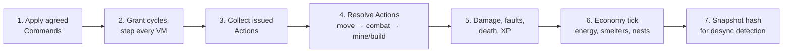

# Architecture (Bevy)

Constraint that shapes everything: the simulation must be **deterministic and fixed-tick** for lockstep multiplayer ([08-multiplayer.md](08-multiplayer.md)). Rendering is decoupled and free-running.

## Layering

```mermaid
flowchart TD
    subgraph SimCrate["sim (pure Rust crate — NO Bevy at all; depends only on pyrite)"]
        VM[Pyrite VM<br/>parser + interpreter]
        WORLD[World state<br/>tiles, bots, structures, Ferals]
        SYS[Tick systems<br/>cycles → actions → resolve → XP/damage]
    end

    subgraph GameCrate["game (Bevy app)"]
        NET[Lockstep networking]
        REND[Rendering, camera, VFX]
        UI[Code editor, inspector,<br/>Codex, build menus]
        INPUT[Player input → Commands]
    end

    INPUT -->|Commands| NET
    NET -->|agreed command stream| SYS
    SYS --> WORLD
    VM <--> SYS
    WORLD -->|read-only snapshot| REND
    WORLD -->|read-only| UI
```



**Rule 1: the `sim` crate is plain Rust and deterministic.** Its only dependency is `pyrite` — no Bevy of any kind. World state lives in ordinary structs and `BTreeMap`s, so iteration order is deterministic *by construction* (this is now locked in — the sim is built on it). Given `(seed, command stream)` it must replay identically on every machine and in tests. This rule is why multiplayer, replays, and headless balance-testing all come cheap.

**Rule 2: players emit Commands, never mutations.** Deploying a program, queueing a print, placing a structure — all are serializable `Command` values fed through the lockstep layer, even in single-player (single-player = lockstep with one peer).

## Tick Model

- Fixed sim tick, target **10 ticks/sec** (bots feel deliberate, cycle budgets stay legible, network headroom is generous).
- Bevy `FixedUpdate` drives the sim; `Update` renders with interpolation between the last two sim states.
- Per-tick system order (deterministic, explicit ordering):



Within each phase, iterate entities in **stable ID order** — never hash-map order.

## Pyrite VM

- **Tree-walking interpreter** over a parsed AST, one op per `step()`. Simple, debuggable, fast enough (thousands of bots × a few ops/tick is trivial). Bytecode VM is a later optimization if profiling demands it.
- VM state per bot (a component): program AST handle, program counter (as an AST cursor), variable table (fixed-size, from hardware), call stack (capped: base 4 frames + hardware), cycle debt, run state (`Running | Faulted { error, cycles_remaining } | Blocked(action)`).
- **Unified fault path**: every runtime failure (stack overflow, type error, unsupported op, failed action) routes through one `fault(error)` transition into the **error handler template**: pay trap cost, run the forced prologue (`handler_init()`), then the player's `on error:` window — or its factory contents, `upload_crash_dump()` (same registry entry players call — one code path). Either way, afterwards reset (clear variables + stack) and restart at line 1 ([01-language.md](01-language.md)).
- **Signal dispatch**: signals (`error` sync; `hurt`/`bump`/`bumped`/`abort` async from damage/collision systems → raised into the VM, checked at op boundaries). Dispatch lives in the VM, not scattered across game systems. Every signal resolves to its **reserved handler template** — forced prologue + editable window + forced epilogue, assembled at deploy time: the engine's forced lines are engine-owned AST fragments spliced around the player's window (which stays the only thing in source, preserving byte-exact hashing). Per-signal **instruction caps** and the **`signal_safe` function flag** (a single per-function registry property — inside any handler window, only safe functions may be called) are parse/deploy-time checks (same machinery as construct gating — the parser takes a handler-context bit alongside the `UnlockSet`). User `def`s get **derived safety** at deploy: build the call graph, reject cycles (no recursion window-reachable) and loop nodes, propagate the flag bottom-up, and compute each def's **worst-case instruction count** (max over branches, callee worst cases added); window cap checking charges call sites at the callee's worst case. All static, all deterministic — one pass over the AST per deploy. `abort` is fully engine-reserved (like recall): no player window, just the forced `upload_log()` + `become_disabled()` (wreck + self-destruct countdown; field-repair within it restores the bot). The **double-handle rule** — any signal or fault arriving while any template phase (prologue, window, *or* forced epilogue; boot and recall via the engine-interrupt flag) is active raises `abort` instead. Abort itself is un-interruptible — no player code to fault; signals during it are absorbed and the forced sequence always completes. There is no instant-destroy path — `Exploded` exists only as the wreck countdown's expiry outcome. Handler entry also drives presentation: each signal's fixed **cloud color/icon** keys off the VM's handler state — the `game` crate's thought-cloud renderer already switches on exactly this. **Engine-forced behaviors reuse the player-facing builtin registry entries** (`upload_crash_dump`, `become_disabled`, boot-time `upload_log`) — no parallel internal implementations to drift out of sync.
- **Recall** is dispatched like any signal but its handler is an **engine-owned Pyrite program** (immutable, runs on the same VM — the forced-call principle extended to a whole program): suspend user program, `move_to(home_printer)`, transfer, re-color → Boot. Recall sets `handler_active` (double-handle applies). Target selection runs in the economy phase: the **target-share allocation** ([01-language.md](01-language.md)) — claims resolve down the player-set printer priority list, per-printer sort keys (any stat), remainder to the first printer, recomputed on rule edits and on the player-set check interval (default 1000 ticks); over-capacity scrap picks lowest-total-XP of colony — deterministic tie-breaks by entity ID throughout.
- **Every `Destroy` spawns a Black Box entity** on the bot's tile (one system, one spawn point — impossible to miss a path): snapshot of the log ring buffer + id, tick, cause + the bot's env snapshot (Q58 — env leaks on death, never live).
- **Decryption state** ([08-multiplayer.md](08-multiplayer.md)) is sim state, not UI state: per `(color slot, faction)` a monotonic decryption level; the character reveal set is derived deterministically per version, keyed on `(color, version, faction, level)`. Both the level *and* the mask must be identical across lockstep peers (they're inspectable state); noise glyphs are seeded the same way so re-viewing never re-rolls. Program storage is per-faction **color slots** (uncapped count) → versioned entries in `ProgramLibrary`; a bot's `DeployedProgram` is `(color, version)`. Bots enter via a `Boot` state (from print, rescue, or recall re-coloring) whose sequence is: force `upload_log()` if buffer non-empty → reset VM → Active. **Boot sets `handler_active`** — it's an interrupt context, so a signal mid-boot triggers the same double-handle abort path (one flag, one rule, no special cases).
- All error/signal constants (`crash_dump_cost`, `trap_cost`, per-signal window caps, `handler_init_ticks`) are `costs.ron` entries like everything else — tunable and overlay-able per biome.
- **Construct gating at parse time**: parser takes an `UnlockSet`; locked syntax yields a structured error the editor renders ([06-progression.md](06-progression.md)).
- **Cycle costs are layered data**: base `costs.ron` asset (op → cost, including `trap_cost`) + per-map/biome **overlay** assets ([05-terrain.md](05-terrain.md)). Effective cost = overlay(base) for the tile the bot occupies, resolved at step time, **floored at 1** (Q75 — no zero-cost ops, no infinite intra-tick loops). Overlays are moddable content — validate at load (every key must exist in base; costs ≥ 1) so a bad mod fails loudly. The old above-`bank_cap` check is gone: `bank_cap` is now **derived per tile** as the max effective op cost under the local overlay stack, so freeze-forever is impossible by construction ([01-language.md](01-language.md)).
- **Function blocks are a registry**: `name → (signature, cost, signal_safe, effect)`. The `signal_safe` flag gates what handler windows may call ([01-language.md](01-language.md)); flags are data alongside costs. Effects don't mutate the world directly — they emit `Action`s resolved in phase 4. Ferals use the same registry ([04-enemies.md](04-enemies.md)). Log entries carry a **level** (`trace…error`, a small enum on the entry) end-to-end: ring buffer → cloud archive → Black Box; the UI colors by it.
- Determinism inside the VM: integers only (i64 + fixed-point), seeded per-match RNG streams for anything random (`wander()`), no host time/IO.

## Key World-State Shapes (sketch — plain structs + `BTreeMap`s, not ECS)

```text
Bot entity:      BotId, Hp, Cargo, Modules, XpTracks,
                 VmState, DeployedProgram, TilePos, Faction
Structure:       StructureKind, Hp, Buffers, TilePos, Faction
Tile map:        dense Grid<TileKind> resource + spatial index (bots per tile)
Programs:        ProgramLibrary resource — source + AST, shared/refcounted
                 (100 bots on one program share one AST)
Commands:        DeployProgram, QueuePrint, PlaceStructure, SetRallyPoint,
                 Research(UnlockId) — the ONLY external inputs to sim
```

## UI Notes (editor & inspector)

- Code editor: egui (`bevy_egui`) to start — fastest path to a functional editor with gutter annotations (per-line cycle costs, live program counter). Custom polish later.
- Inspector = same widget pointed at any bot's `VmState` in read-only mode, **filtered through the viewer's decryption level** for foreign bots (player or Feral): revealed characters render, the rest is stable noise, and the live program counter only steps over revealed lines. One widget, one masking pass — the transparency rules fall out of architecture.
- Codex ([04-enemies.md](04-enemies.md)) is a `ProgramLibrary` view with diffing.

## Testing Strategy (day one, not later)

- **Golden replays**: `(seed, command stream) → final state hash` tests; any PR changing a hash must explain why.
- **Cross-run determinism test in CI**: run the same replay twice in one process + once in another, compare hashes every 100 ticks.
- VM unit tests: each construct/function, cycle-cost accounting, gating errors.
- Headless balance harness: run scripted colonies for N ticks, assert economy curves — the `sim` crate split makes this a plain `cargo test`.

## Crate Layout

```text
programming_game/
├── crates/
│   ├── pyrite/        # language: lexer, parser, AST, VM (zero game deps)
│   ├── sim/           # world, ticks, actions, economy (depends: pyrite)
│   └── game/          # Bevy app: net, render, ui (depends: sim)
└── docs/              # these documents
```

## Decided

- **Plain-Rust sim with a `BTreeMap` world** (supersedes the original "`bevy_ecs` inside sim, with careful queries" decision — the implementation went the other way and is locked in). Deterministic iteration comes free from the storage choice; no sort-before-mutate discipline is needed inside sim. `bevy_ecs` is confined to the `game` crate (rendering/UI), where iteration order can never touch sim state — the boundary is the `Command` stream in and read-only world views out. If ECS-side code ever grows sim-state-affecting logic, that's the smell to fix, not a sorting problem to manage. The rule lives in `CLAUDE.md`.
- **Pathfinding: A\* per `move_to`.** Deterministic, simple, per-bot. **Note for later:** if profiling shows pathing dominating (hundreds of bots re-pathing every tick), flow fields per destination-tile are the escape hatch — one field shared by all bots heading to the same place; still deterministic. Don't build it until it's needed.
- **Programs are stored as plain text, byte-exact.** Source is the canonical artifact everywhere: saves, replays, the Codex, network deploys. The AST is a derived cache (parser is deterministic). Color **versions are identified by hashing the source bytes** — hence byte-exact storage, no whitespace normalization, fixed UTF-8. Everything downstream composes: text diffs power the Codex, `(color, version-hash)` keys the decryption masks, and programs are shareable as ordinary files.
