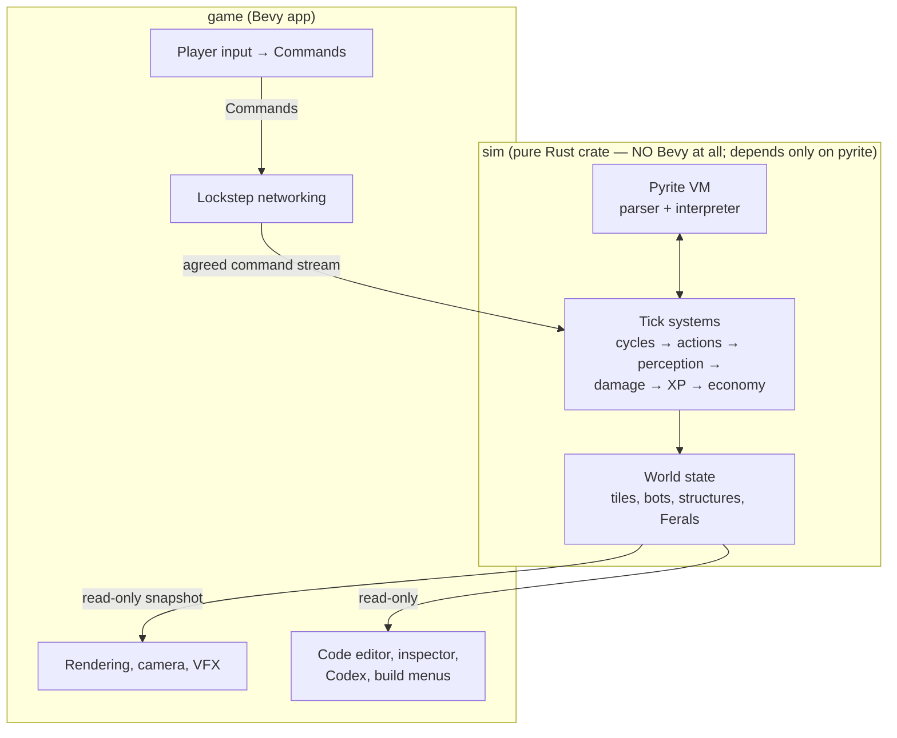

*Part of [07-architecture](../07-architecture.md).*

# Layering & Crates



**Rule 1: the `sim` crate is plain Rust and deterministic.** Its only dependency is `pyrite` — no Bevy of any kind. World state lives in ordinary structs and `BTreeMap`s, so iteration order is deterministic *by construction* (this is now locked in — the sim is built on it). Given `(seed, command stream)` it must replay identically on every machine and in tests. This rule is why multiplayer, replays, and headless balance-testing all come cheap.

**Rule 2: players emit Commands, never mutations.** Deploying a program, queueing a print, placing a structure — all are serializable `Command` values fed through the lockstep layer, even in single-player (single-player = lockstep with one peer).

## Crate Layout

```text
programming_game/
├── crates/
│   ├── pyrite/        # language: lexer, parser, AST, VM (zero game deps)
│   ├── sim/           # world, ticks, actions, economy (depends: pyrite)
│   └── game/          # Bevy app: net, render, ui (depends: sim)
└── docs/              # these documents
```
