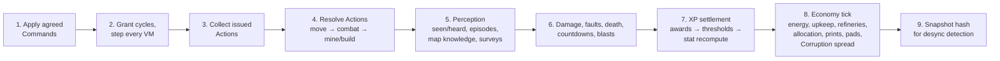

*Part of [07-architecture](../07-architecture.md).*

# Tick Model

- Fixed sim tick, target **10 ticks/sec** (bots feel deliberate, cycle budgets stay legible, network headroom is generous).
- Bevy `FixedUpdate` drives the sim; `Update` renders with interpolation between the last two sim states.
- Per-tick system order (deterministic, explicit ordering):

Within each phase, iterate entities in **stable ID order** — never hash-map order. Commands within a tick apply in **(player ID, per-player sequence)** order — the relay's total order. Phase notes (Q81):

- **Match start runs a phase-0 perception seed** (round 4) — tick 1's queries have a "previous tick" to read, so the pre-deployed starter program works from its first operation. Self-repair ticks and rust decay live in the economy phase, alongside upkeep.
- **Resolve Actions (phase 4) runs three sub-passes: move → combat → mine/build** (2026-07-26, answers Q102's first half — the code resolved one bot end-to-end at a time until then). The split exists so **combat sees a settled world**: every mover finishes stepping before the first swing range-checks, which turns "did I get out of range in time?" into a rule instead of a function of entity id (under the old order a lower-id attacker checked range *before* its victim's traverse completed and a higher-id attacker checked *after* — the same escape succeeded or failed on print order). It also makes retreat, the canonical hurt-handler response, reliable. The **engine-driven walks** (boot countdowns, recall) ride the move pass for the same reason. Each pass still iterates in stable ID order and a bot's pass is decided from what it holds at phase entry — finishing an action resumes the VM inline, so the classification is snapshotted before any pass runs and no bot can act twice in one tick. Note what this does *not* buy: movers still resolve against each other in ID order within the move pass; true simultaneity would need an intent-collection model and is deliberately out of scope.

  **Pass assignment is part of the spec, not an implementation detail** (it is hash-affecting, so it must not be invented per implementation): **Move** — `move_to`, `wander`, `explore`, an in-flight `Move`, and a bump-freeze tick-down with its replan, plus the engine walks (boot countdowns, recall). **Combat** — `attack`, `guard`/`escort`. **Work (the doc's "mine/build" pass)** — everything else: `mine`, `build`, `deposit`/`withdraw`, `repair`, the wreck-race verbs `salvage`/`analyze`/`hijack`, `recover_black_box`, `study`, `search`, `wait`, and the channel ops. **A `try_` verb always resolves in its faulting sibling's pass** — `try_move_to` is Move; `try_mine`, `try_deposit`, `try_withdraw` are Work — the prefix changes failure reporting, never scheduling (ruled with the P7/P10 source rewrites, 2026-08-01). Note the consequence for the wreck race: `repair` and `salvage` are **both Work**, so a rescue and a salvage landing on one wreck in one tick still resolve against each other in entity-ID order inside that pass — Q102 removed the cross-category artifact, not the intra-pass one.
- **Damage is a phase for EVERY attackable mass** (2026-07-26, answers Q102's second half). Bots always queued; structures, Feral nests, Blight Cores, and wreck hulls used to lose hp inline, wherever the blow was struck, because the pending-damage queue was typed to bot ids. It now carries a **target** (bot / structure / nest / blight / wreck), so one settle owns every hp change, every Combat-XP credit (paid on hp *actually* removed), and every destruction — which runs once, after the whole queue drains, so all of a tick's events resolve against the same world. The rule this restores: **two blows landing on one mass in a single tick resolve by rule, not by entity ID.** Previously the lower-ID attacker felled a structure and removed it mid-phase, so the higher-ID attacker's swing found nothing and took a *fault* — a crash dump, an error template, and a chassis chip — for a swing that was legal when it committed; two bots ganking a *bot* never suffered that. Blast damage queues the same way, and an untagged (culprit-less) hit is exactly what tells the settle to file a destroyed wreck's black box under "caught in a blast" rather than "destroyed by attack".
- **Perception (phase 5)** recomputes seeing/hearing from post-move positions: episode open/close per (bot, enemy faction), per-faction map-knowledge writes (a seen tile is fully known; seen foreign structures enter the faction's known-structures memory — P22), `search()`/`explore()` ring steps. **Phase-2 queries read the *previous* tick's perception** — one tick stale, deterministic, cheap. A bot is *moving* on any tick it advanced its traverse (mid-tile progress, slides, and sidesteps count); zero progress = stationary = silent. **Scale note** (the flow-fields-style escape hatch): perception must not be naive O(perceivers × bots) with per-pair raycasts — spatial hashing, event-driven episode transitions, and chunk-cached LoS are the intended shape; the check is sim-critical (it feeds Hiding XP), so whatever the optimization, results must be bit-identical to the naive check.
- **XP settlement (phase 7)**: every XP event earned anywhere in the tick is *queued*, then settles here in **one pass** over the ten tracks in fixed order — the five task tracks (Mining, Hauling, Combat, Building, Scouting), then Processing, Age, Mileage, Hiding, Flinch. Awards are in **centi-points** and each track's level reads its own `curve_base` ([02-agents.md](../02-agents.md)); XP is monotonic and uncapped, so there is no clamp step. Any per-bot XP-gain multiplier (quirks only, since Q121 retired the Learning track) applies at its **start-of-tick** value — no intra-tick self-compounding. There is **no second pass**: the Learning feed was deleted with the track. Then thresholds check (quirk manifestation, which reads the **Age level**), then the stat sheet recomputes once (state-layer flags like Damaged also recompute immediately when they flip).
- **Deploys re-allocate in the economy phase** of their own tick ("immediate" = this tick's phase 8, not phase 1). Corruption spread is an economy-phase counter system — no RNG. Wrecks have **HP** (~25% of the bot's max, tuning) so the damage phase can resolve hits on them; countdown decrements live in phase 6.
- **RNG streams, enumerated** (the CLAUDE.md rule's inventory): `rng.combat`, `rng.wander`, `rng.explore`, `rng.sidestep`, `rng.quirk_roll`, `rng.feral_mutation`, and `rng.program` — the `rng(n)` builtin draws from a **per-bot stream seeded by (match seed, entity ID)**, so identical programs desync deterministically, which is the builtin's whole job.
- **Quirk scratch state** (Branch Predictor's last-branch memory, the deterministic counters of GC Pause / Heisenbug / Off-by-One / Cold Start / Crypto Miner, Eventual Consistency's one-*additional*-tick perception snapshot) is declared **sim state**: serialized, hashed, cleared on restart like variables, persistent across recolor and rescue.
- **UnlockSets** ship in the match-start data (every peer validates every player's deploys identically); `Research` Commands mutate them in lockstep order. **Runtime alliances** (`SetAlliance`) share vision, ears, channels, and **decryption progress from the alliance forward** (Q107, 2026-07-26 — this line previously read "never decryption", contradicting docs/08's "shared color-decryption intel"; docs/08 is the ruling one). **Never retroactively**: pre-alliance levels are not merged, because decryption is permanent and monotonic, so a merge-on-formation would let a faction ally for one tick, absorb everything a partner ever learned, and divorce — decryption laundering. Forward-only pooling has no such hole: allies must actually stay allied and salvage together, and a divorce leaves nothing to unwind. Granted vision **feeds allied bots' queries** — the grant is a sim-level perception union, not a UI overlay.
