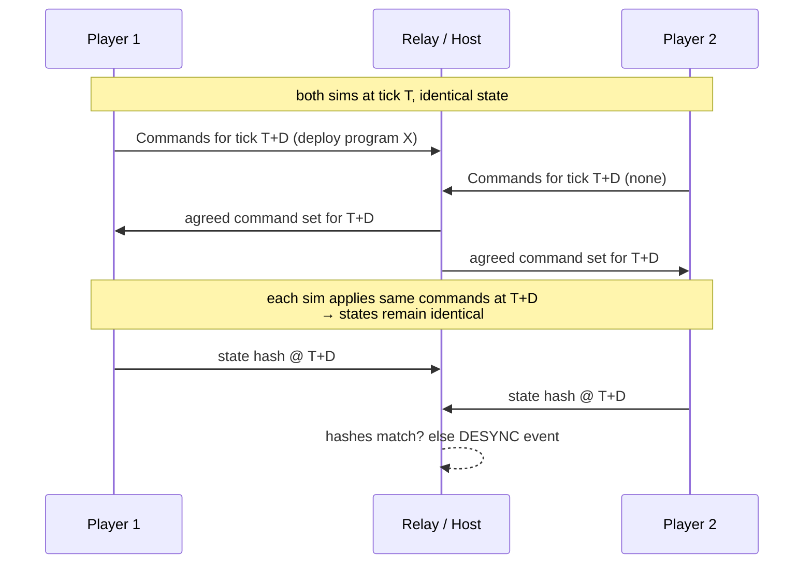

# Multiplayer

Multiplayer is a **day-one constraint**, not a feature (per project decision: retrofitting it later was judged too costly). There are no hard modes: every player owns a colony, and co-op vs. PvP is how players choose to interact on a given server (see Modes).

## Model: Deterministic Lockstep

This game is unusually well-suited to lockstep:

- Player inputs are **rare and small** — deploy a program, queue a print, place a structure, research. No per-unit micro spam. Bandwidth is trivial.
- The sim (including every Pyrite VM step) is deterministic by construction ([07-architecture.md](07-architecture.md)).
- Bot counts can grow large; lockstep cost is independent of entity count (unlike state sync).

- **Input delay D**: ~3 ticks (300ms at 10 tps). Invisible here — commands are "deploy code," not "dodge left." This is why lockstep's classic weakness doesn't hurt us.
- **Topology**: client-hosted relay for v1 (one player hosts; relay only orders commands, doesn't simulate ahead of others). Dedicated relay later if needed.
- **Desync handling**: per-tick state hash exchange ([07-architecture.md](07-architecture.md) phase 7). On mismatch: pause, dump divergent-state diff to log (dev), attempt host-state resync (prod).
- **Late join / reconnect**: host serializes full sim state + tick; joiner loads and enters lockstep. Same path as save/load — build once.

## Determinism Contract

The rules every system must obey (enforced by CI replay tests):

1. Fixed tick rate; sim never reads wall clock or frame time.
2. Integer/fixed-point math only in sim. No `f32`/`f64` in any state-affecting path.
3. All randomness from named, seeded RNG streams (`rng.combat`, `rng.wander`, …) advanced only by sim systems.
4. Stable iteration order everywhere (sort by entity ID before mutation).
5. All external influence enters as ordered `Command`s — including in single-player.
6. Pyrite VM: no nondeterministic builtins; `scan_enemies()` returns results in stable sorted order, etc.

## Modes (DECIDED: one model — allied colonies, interaction is up to the server)

**Every player owns their own colony.** There is no shared-colony mode: co-op vs. PvP isn't a hard mode split but *how players choose to interact on a given server*. Allies share research intel, program libraries, and leak intel; rivals fight. The same match can contain both.

| Server setting | Effect |
|---|---|
| **Open** (default) | Players may ally, trade, raid, or war freely. Ferals escalate against everyone. |
| **Non-PvP** | Players **cannot directly harm each other** (no damage to other players' bots/structures, no salvaging their wrecks, no hijacking their colonies' units). Competition is indirect: territory, nests, resources. Ferals remain the common enemy. |
| **Duel** (stretch) | 2 players, tiny mirror map, fixed identical loadouts, pure program-vs-program. Esports-minimal; also the perfect balance-testing arena. |

- **PvP entry gate**: joining any server where players can be harmed requires **all language constructs permanently unlocked** ([06-progression.md](06-progression.md)) — every combatant has the full language; matches are decided by usage, not vocabulary. Non-PvP servers have no gate.
- Allied-colony scaffolding: shared Research Archive access (function research), shared **program library** (call a friend's published functions), shared color-decryption intel, and drop-in adoption rules are unnecessary — a quitting player's colony just goes Feral-dormant (open question below).

## Multiplayer × Code — the interesting design space

- **Shared program libraries (co-op)**: allies can publish functions to a shared library; your colony can call your friend's `defend_choke()`. Co-op becomes pair programming.
- **Code visibility (DECIDED): programs are read on murder, by per-color attrition.** Every player runs **colored program slots** (start Red + Green; more by controlling Feral nests — quadratic, uncapped, [01-language.md](01-language.md)). Each `salvage()` of a bot grants the salvaging faction **+N% decryption of that color** (match-rules constant, default **5%** → ~20 kills for full read). The percentage is **permanent and only ever increases** — it survives redeploys: rewriting Red doesn't reset an enemy's 60% on Red; the new version simply appears 60% readable. Viewing a partially decrypted color shows the current version with that fraction of characters revealed, the rest stable noise. Live opponent bots show behavior and color, never more.
  - **Some kills = some leaks.** Every loss bleeds a little of that color, forever. There's no reset button — only the choice of *which* color bleeds.
  - **Risk is assigned per color.** Red on 30 disposable miners will be fully readable by mid-game: write it knowing that. Blue on one escorted veteran might end the match at 5%. Where you put your cleverness is a strategic decision — and visible tinting means the enemy always knows which secret a kill would buy.
  - **Counter-intel is possible**: a sacrificial color running plausible-but-misleading code is a legal and delicious play.
  - Tiers: **own + allies** — full source, live; **opponents** — per-color decryption via salvage attrition; **Ferals** — always open, live ([04-enemies.md](04-enemies.md)) — the curriculum, not the competition.
- **Spectating** is nearly free (a spectator is a lockstep peer with no command rights) and unusually fun here: watching two codebases fight.

### Color-decryption rules

- Decryption level is **per (color, salvaging faction)**, monotonic, permanent — sim state, identical across lockstep peers ([07-architecture.md](07-architecture.md)). Allies on a team share it (one teammate's salvage advances the team's level) — matches shared research.
- **The reveal mask must be stable, seeded, and monotonic** (anti-inference — a correctness requirement): which characters are revealed at level *k* is a deterministic function of `(color, version, faction, k)`; noise glyphs are equally stable. If noise re-rolled between viewings, real characters would be identifiable as the ones that never change.
- The mask is **re-drawn per version** (at the same level). Deliberate consequence: *lazy edits don't protect you*. If v5 is 95% identical to v4, the enemy's 50% mask on each reveals different characters of nearly the same text — cross-version reading recovers more than 50%. Only a genuine rewrite re-obscures. The Codex keeps every version snapshot at its viewed level, diffable, to support exactly this play.
- Open questions: can opponents see a color's *version counter* tick ("they redeployed Blue 30s after our salvage" — juicy intel)? Lean yes, it rewards attention. Should structural whitespace (line breaks, indentation) be always-visible rather than maskable? Lean yes — silhouettes read as "shape of the program," which is good partial-intel texture.

## Decided

- **Allied colonies, never shared** — every player owns a colony; cooperation happens through shared research, the shared program library, messaging, and leak intel (see Modes).
- **Co-op vs. PvP is a server setting, not a mode** — Open / Non-PvP / Duel.
- **PvP gate**: full permanent construct knowledge required to join harm-enabled servers ([06-progression.md](06-progression.md)).
- **Replays ship v1** — free with lockstep (seed + command log); also our bug-report format and the input to golden-replay CI tests ([07-architecture.md](07-architecture.md)).
- **Host migration on host quit** — serialize-state handoff to another peer, the same machinery as late join and save/load. Build it once, get all three.

## Open Questions

- Sim-speed control (pause/2× while everyone codes)? Needs unanimous consent. Probably yes on non-PvP servers, never where players can be harmed.
- What happens to a quitting/disconnected player's colony? Options: goes dormant (bots hold last programs, printers stop), becomes Feral-aligned, or adoptable by allies. Lean dormant with a reconnection window.
- Do Non-PvP servers still allow *indirect* aggression (racing to claim a nest an ally is sieging, out-mining a contested vein)? Lean yes — that's the point of the setting.
