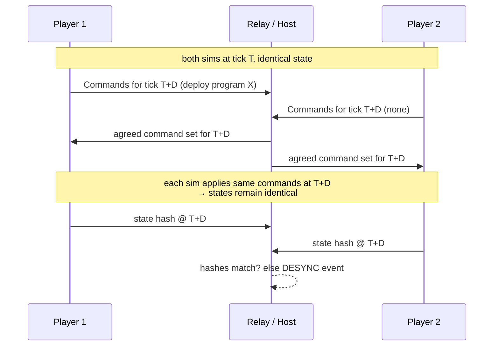

*Part of [08-multiplayer](../08-multiplayer.md).*

# Model: Deterministic Lockstep

This game is unusually well-suited to lockstep:

- Player inputs are **rare and small** — deploy a program, queue a print, place a structure, research. No per-unit micro spam. Bandwidth is trivial.
- The sim (including every Pyrite VM step) is deterministic by construction ([07-architecture.md](../07-architecture.md)).
- Bot counts can grow large; lockstep cost is independent of entity count (unlike state sync).

- **Input delay D**: ~3 ticks (300ms at 10 tps). Invisible here — commands are "deploy code," not "dodge left." This is why lockstep's classic weakness doesn't hurt us.
- **Topology**: client-hosted relay for v1 (one player hosts; relay only orders commands, doesn't simulate ahead of others). Dedicated relay later if needed.
- **Desync handling**: per-tick state hash exchange ([07-architecture.md](../07-architecture.md) phase 9, the snapshot hash). On mismatch: pause, dump divergent-state diff to log (dev), attempt host-state resync (prod).
- **Late join / reconnect**: host serializes full sim state + tick; joiner loads and enters lockstep. Same path as save/load — build once.
